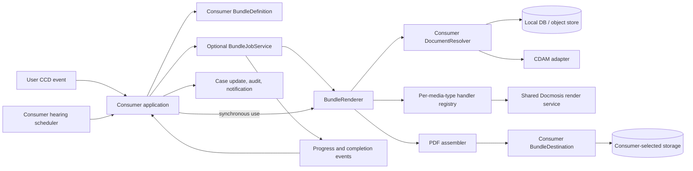

# Document Bundling SDK Module: Initial Design

**Status:** Draft for discovery

**Target module:** `sdk/document-bundling`

**Primary inputs:** the current `em-stitching-api`, `em-ccd-orchestrator`, the
[one-click bundle requirements](oneclick-bundle-requirements-DRAFT.xlsx), and initial service-team feedback

## Summary

Add a document-bundling module to the CCD SDK that lets a consuming service describe a legal bundle, supply its
documents, and receive a completed PDF without calling the shared stitching microservice.

The module should have two layers:

1. A synchronous, storage-agnostic rendering engine. This owns validation, document conversion, PDF assembly, table of
   contents, bookmarks, cover sheets, page numbering, approved watermarks, warnings, and the generation report.
2. An optional, small durable job runner. This persists work in the consuming service's database and invokes the same
   rendering engine. Both a user action and a service-owned scheduler can submit jobs to it.

Four further commitments shape the design:

* **Jackson-style extensibility.** The renderer is constructed through a builder whose defaults reproduce the output of
  the current microservice. Consumers register optional extension modules that add or override behaviour per media type,
  exactly as Jackson consumers register `Module`s. No extension means default behaviour.
* **Reuse of the shared Docmosis rendering service.** Office-format conversion and template-rendered generated pages call
  the existing Docmosis Tornado render service that HMCTS services already use, configured through the same
  `TORNADO_URL`/`TORNADO_ACCESS_KEY`-style properties. The SDK ships the client; it does not introduce a new conversion
  server.
* **First-class media documents.** MP3 and MP4 sources are supported natively: the SDK generates a standard, accessible
  link page for each media item instead of every team hand-building a placeholder PDF.
* **Observability as a primary concern.** Because this is a library, all logs land in the consuming service's
  Application Insights for free; on top of that, every failure mode maps to a typed, descriptive error that states what
  failed, on which document, at which stage, and what to do about it.

Consumers continue to own their case model, document-selection rules, hearing schedule, authorisation, storage adapters,
CCD events, case-file presentation, notifications, audit records, and retention policy. The SDK supplies explicit ports
and lifecycle events at those boundaries. It must not require documents to be copied into a stitching-specific case-data
DTO.

The first delivery should extract and harden suitable PDF code from `em-stitching-api`, not transplant its REST API,
Spring Batch schema, JPA model, callback protocol, or DM Store/CDAM clients.

## Context

The current capability is split across two services:

* `em-ccd-orchestrator` reads YAML rules, walks a CCD JSON blob, filters and sorts documents, duplicates them into a
  `CcdBundleDTO`, and maps that DTO to the stitching service contract.
* `em-stitching-api` stores a `DocumentTask`, polls it in Spring Batch chunks, downloads every document, converts it to
  PDF, assembles the bundle, uploads the result, and reports `NEW`, `IN_PROGRESS`, `DONE`, or `FAILED` by polling or an
  HTTP callback.

The rendering service already supports nested folders, document and folder cover sheets, a generated table of contents,
PDF bookmarks, several page-number positions, table-of-contents entries expressed as a page range or total page count,
preservation of source outlines, an optional cover-page template, images, office-document conversion through Docmosis,
and configurable image watermarks.

This distribution creates avoidable complexity:

* A consumer has to reshape its case data into a second document tree and later reconcile the asynchronous result.
* The central service must re-authorise and remotely retrieve each source. The legacy DM Store path gets user details and
  then makes metadata and binary calls; the CDAM path makes binary and metadata calls for each document. Those calls can
  trigger further access-control calls downstream.
* The service queue, distributed locks, callbacks, polling, deployment, and database are disproportionate to the expected
  volume of roughly 100 bundles per service per day.
* Extension requires changes across a central API contract and often the orchestrator. Consumers cannot compose domain
  selection, layout, failure, and storage behaviours locally.
* A single corrupt, inaccessible, or failed conversion currently fails the whole task. The result does not identify
  omitted documents, empty expected folders, or meaningful progress.
* Observability is poor. Failures surface as an opaque `FAILED` task state; the diagnostic detail lives in the central
  services' logs, not the consuming service's Application Insights, so service teams cannot see why their own bundle
  failed without cross-team log access.
* Audio and video evidence has no support at all. Teams currently hand-build a PDF containing a hyperlink to the media
  and add that PDF to the document list, each service reinventing the same page in a slightly different way.

The microservice is currently named `em-stitching-api` on disk and in GitHub, although older material and the original
request refer to `rpa-em-stitching-api`.

## Goals

* Make bundle definition composable in normal Java code, without coupling it to a CCD JSON blob or a document store.
* Preserve safe, consistent defaults for legal-document readability.
* Support user-triggered and scheduled generation through one execution path.
* Resolve each unique source document once per job and permit efficient bulk/local resolvers.
* Support nested sections, deterministic selection and ordering, titles and dates, clickable contents, bookmarks, page
  numbering, approved watermarks, and explicit confidentiality markings.
* Return actionable progress, warnings, omissions, timings, page counts, and an output reference.
* Provide defaults equivalent to the current microservice output, with a per-media-type extension model for consumers
  that need different behaviour.
* Render audio and video sources (MP3, MP4) as standard generated link pages without consumer-built placeholder PDFs.
* Reuse the existing shared Docmosis rendering service for office conversion and templated pages instead of introducing
  a new converter dependency.
* Emit descriptive, typed errors and structured telemetry that surface directly in the consuming service's Application
  Insights.
* Permit partial completion only when a consumer deliberately selects an approved policy.
* Allow incremental migration from existing orchestrator and stitching DTOs.
* Run locally and be testable without the shared stitching stack, CDAM, DM Store, or Docmosis.

## Non-goals

* Owning the consuming service's hearing scheduler, case lifecycle, UI, notifications, role configuration, or retention
  decisions.
* Reading arbitrary CCD case-data paths in the rendering core.
* Requiring a service to decentralise CCD persistence or rewrite all existing bundle-selection logic before migration.
* Providing a general-purpose PDF editor or arbitrary coordinates, fonts, colours, HTML, or executable templates.
* Building a distributed, high-throughput rendering platform.
* Guaranteeing that inaccessible source material becomes accessible merely by merging it.
* Supporting an unbounded number of formats or silently changing source-document content.

## Design Principles

### Separate content from workflow

`BundleRenderer` is a plain synchronous API. It has no knowledge of users, hearings, case events, HTTP callbacks, or job
tables. A thin `BundleJobService` persists and executes requests when durable asynchronous behaviour is wanted.

This permits the same definition to be used from a CCD user event, an application command, a scheduled task, or a test.

### Invert document storage

A bundle contains stable, opaque `DocumentReference` values rather than URLs or CDAM DTOs. A consumer-provided
`DocumentResolver` turns those references into streams. A `BundleDestination` publishes the finished artifact and returns
an opaque output reference.

The SDK must never infer an authorisation model from a URI or retain an end-user bearer token in a job row. A background
resolver normally uses the consuming service's own authorised access path and case context.

### Customise policy, constrain presentation

Consumers may compose inclusion, grouping, ordering, labels, dates, failure policies, cover metadata, and lifecycle hooks.
They choose presentation from versioned SDK presets. They cannot place arbitrary text or graphics over evidence pages or
select unsafe font sizes and margins.

Escape hatches should be added only after a concrete legal/document requirement and rendering regression tests exist.

### Make incompleteness visible

The default is fail closed. Best-effort generation must be explicit and must add a visible placeholder for each omitted
document, record the reason in the contents and result report, and complete as `COMPLETED_WITH_WARNINGS`.

An access-denied result always fails the job. Treating it as a missing file could both hide a security fault and produce
apparently complete evidence.

### Publish atomically

Only publish an output after validation and rendering complete. A failed job must not replace the last successful bundle.
The destination returns its reference only after storage succeeds. The consumer then attaches it to its case through its
normal transactional/event mechanism.

## Proposed Architecture



### Module packaging

Start with one published Gradle module, `com.github.hmcts:document-bundling`, with package boundaries that can be split
later if dependency weight becomes a problem:

* `...bundling.api`: stable public records, interfaces, builders, policies, results, and exceptions.
* `...bundling.render`: orchestration and validation.
* `...bundling.pdf`: PDFBox-based implementation adapted from the stitching service.
* `...bundling.convert`: per-media-type handler SPI, extension registry, and built-in PDF/image/media handlers.
* `...bundling.docmosis`: client for the shared Docmosis render service, used by the default office-format handler and
  template-rendered generated pages.
* `...bundling.job`: optional JDBC repository, lease-based worker, retry policy, and lifecycle events.
* `...bundling.spring`: opt-in auto-configuration and properties.
* `...bundling.legacy`: temporary adapters for current bundle/stitching DTO shapes.

Keep PDFBox and converter implementations as implementation dependencies. Do not expose the stitching service's domain
classes in the public API.

## Public API Sketch

Names are illustrative and should be proved with two consumer prototypes before stabilisation.

### Renderer construction and the extension model

The renderer follows the Jackson `ObjectMapper`/`Module` pattern: a builder with complete defaults, plus optional
extension modules that add or override behaviour per media type. A consumer that registers nothing gets output
equivalent to today's stitching microservice.

```java
BundleRenderer renderer = BundleRenderer.builder()
    .resolver(caseDocumentResolver)          // consumer port (required)
    .destination(caseDocumentDestination)    // consumer port (required)
    .build();
// Defaults only: PDF passthrough, image conversion, Docmosis-backed office
// conversion, generated media link pages, court-default presentation.

BundleRenderer renderer = BundleRenderer.builder()
    .resolver(caseDocumentResolver)
    .destination(caseDocumentDestination)
    .extension(new BundlingExtension() {
        @Override
        public String name() {
            return "et-media-pages";
        }

        @Override
        public void configure(BundlingExtensionContext context) {
            // Override a built-in handler for one media type.
            context.replaceHandler("video/mp4", new EtBrandedMediaLinkHandler());
            // Add support for a media type the SDK does not handle.
            context.addHandler("application/vnd.ms-outlook", new MsgToPdfHandler());
        }
    })
    .build();
```

The extension SPI:

```java
public interface BundlingExtension {
    String name();

    void configure(BundlingExtensionContext context);
}

public interface BundlingExtensionContext {
    void addHandler(String mediaType, DocumentHandler handler);      // fails if type already handled
    void replaceHandler(String mediaType, DocumentHandler handler);  // fails if type not already handled
    void removeHandler(String mediaType);                            // type reverts to failure policy
}

public interface DocumentHandler {
    /** Produce the PDF representation of one resolved source document. */
    HandledDocument handle(ResolvedDocument source, HandlerContext context) throws DocumentHandlingException;
}
```

Rules that keep the registry predictable:

* Built-in handlers register first; extensions apply in registration order, so the last registration for a media type
  wins and the effective registry is inspectable at build time.
* `addHandler` and `replaceHandler` are distinct on purpose: silently shadowing a built-in (or silently failing to) is a
  classic source of surprise, so each fails fast with a message naming the extension and media type involved.
* A media type with no handler follows the request's `DocumentFailurePolicy`, and the resulting error names the media
  type, the document, and the registered types.
* `HandlerContext` gives handlers bounded services — temp-file allocation, the Docmosis client when configured, page
  limits — not raw access to the assembler, so custom handlers cannot break bundle-wide invariants.
* Presentation remains preset-based and is not part of the handler SPI; extensions change how a source becomes PDF
  pages, not how the bundle is laid out.

Default handler registry:

| Media type | Built-in default |
|---|---|
| `application/pdf` | Validate and pass through |
| `image/png`, `image/jpeg`, `image/tiff`, `image/bmp`, `image/gif` | Render onto a correctly sized PDF page |
| Word/Excel/PowerPoint/OpenDocument/RTF/plain text | Convert via the shared Docmosis render service |
| `audio/mpeg` (MP3), `video/mp4` (MP4) | Generated media link page (see below) |
| Anything else | No handler; failure policy applies |

### Bundle definition

```java
BundleRequest request = BundleRequest.builder()
    .jobKey("case-1234/hearing-2026-08-06")
    .title("Hearing bundle")
    .fileName("case-1234-hearing-bundle.pdf")
    .root(BundleSection.builder("Case file")
        .section(BundleSection.builder("Applications")
            .documents(applicationDocuments.stream()
                .sorted(comparing(ApplicationDocument::date))
                .map(document -> BundleDocument.builder()
                    .id(document.id().toString())
                    .title(document.title())
                    .date(document.date())
                    .reference(new DocumentReference("case-documents", document.id().toString()))
                    .confidential(document.confidential())
                    .requirement(DocumentRequirement.REQUIRED)
                    .build())
                .toList())
            .emptySectionPolicy(EmptySectionPolicy.INCLUDE_PLACEHOLDER)
            .build())
        .build())
    .presentation(BundlePresentation.courtDefault()
        .withTableOfContents(true)
        .withSectionCoverSheets(true)
        .withPageNumbers(PageNumbers.BOTTOM_CENTRE_N_OF_M)
        .withConfidentialMarking(ConfidentialMarking.APPROVED_HEADER))
    .documentFailurePolicy(DocumentFailurePolicy.FAIL_REQUIRED_AND_MARK_OPTIONAL)
    .build();

BundleResult result = bundleRenderer.render(request, executionContext);
// Or, for durable execution:
BundleJob job = bundleJobService.submit(request, executionContextReference);
```

`BundleDefinition<T>` may be added as a convenience for reusable mapping of a service domain type into a
`BundleRequest`. The request itself remains an explicit ordered tree; the SDK should not introduce a generic expression
language in its first version. Consumers can reuse current selection logic and later move it into typed definitions
incrementally.

### Media documents (audio and video)

Today a team that must bundle an MP3 or MP4 builds its own single-page PDF containing a hyperlink to the media and adds
that PDF to the document list. The SDK makes this a built-in feature: MP3 and MP4 are ordinary bundle documents, and the
default handler renders a standard generated link page for each one.

```java
BundleDocument.builder()
    .id(recording.id().toString())
    .title("Hearing recording, day 2")
    .date(recording.date())
    .reference(new DocumentReference("case-documents", recording.id().toString()))
    .media(MediaPlaceholder.builder()
        .accessUrl(recording.playbackUrl())          // required: where a reader plays/downloads it
        .duration(recording.duration())              // optional metadata rendered on the page
        .note("Playback requires case access")       // optional bounded text
        .build())
    .build();
```

The generated page is a tagged, deterministic SDK template showing the document title, date, media type, size, optional
duration and note, and a clickable link to the consumer-supplied access URL. It participates in the table of contents,
bookmarks, pagination, and confidentiality marking like any other document.

Constraints:

* The consumer must supply the access URL. The SDK cannot know how a service exposes media for playback, and it must not
  invent links from `DocumentReference` internals. A media document without an access URL fails request validation with
  an error naming the document.
* The media file itself is not fetched by default — the page is built from supplied metadata, so a 2 GB recording costs
  nothing to bundle. A consumer needing verified size/checksum metadata can resolve the reference itself first.
* Link freshness is a consumer decision: a signed URL that expires before the bundle is read is worse than a stable
  case-scoped link, and the SDK documentation must say so.
* Other media types (for example `audio/wav`, `video/quicktime`) can be enabled by registering the built-in
  `MediaLinkHandler` for those types through an extension.

### Document resolution

```java
public interface DocumentResolver {
    String provider();

    ResolvedDocuments resolveAll(
        List<DocumentReference> references,
        BundleExecutionContext context
    );
}

public interface ResolvedDocument extends AutoCloseable {
    InputStream content();
    String mediaType();
    String fileName();
    OptionalLong contentLength();
    Optional<String> checksum();
}
```

`resolveAll` allows a consumer to batch metadata/access checks or load content locally. The module deduplicates identical
references, spools each resolution once to a restricted temporary directory, and can place the same source at multiple
positions in a bundle without another network call.

Resolution failures use typed reasons: `NOT_FOUND`, `ACCESS_DENIED`, `TRANSIENT_FAILURE`, `UNSUPPORTED_MEDIA_TYPE`,
`INVALID_CONTENT`, and `TOO_LARGE`. Raw downstream messages and credentials are not placed in user-visible results.

### Output storage

```java
public interface BundleDestination {
    StoredBundle store(BundleArtifact artifact, BundleExecutionContext context);
}

public record StoredBundle(
    String reference,
    String fileName,
    String mediaType,
    long size,
    String sha256
) {}
```

The initial module can include a filesystem destination for tests. CDAM, blob storage, or a consumer database are
adapters, not assumptions in the renderer. A CDAM adapter may live in a separate SDK integration module if two consumers
need it.

### Result and lifecycle

```java
public record BundleResult(
    BundleOutcome outcome,
    StoredBundle output,
    int pageCount,
    List<BundleWarning> warnings,
    List<DocumentResult> documents,
    Map<BundleStage, Duration> timings
) {}
```

Outcomes are `COMPLETED` and `COMPLETED_WITH_WARNINGS`; failures throw a typed `BundleGenerationException` synchronously
or end a job as `FAILED`. Job states are `QUEUED`, `RESOLVING`, `CONVERTING`, `ASSEMBLING`, `STORING`, `COMPLETED`,
`COMPLETED_WITH_WARNINGS`, and `FAILED`.

Progress events contain a stage plus completed/total document and page counts. A percentage may be derived for a UI, but
the SDK should not claim precise percentage completion when conversion and final PDF writing have unknown cost.

## Rendering Pipeline

1. Validate the request before reading any content: unique item IDs, non-empty safe titles, deterministic order, valid
   filename, supported presentation combination, item/page/byte limits, and at least one document or explicit placeholder.
2. Resolve all unique references through their registered resolvers. Spool streams to job-scoped temporary files while
   enforcing declared and actual byte limits and computing SHA-256 checksums.
3. Apply the failure policy. Fail access-denied and required-document failures. Materialise visible placeholder entries
   for permitted omissions and empty expected sections.
4. Detect and validate media types from content as well as supplied metadata.
5. Convert sources to PDF through the per-media-type handler registry. PDF is passed through after validation; common
   raster images use a built-in converter; office formats use the Docmosis-backed handler; MP3/MP4 produce generated
   link pages; consumer extensions supply or override handlers for anything else. Conversion is bounded and timed out.
6. Inspect converted PDFs for encryption, corruption, page count, page dimensions, extractable text, and other agreed
   evidence-readability checks.
7. Build generated cover/placeholder pages, table of contents, links, bookmarks, confidentiality marks, approved
   watermarks, and pagination using deterministic SDK templates.
8. Validate the finished artifact, compute its checksum, and publish it through `BundleDestination`.
9. Emit the immutable result and clean all temporary files, including on cancellation or failure.

Do not mutate source files. Preserve source page dimensions and rotations. Any normalisation that can alter evidence
appearance must be separately proposed and tested.

## Presentation Model

The first safe profile should provide:

* A generated title page with bounded text fields.
* A clickable table of contents with title, supplied document date, start page, and omission/confidential markers.
* PDF bookmarks mirroring the section/document tree.
* Optional section and document cover sheets.
* Sequential arabic page numbering, with `N` and `N of M` variants at approved header/footer positions.
* Existing source outlines nested beneath the corresponding document where PDFBox can preserve them reliably.
* A standard confidential/restricted marker driven by explicit document metadata.
* Optional approved image/text watermarks with fixed opacity, scale, margins, and page scope presets.
* A visible standard page for an empty expected section or permitted missing document.
* A standard media link page for audio/video documents, with title, date, media metadata, and a clickable access link.

Retain useful logic and tests from `PDFMerger`, `PDFOutline`, `TableOfContents`, `PDFUtility`, and `PDFWatermark`. Refactor
them away from mutable JPA entities, `File` maps, Spring annotations, and service DTO enums. The current implementation's
fallback that installs an empty PDF structure tree requires particular scrutiny because it may conceal accessibility
damage.

Free-form X/Y watermark coordinates, arbitrary Docmosis assets, and arbitrary cover templates should not be in the
default API. Existing consumers that require them can use a time-limited legacy profile while equivalent approved
presets are agreed.

## Docmosis Integration

The SDK reuses the Docmosis Tornado render service that HMCTS services already run rather than adopting a new
conversion engine. The integration pattern is well established in consuming services — for example
`et-ccd-callbacks` (`TornadoService`/`TornadoConnection` in this repository's test projects) posts a JSON render
instruction to `tornado.url` with an access key, both bound from `TORNADO_URL` and `TORNADO_ACCESS_KEY` — and
`em-stitching-api` already delegates office-format conversion to the same service.

The SDK uses Docmosis for two things:

* **Office-format conversion.** The default handler for Word, Excel, PowerPoint, OpenDocument, RTF, and plain-text
  media types sends the source to Docmosis for conversion to PDF, preserving the behaviour bundles get from
  `em-stitching-api` today.
* **Template-rendered generated pages.** Where a generated page needs a Docmosis template (for example, an existing
  consumer cover-page template during migration), the same client renders it. New SDK-generated pages (contents,
  placeholders, media link pages) use deterministic built-in PDFBox templates and do not require Docmosis.

Configuration comes from properties, defaulting to the environment variables services already set:

```yaml
ccd:
  bundling:
    docmosis:
      url: ${TORNADO_URL}
      access-key: ${TORNADO_ACCESS_KEY}
```

Behavioural rules:

* When the properties are present, the Spring auto-configuration registers the Docmosis-backed office handler as a
  default. When they are absent, office media types have no handler, and a bundle containing one fails with an error
  that says exactly that and names the properties to set (or the handler to register instead).
* Calls are bounded: connection/read timeouts, a source-size ceiling, and bounded retry on transient failures only.
  Docmosis error responses are mapped to typed conversion failures that identify the document; the access key never
  appears in logs, errors, or the job table.
* The client sits behind the handler SPI, so tests and local runs substitute a stub converter and the "runs without
  Docmosis" goal holds. A consumer may also replace the office handler wholesale with a different converter through an
  extension.

## Durable Job Runner

Synchronous rendering is the unit of reuse; the optional runner is deliberately small:

* A JDBC job table in the consumer database stores the request, non-secret execution-context reference, state, progress,
  attempts, timestamps, result, and sanitised failure.
* Submission requires a consumer-supplied idempotency key. A repeated user click or scheduler run returns the existing
  active/completed job instead of creating another bundle.
* One scheduled worker claims a small batch using PostgreSQL `FOR UPDATE SKIP LOCKED` and a lease. No Spring Batch,
  callback URL, separate service, or distributed scheduler lock is required.
* A stale lease is recoverable. Retry applies only to typed transient resolution, conversion, or storage failures, with a
  small bounded backoff. Rendering failures are not blindly retried.
* Request and adapter versions are stored with the job. A worker must fail clearly if it cannot read an old request.
* Completed job retention is configurable, but deletion of the stored court bundle remains a consumer workflow.

For a user action, the consumer submits a job, records/displays its ID and state, and returns without holding an HTTP/CCD
callback open. For an overnight flow, the consumer's scheduler finds due hearings and submits the same command. The SDK
does not decide that 05:00 or less than one day before a hearing is universally correct.

If a first consumer already has a reliable application job mechanism, it may use only `BundleRenderer`; the SDK runner
must not be mandatory.

## Ownership Boundaries

| Concern | SDK module | Consuming service |
|---|---|---|
| Bundle tree, PDF rendering and validation | Owns | Supplies domain mapping and metadata |
| Document selection and case-file order | Provides builders | Owns business rules/source of truth |
| Document download | Coordinates/deduplicates | Implements resolver and authorisation |
| Output upload | Calls port | Implements destination and classification |
| Manual and scheduled execution | Same callable/job API | Defines CCD events and schedule |
| Job progress/result | Persists/emits when runner enabled | Presents in UI/case data |
| Missing/empty/confidential markers | Renders from explicit policy/data | Decides classification and required status |
| Audit | Emits lifecycle facts | Writes jurisdiction/service audit record |
| Access to generated bundle | No role assumptions | Configures case field and document access |
| Retention/deletion | Exposes output reference/result | Owns confirmation, event, schedule and deletion |
| Notification | Emits completion | Chooses audience/channel/content |

This boundary is necessary for storage agnosticism and prevents the SDK from becoming another orchestrator embedded in
every service.

## Security and Legal-Document Safety

* The consuming service provides a system user with the correct RBAC for bundling, configured through application
  properties (IDAM client and system-user credentials, the pattern services already use for background work). The
  Spring auto-configuration exposes this as a system-user authentication port that built-in resolver/destination
  adapters and the job worker use, so background and scheduled bundling never depends on an end-user token. Tokens are
  acquired on demand and cached in memory only.
* Never persist bearer tokens, service tokens, source bytes, or signed URLs in the job table.
* A resolver must authorise the whole requested set for the execution context. The SDK should support a batch preflight so
  consumers can avoid per-document access-control fan-out.
* Output classification must be explicit; an adapter must not default a bundle containing restricted material to public.
* Access denied is fatal and is distinguishable from not found only in restricted operational diagnostics.
* Temporary files use a per-job directory, owner-only permissions, bounded disk allocation, and guaranteed cleanup.
* Filenames and PDF strings are sanitised; remote URLs, active content, embedded files, JavaScript/actions, malformed
  outlines, encryption, and decompression bombs require validation or removal under a documented policy.
* Logs and metrics use job/case correlation IDs but no document content, auth material, or sensitive titles by default.
* Dependency and malicious-document testing is required because PDF and office parsers handle untrusted input.
* The generation report records source IDs/checksums, output checksum, renderer/config version, ordering, omissions,
  initiator reference, and timestamps so the consumer can create an adequate audit event.

## Observability

Observability is a primary requirement, not an operational afterthought. The current services are hard to observe:
failures collapse into a `FAILED` state whose cause lives in central-service logs the consuming team cannot see. As a
library, the SDK inverts that by default — everything it logs is emitted through the consuming service's own logger and
therefore lands in that service's Application Insights. The design must then make what it emits worth having:

* **Descriptive, typed errors for every failure mode.** Each enumerated failure — validation, resolution, handling,
  conversion, inspection, assembly, storage, job recovery — has a typed exception carrying a stable error code, the
  stage, the document ID and safe display name where relevant, the handler or adapter involved, and a remediation hint.
  The standing test is that a service developer reading one exception message in App Insights can tell what failed, on
  which document, at which stage, and what to do next, without access to any other system's logs.
* **A documented error catalogue.** Error codes are stable, enumerated in the module documentation, and safe to alert
  on. New failure modes get new codes rather than being folded into generic ones.
* **Structured logging.** SLF4J with MDC/key-value pairs (`bundleJobId`, `jobKey`, `stage`, `documentId`, reason codes,
  durations, counts) so App Insights queries and dashboards work without string parsing. Stage transitions log at INFO
  with document/page/byte counts; every permitted omission logs at WARN with its reason code; failures log once, at the
  point of final failure, with full typed context — no double-logging from rethrown exceptions.
* **Metrics.** Micrometer (an API-only dependency bound to the consumer's registry) publishes `ccd.bundling.*` counters
  and timers: stage duration, documents/pages/bytes processed, resolver and Docmosis latency, warning and failure
  counts tagged by reason code, queue age and retries when the job runner is enabled.
* **Correlation.** Every log line, event, metric tag set, and error carries the job ID and the consumer's business key
  (`jobKey`), so one bundle's whole story is a single query.
* **Sanitisation still applies.** Descriptive never means leaky: no tokens, no document content, no raw downstream
  error bodies, and document titles only in fields documented as safe for the consumer's log classification.

The generation report remains the audit-grade record (source IDs, checksums, ordering, omissions, versions,
timestamps); observability output is the operational view of the same facts.

## Accessibility and Searchability

The one-click requirements call for an accessible and searchable PDF. These terms need measurable acceptance criteria.
They cannot be assumed from the existing code:

* Merging tagged PDFs may damage their structure tree, reading order, language, bookmarks, or form semantics.
* Images and scanned PDFs have no searchable text unless OCR is performed.
* Generated contents/cover pages can be made tagged, but that does not repair inaccessible source documents.
* PDFBox assembly alone does not demonstrate PDF/UA or WCAG conformance.

Before promising compliance, run a technical spike using representative customer documents and agree a target such as
PDF/UA-1 plus the validation tool(s), screen-reader checks, permitted exceptions, OCR service, and responsibility for
source remediation. Until then, the API should report accessibility/searchability inspection results and must not label
an unchecked bundle as compliant.

## Performance and Operability

The one-minute requirement should initially be treated as a service-level objective to validate, not an invariant of the
API. Total time depends primarily on source size, remote access, office conversion, OCR, and upload.

Initial safeguards and instrumentation:

* Configurable maxima for document count, source bytes, converted bytes, source pages, total pages, and elapsed time.
* Bounded resolution/conversion concurrency rather than parallel streams and the common fork-join pool.
* One fetch per unique reference, resolver batch preflight, streaming copy to disk, and no whole-bundle byte array.
* PDFBox scratch-file/mixed-memory configuration sized for service containers.
* Metrics, structured logging, and correlation as described in [Observability](#observability).

Establish small/typical/large fixtures with both customers. Report p50/p95 generation time by class. Do not add a remote
shared cache or horizontal coordination unless measurements show it is needed.

## Failure Semantics

Recommended defaults:

| Condition | Default | Optional explicit behaviour |
|---|---|---|
| Required source missing/corrupt | Fail, publish nothing | None initially |
| Optional source missing/corrupt | Fail | Visible placeholder plus warning |
| Access denied | Fail, publish nothing | None |
| Empty expected section | Omit section | Visible empty-section page |
| Unsupported media type | Fail | Visible placeholder for optional document |
| Transient source/converter/storage failure | Bounded job retry | Consumer may disable retry |
| Output validation failure | Fail, publish nothing | None |
| Case changed during generation | Consumer policy | Rebuild, reject, or attach snapshot-labelled result |

Every non-fatal omission appears both in the PDF and `BundleResult`. A warning-only result must not be represented as a
plain success in the consumer UI or audit trail.

## Migration Plan

### Phase 0: discovery and characterisation

* Confirm the second customer and collect real bundle definitions, input types/sizes, current DTOs, and sample outputs.
* Characterise current rendering with golden PDFs and semantic assertions before extraction.
* Benchmark current end-to-end network calls and generation times.
* Complete the accessibility/searchability spike.

### Phase 1: rendering core

* Create `sdk/document-bundling` with request/result models, resolver/destination/converter ports, validation, temp-file
  management, and synchronous rendering.
* Port PDF merge, outline, contents, pagination, cover-sheet, and watermark behaviour with focused regression tests.
* Build the per-media-type handler registry and extension SPI from the start, with built-in PDF, image, and media
  link-page handlers.
* Add the Docmosis client and register it as the default office-format handler, configured from the existing
  `TORNADO_URL`/`TORNADO_ACCESS_KEY`-style properties.
* Establish the observability baseline in the same phase: typed error catalogue, structured logging, and metrics.

### Phase 2: first consumer and compatibility

* Implement one consumer's resolver, destination, typed bundle definition, and completion case event.
* Add a legacy adapter that maps the existing ordered `CcdBundleDTO`/`BundleDTO` tree into `BundleRequest`. This lets the
  consumer keep its current selection/configuration code while removing the remote stitching call.
* Support legacy presentation options through a documented compatibility profile, with deprecations for unsafe options.
* Compare old/new output for ordering, titles, pages, links, bookmarks, marks, and failures.

### Phase 3: durable execution and second consumer

* Add the opt-in JDBC job runner, idempotency, progress, retry, recovery, and Spring auto-configuration if the first
  consumer's workflow demonstrates the need.
* Integrate the second consumer using its existing selection logic first.
* Extract common CDAM or other storage adapters only when reuse is demonstrated.

### Phase 4: remove duplication and retire services

* Move consumer rules from JSON-blob selectors/duplicated case bundle fields to typed `BundleDefinition` code where it
  provides value.
* Run old and new paths in controlled comparison, then switch per case type/feature flag.
* Retire orchestrator/stitching paths only after all consumers have a rollback window and verified audit/output parity.

## Testing Strategy

Follow [the SDK testing strategy](../testing-strategy.md): test behaviour with real components where practical and reserve
mocks for external adapters.

* Unit/property tests: tree validation, deterministic ordering, page-label calculations, failure policy, filename/text
  sanitisation, retry decisions, and progress monotonicity.
* PDF integration tests: real PDFs/images with semantic assertions for page count, extracted text, visible page labels,
  links, destinations, bookmarks, metadata, structure tags, confidentiality marks, empty/missing pages, and source order.
  Avoid byte-for-byte comparison because PDF metadata/object order can differ.
* Visual regression tests: render representative pages to images and compare within a controlled tolerance, with manual
  review for intentional template changes.
* Adapter contract tests: resolver batches once, closes streams, maps typed failures, preserves media metadata, and never
  persists auth material; destination publishes atomically with the requested classification.
* Job integration tests: PostgreSQL-backed claiming, duplicate submission, lease expiry, restart recovery, bounded retry,
  cancellation, result retention, and two-worker contention.
* Security tests: malicious/malformed/encrypted PDFs, oversized images, zip bombs in office files, active content, path
  traversal filenames, disk exhaustion, and cleanup after forced failure.
* Accessibility tests: agreed automated validator plus manual assistive-technology checks on customer fixtures.
* Consumer Cftlib tests: user event and scheduled flow update the case, restrict the bundle to internal users, expose
  progress/failure, audit creation/deletion, and retain the last good bundle when replacement fails.

## Requirement Traceability

| Requirement | Proposed response |
|---|---|
| One-click generation | Consumer event submits an idempotent job |
| Automatic generation around hearing | Consumer scheduler submits the same job command |
| One-minute generation | Benchmark/SLO by bundle class; stage metrics and bounded concurrency |
| Progress status | Durable states plus completed/total stage events |
| Large/high-volume cases | Explicit limits, disk spooling, bounded concurrency, representative load tests |
| PDF in case-file view, internal only | Consumer destination, case event, CCD field/role configuration |
| Download | Consumer exposes stored PDF through its existing document mechanism |
| Manual/automatic deletion and audit | Consumer workflow using returned output reference and lifecycle facts |
| Pagination/search/clickable contents | Safe presentation profile; search inspection/OCR decision still open |
| Preserve titles and dates | Explicit immutable document metadata rendered in contents/cover sheets |
| Same order as case-file view | Consumer supplies the authoritative ordered tree |
| Business-defined folder/order rules | Typed Java definition/builders; legacy YAML/DTO adapter during migration |
| Missing documents but usable bundle | Explicit optional policy, visible placeholder, warning result; access denial fatal |
| Empty folders | `INCLUDE_PLACEHOLDER` section policy |
| Confidential/restricted identification | Explicit metadata plus approved visible mark and output classification |
| Creation/deletion audit | SDK generation report/lifecycle events; consumer persists service audit |
| Accessible PDF | Discovery spike and measurable standard required before commitment |
| Audio/video evidence in bundles | Built-in MP3/MP4 media link pages; other types via handler extensions |
| Office document conversion | Default handler calls the existing shared Docmosis render service |
| Per-service custom behaviour | Jackson-style extension modules override per-media-type handlers |
| Diagnosable failures in the service's own telemetry | Typed error catalogue, structured logs, and metrics emitted through the consumer's Application Insights |

## Decisions Needed Before Implementation

1. Which service team is the second initial customer, and which two existing bundle flows should be the reference
   migrations?
2. Does "all documents and images in case file view" include judicial notes, sealed/restricted documents, previous
   bundles, and documents hidden from the initiating user?
3. Is the authoritative order the current case-file UI order, a business-defined bundle order, chronological order within
   folders, or a precedence among those rules?
4. Which documents are required versus optional, and for which technical failures is partial generation legally
   acceptable? Who must see and acknowledge warnings?
5. What does "confidential" mean in the PDF and in storage: visible label, separate bundle variants, output
   classification, access roles, or all four?
6. Is generation a snapshot at job submission or job execution? What should happen if the case changes while rendering or
   before the result is attached?
7. Should a new bundle replace the previous one, create a version, or coexist per hearing? What is the idempotency key?
8. What are representative and maximum document counts, pages, bytes, formats, encrypted files, and scanned-image ratios?
9. Is the one-minute threshold p95, a hard timeout, or a UI expectation, and does it include queueing, downloads,
   conversion, upload, and case update?
10. Which measurable accessibility standard, validator, OCR quality, supported languages, and exception process apply?
11. ~~Are Docmosis cover templates and office conversion still required? If so, may the SDK call Docmosis directly from
    a consumer, or is another converter required?~~ **Decided:** the SDK calls the existing shared Docmosis render
    service directly from the consumer, configured from the consumer's existing Tornado properties. Remaining question:
    do access keys/quotas permit each consuming service to call it at bundle volume, and which consumer cover-page
    templates must be carried over?
12. Which watermark variants are required beyond page numbers and confidentiality, and which current coordinate-based
    configurations must be preserved during migration?
13. Where should completed bundles be stored and at what classification? Token-less resolution is now assumed solved:
    the consuming service supplies a system user with correct RBAC via application properties, which the SDK's adapters
    and job worker use. Remaining question: can that system user's access checks be batched per bundle?
14. Does either customer already have a durable application-job mechanism that should invoke the synchronous renderer
    instead of adopting an SDK-managed job table?
15. What creation, warning, failure, access, replacement, and deletion events must be present in each service's audit
    history?

## Initial Recommendation

Proceed with Phase 0 and a thin Phase 1 prototype before committing to the job-runner contract. Prove the synchronous API
against one existing complex bundle and the one-click customer's case-file ordering. In parallel, treat accessibility,
partial-bundle policy, confidentiality, and snapshot semantics as product/legal decisions rather than renderer details.

The architectural direction is deliberately local and modest: one library call, consumer-owned adapters, bounded PDF
configuration, and optionally one database table/worker. It removes the central service and repeated DTO/network
orchestration without replacing them with a generic workflow platform inside the SDK.
