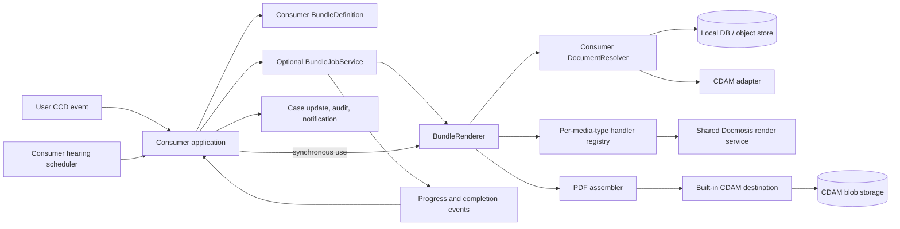

# Document Bundling SDK Module: Initial Design

**Status:** Draft for discovery

**Target module:** `sdk/document-bundling`

**Primary inputs:** the current `em-stitching-api`, `em-ccd-orchestrator`, the
[one-click bundle requirements](oneclick-bundle-requirements-DRAFT.xlsx), and initial service-team feedback

## Summary

Add a document-bundling module to the CCD SDK that lets a consuming service describe a legal bundle, supply its
documents, and receive a completed PDF without calling the shared stitching microservice.

The module should have two layers:

1. A synchronous, storage-agnostic rendering engine. This owns validation, document conversion, PDF assembly, table of
   contents, bookmarks, cover sheets, page numbering, approved watermarks, warnings, and the generation report.
2. An optional, small durable job runner. This persists work in the consuming service's database and invokes the same
   rendering engine. Both a user action and a service-owned scheduler can submit jobs to it.

Four further commitments shape the design:

* **Jackson-style extensibility.** The renderer is constructed through a builder whose defaults reproduce the output of
  the current microservice. Consumers register optional extension modules that add or override behaviour per media type,
  exactly as Jackson consumers register `Module`s. No extension means default behaviour.
* **Reuse of the shared Docmosis rendering service.** Office-format conversion and template-rendered generated pages call
  the per-environment Docmosis render service that HMCTS services already use, configured from the Docmosis
  endpoint/access-key properties consuming services already hold. The SDK ships the client; it does not introduce a new
  conversion server.
* **First-class media documents.** MP3 and MP4 sources are supported natively: the SDK generates a standard, accessible
  link page for each media item instead of every team hand-building a placeholder PDF.
* **Observability as a primary concern.** Because this is a library, all logs land in the consuming service's
  Application Insights for free; on top of that, every failure mode maps to a typed, descriptive error that states what
  failed, on which document, at which stage, and what to do about it.
* **A bounded footprint in the consumer's JVM.** In-process stitching inherits heap and concurrency that used to live
  in dedicated pods. The renderer caps concurrent renders explicitly, merges under a bounded-heap PDFBox configuration,
  runs all concurrency on injected executors, and never mutates global JVM state.

Consumers continue to own their case model, document-selection rules, hearing schedule, authorisation, document-source
resolvers, CCD events, case-file presentation, notifications, audit records, and retention policy. The finished PDF's
bytes always land in CDAM; what consumers own on the output side is the resulting `Document` metadata. The SDK supplies explicit ports
and lifecycle events at those boundaries. It must not require documents to be copied into a stitching-specific case-data
DTO.

The first delivery should extract and harden suitable PDF code from `em-stitching-api`, not transplant its REST API,
Spring Batch schema, JPA model, callback protocol, or DM Store/CDAM clients.

## Context

The current capability is split across two services:

* `em-ccd-orchestrator` reads YAML rules, walks a CCD JSON blob, filters and sorts documents, duplicates them into a
  `CcdBundleDTO`, and maps that DTO to the stitching service contract.
* `em-stitching-api` stores a `DocumentTask`, polls it in Spring Batch chunks, downloads every document, converts it to
  PDF, assembles the bundle, uploads the result, and reports `NEW`, `IN_PROGRESS`, `DONE`, or `FAILED` by polling or an
  HTTP callback.

The rendering service already supports nested folders, document and folder cover sheets, a generated table of contents,
PDF bookmarks, several page-number positions, table-of-contents entries expressed as a page range or total page count,
preservation of source outlines, an optional cover-page template, images, office-document conversion through Docmosis,
and configurable image watermarks.

This distribution creates avoidable complexity:

* A consumer has to reshape its case data into a second document tree and later reconcile the asynchronous result.
* The central service must re-authorise and remotely retrieve each source. The legacy DM Store path gets user details and
  then makes metadata and binary calls; the CDAM path makes binary and metadata calls for each document. Those calls can
  trigger further access-control calls downstream.
* The service queue, distributed locks, callbacks, polling, deployment, and database are disproportionate to the expected
  volume of roughly 100 bundles per service per day.
* Extension requires changes across a central API contract and often the orchestrator. Consumers cannot compose domain
  selection, layout, failure, and storage behaviours locally.
* A single corrupt, inaccessible, or failed conversion currently fails the whole task. The result does not identify
  omitted documents, empty expected folders, or meaningful progress.
* Observability is poor. Failures surface as an opaque `FAILED` task state; the diagnostic detail lives in the central
  services' logs, not the consuming service's Application Insights, so service teams cannot see why their own bundle
  failed without cross-team log access.
* Audio and video evidence has no support at all. Teams currently hand-build a PDF containing a hyperlink to the media
  and add that PDF to the document list, each service reinventing the same page in a slightly different way.

The microservice is currently named `em-stitching-api` on disk and in GitHub, although older material and the original
request refer to `rpa-em-stitching-api`.

## Goals

* Make bundle definition composable in normal Java code, without coupling it to a CCD JSON blob or a document store.
* Preserve safe, consistent defaults for legal-document readability.
* Support user-triggered and scheduled generation through one execution path.
* Resolve each unique source document once per job and permit efficient bulk/local resolvers.
* Support nested sections, deterministic selection and ordering, titles and dates, clickable contents, bookmarks, page
  numbering, approved watermarks, and explicit confidentiality markings.
* Return actionable progress, warnings, timings, page counts, and an output reference.
* Provide defaults equivalent to the current microservice output, with a per-media-type extension model for consumers
  that need different behaviour.
* Render audio and video sources (MP3, MP4) as standard generated link pages without consumer-built placeholder PDFs.
* Reuse the existing shared Docmosis rendering service for office conversion and templated pages instead of introducing
  a new converter dependency.
* Emit descriptive, typed errors and structured telemetry that surface directly in the consuming service's Application
  Insights.
* Stitch every requested document or fail with an error that names the documents responsible; never publish a partial
  bundle.
* Allow incremental migration from existing orchestrator and stitching DTOs.
* Run locally and be testable without the shared stitching stack, CDAM, DM Store, or Docmosis.

## Non-goals

* Owning the consuming service's hearing scheduler, case lifecycle, UI, notifications, role configuration, or retention
  decisions.
* Reading arbitrary CCD case-data paths in the rendering core.
* Requiring a service to decentralise CCD persistence or rewrite all existing bundle-selection logic before migration.
* Providing a general-purpose PDF editor or arbitrary coordinates, fonts, colours, HTML, or executable templates.
* Building a distributed, high-throughput rendering platform.
* Guaranteeing that inaccessible source material becomes accessible merely by merging it.
* Supporting an unbounded number of formats or silently changing source-document content.

## Design Principles

### Separate content from workflow

`BundleRenderer` is a plain synchronous API. It has no knowledge of users, hearings, case events, HTTP callbacks, or job
tables. A thin `BundleJobService` persists and executes requests when durable asynchronous behaviour is wanted.

This permits the same definition to be used from a CCD user event, an application command, a scheduled task, or a test.

### Invert document storage

A bundle contains stable, opaque `DocumentReference` values rather than URLs or CDAM DTOs. A consumer-provided
`DocumentResolver` turns those references into streams.

Inversion applies to sources, not to the output: the finished artifact is always published to CDAM by the SDK's
built-in destination (see [Output storage](#output-storage)). The `BundleDestination` port exists as the seam that
keeps the renderer testable without CDAM, not as a consumer decision point.

The SDK must never infer an authorisation model from a URI or retain an end-user bearer token in a job row. A background
resolver normally uses the consuming service's own authorised access path and case context.

### Customise policy, constrain presentation

Consumers may compose inclusion, grouping, ordering, labels, dates, failure policies, cover metadata, and lifecycle hooks.
They choose presentation from versioned SDK presets. They cannot place arbitrary text or graphics over evidence pages or
select unsafe font sizes and margins.

Escape hatches should be added only after a concrete legal/document requirement and rendering regression tests exist.

### Fail closed and name the document

Every document in a request must be stitched; there is no partial bundle. A failure publishes nothing, and the module's
obligation shifts entirely to diagnostic precision: the terminal error, the logs, and the job record must identify
exactly which document(s) prevented generation and why, so the service team can see the offending document in their own
Application Insights without reproducing the job.

An access-denied result also fails the job; it is distinguishable from not-found only in restricted operational
diagnostics, because treating it as a missing file could hide a security fault. Placeholder pages exist only as
deliberate presentational features — the empty-expected-section page and the media link page — never as substitutes for
a document that failed to stitch.

### Publish atomically

Only publish an output after validation and rendering complete. A failed job must not replace the last successful bundle.
The destination returns its reference only after storage succeeds. The consumer then attaches it to its case through its
normal transactional/event mechanism.

## Proposed Architecture



### Module packaging

Start with one published Gradle module, `com.github.hmcts:document-bundling`, with package boundaries that can be split
later if dependency weight becomes a problem:

* `...bundling.api`: stable public records, interfaces, builders, policies, results, and exceptions.
* `...bundling.render`: orchestration and validation.
* `...bundling.pdf`: PDFBox-based implementation adapted from the stitching service.
* `...bundling.convert`: per-media-type handler SPI, extension registry, and built-in PDF/image/media handlers.
* `...bundling.docmosis`: client for the shared Docmosis render service, used by the default office-format handler and
  template-rendered generated pages.
* `...bundling.cdam`: the built-in CDAM destination that stores every production artifact, plus the CDAM resolver
  adapter.
* `...bundling.job`: optional transactional outbox (JDBC repository, lease-based worker, retry policy, lifecycle
  events), following `sdk/task-management`.
* `...bundling.spring`: opt-in auto-configuration and properties.
* `...bundling.legacy`: temporary adapters for current bundle/stitching DTO shapes.

Keep PDFBox and converter implementations as implementation dependencies. Do not expose the stitching service's domain
classes in the public API.

## Public API Sketch

Names are illustrative and should be proved with two consumer prototypes before stabilisation.

### Renderer construction and the extension model

The renderer follows the Jackson `ObjectMapper`/`Module` pattern: a builder with complete defaults, plus optional
extension modules that add or override behaviour per media type. A consumer that registers nothing gets output
equivalent to today's stitching microservice.

```java
BundleRenderer renderer = BundleRenderer.builder()
    .resolver(caseDocumentResolver)          // consumer port (required)
    .destination(caseDocumentDestination)    // consumer port (required)
    .build();
// Defaults only: PDF passthrough, image conversion, Docmosis-backed office
// conversion, generated media link pages, court-default presentation.

BundleRenderer renderer = BundleRenderer.builder()
    .resolver(caseDocumentResolver)
    .destination(caseDocumentDestination)
    .extension(new BundlingExtension() {
        @Override
        public String name() {
            return "et-media-pages";
        }

        @Override
        public void configure(BundlingExtensionContext context) {
            // Override a built-in handler for one media type.
            context.replaceHandler("video/mp4", new EtBrandedMediaLinkHandler());
            // Add support for a media type the SDK does not handle.
            context.addHandler("application/vnd.ms-outlook", new MsgToPdfHandler());
        }
    })
    .build();
```

The extension SPI:

```java
public interface BundlingExtension {
    String name();

    void configure(BundlingExtensionContext context);
}

public interface BundlingExtensionContext {
    void addHandler(String mediaType, DocumentHandler handler);      // fails if type already handled
    void replaceHandler(String mediaType, DocumentHandler handler);  // fails if type not already handled
    void removeHandler(String mediaType);                            // type reverts to unhandled (bundle fails)
}

public interface DocumentHandler {
    /** Produce the PDF representation of one resolved source document. */
    HandledDocument handle(ResolvedDocument source, HandlerContext context) throws DocumentHandlingException;
}
```

Rules that keep the registry predictable:

* Built-in handlers register first; extensions apply in registration order, so the last registration for a media type
  wins and the effective registry is inspectable at build time.
* `addHandler` and `replaceHandler` are distinct on purpose: silently shadowing a built-in (or silently failing to) is a
  classic source of surprise, so each fails fast with a message naming the extension and media type involved.
* A media type with no handler fails the bundle, and the resulting error names the media type, the document, and the
  registered types.
* `HandlerContext` gives handlers bounded services — temp-file allocation, the Docmosis client when configured, page
  limits — not raw access to the assembler, so custom handlers cannot break bundle-wide invariants.
* Presentation remains preset-based and is not part of the handler SPI; extensions change how a source becomes PDF
  pages, not how the bundle is laid out.

Default handler registry:

| Media type | Built-in default |
|---|---|
| `application/pdf` | Validate and pass through |
| `image/png`, `image/jpeg`, `image/tiff`, `image/bmp`, `image/gif`, `image/svg+xml` | Render onto a correctly sized PDF page |
| Word/Excel/PowerPoint/RTF/plain text (the exact MIME list `em-stitching-api` routes to Docmosis today) | Convert via the shared Docmosis render service |
| `audio/mpeg` (MP3), `video/mp4` (MP4) | Generated media link page (see below) |
| Anything else | No handler; the bundle fails with a descriptive error |

### Bundle definition

```java
BundleRequest request = BundleRequest.builder()
    .externalId(bundleExternalId) // UUID supplied by the service; the idempotency key
    .title("Hearing bundle")
    .fileName("case-1234-hearing-bundle.pdf")
    .root(BundleSection.builder("Case file")
        .section(BundleSection.builder("Applications")
            .documents(applicationDocuments.stream()
                .sorted(comparing(ApplicationDocument::date))
                .map(document -> BundleDocument.builder()
                    .id(document.id().toString())
                    .title(document.title())
                    .date(document.date())
                    .reference(new DocumentReference("case-documents", document.id().toString()))
                    .confidential(document.confidential())
                    .build())
                .toList())
            .emptySectionPolicy(EmptySectionPolicy.INCLUDE_PLACEHOLDER)
            .build())
        .build())
    .presentation(BundlePresentation.courtDefault()
        .withTableOfContents(true)
        .withSectionCoverSheets(true)
        .withPageNumbers(PageNumbers.BOTTOM_CENTRE_N_OF_M)
        .withConfidentialMarking(ConfidentialMarking.APPROVED_HEADER))
    .build();

BundleResult result = bundleRenderer.render(request, executionContext);
// Or, for durable execution:
BundleJob job = bundleJobService.submit(request, executionContextReference);
```

`BundleDefinition<T>` may be added as a convenience for reusable mapping of a service domain type into a
`BundleRequest`. The request itself remains an explicit ordered tree; the SDK should not introduce a generic expression
language in its first version. Consumers can reuse current selection logic and later move it into typed definitions
incrementally.

### Media documents (audio and video)

Today a team that must bundle an MP3 or MP4 builds its own single-page PDF containing a hyperlink to the media and adds
that PDF to the document list. The SDK makes this a built-in feature: MP3 and MP4 are ordinary bundle documents, and the
default handler renders a standard generated link page for each one.

```java
BundleDocument.builder()
    .id(recording.id().toString())
    .title("Hearing recording, day 2")
    .date(recording.date())
    .reference(new DocumentReference("case-documents", recording.id().toString()))
    .media(MediaPlaceholder.builder()
        .accessUrl(recording.playbackUrl())          // required: where a reader plays/downloads it
        .duration(recording.duration())              // optional metadata rendered on the page
        .note("Playback requires case access")       // optional bounded text
        .build())
    .build();
```

The generated page is a tagged, deterministic SDK template showing the document title, date, media type, size, optional
duration and note, and a clickable link to the consumer-supplied access URL. It participates in the table of contents,
bookmarks, pagination, and confidentiality marking like any other document.

Constraints:

* The consumer must supply the access URL. The SDK cannot know how a service exposes media for playback, and it must not
  invent links from `DocumentReference` internals. A media document without an access URL fails request validation with
  an error naming the document.
* The media file itself is not fetched by default — the page is built from supplied metadata, so a 2 GB recording costs
  nothing to bundle. A consumer needing verified size/checksum metadata can resolve the reference itself first.
* Link freshness is a consumer decision: a signed URL that expires before the bundle is read is worse than a stable
  case-scoped link, and the SDK documentation must say so.
* Other media types (for example `audio/wav`, `video/quicktime`) can be enabled by registering the built-in
  `MediaLinkHandler` for those types through an extension.

### Document resolution

```java
public interface DocumentResolver {
    String provider();

    ResolvedDocuments resolveAll(
        List<DocumentReference> references,
        BundleExecutionContext context
    );
}

public interface ResolvedDocument extends AutoCloseable {
    InputStream content();
    String mediaType();
    String fileName();
    OptionalLong contentLength();
    Optional<String> checksum();
}
```

`resolveAll` allows a consumer to batch metadata/access checks or load content locally. The module deduplicates identical
references, spools each resolution once to a restricted temporary directory, and can place the same source at multiple
positions in a bundle without another network call.

Resolution failures use typed reasons: `NOT_FOUND`, `ACCESS_DENIED`, `TRANSIENT_FAILURE`, `UNSUPPORTED_MEDIA_TYPE`,
`INVALID_CONTENT`, and `TOO_LARGE`. Raw downstream messages and credentials are not placed in user-visible results.

#### Current resolution evidence (`em-stitching-api` CDAM path)

Verified in source: the current CDAM path performs **two full authorisation passes per document**
(`CdamService.java:66-96`). It calls `getDocumentBinary` and then, inside the try-with-resources still holding the
binary stream — after the transfer completes and before the temp file is written, serially within each document's
chain — calls `getMetadataForDocument`. The metadata response is used for exactly two fields: `originalDocumentName`
and `mimeType`.

Both are already on the binary response. CDAM defines `OriginalFileName` and `Content-Disposition` response headers
(`Constants.java:16-17`), its non-streaming path returns dm-store's `ResponseEntity` wholesale
(`DocumentStoreClient.java:112-119`), its streaming path copies every header verbatim
(`mapResponseHeaders`, `:212-216`), and `getDocumentBinary` already returns `ResponseEntity<Resource>`, so the headers
are reachable with no client change. `Content-Type` supplies the MIME type regardless — and that is the field with no
fallback.

Dropping the metadata call removes, per document, one dm-store metadata fetch, one full data-store case read with ACL
filtering, and one AM role-assignment lookup — exactly half the authorisation work in the chain, with no platform, API,
or behavioural change, because `/binary` already performed the identical `checkServicePermission` +
`checkUserPermission` pair before returning the bytes. For a 20-document bundle: 40 → 20 case reads of the same case,
40 → 20 AM lookups. The SDK's CDAM resolver adapter must therefore make **one authorised binary fetch per document**,
taking filename and media type from the response headers, with the pipeline's content-based type detection as the
backstop.

One evidence gap before committing: CDAM's tests construct binary-response fixtures carrying `OriginalFileName` and
`Content-Disposition` (`DocumentStoreClientTest.java:190-191`, `DocumentManagementServiceImplTest.java:142-143`),
which shows what CDAM expects dm-store to send — but they are fixtures, not proof. Confirm with one live call against
AAT that dm-store's binary response actually carries the filename headers.

A second constraint, established during implementation review: `ccd-case-document-am-client`'s Feign decoder
materialises each binary as a fully buffered `ByteArrayResource` (em-stitching's production code depends on that cast,
`CdamService.java:77`), so streaming retrieval is impossible with the current client. The SDK's resolver therefore
fetches sequentially and spools each binary to disk before fetching the next, bounding peak heap to roughly one
document rather than the whole batch; a streaming decode in the client is the long-term fix.

### Output storage

Where the finished PDF's bytes live is an **invariant**, not a port decision: the artifact is always uploaded to
CDAM, into the centralised document blob store, exactly as `em-stitching-api` publishes its output today
(`CdamService.uploadDocuments` → `caseDocumentClientApi.uploadDocuments`) and as consumers already expect —
`sptribs-case-api`'s `Bundle.stitchedDocument` field is the standard CCD `Document` complex type. The SDK ships the
CDAM destination and production always uses it; the `BundleDestination` port remains as the seam that keeps the
renderer testable, with a filesystem implementation for tests and local runs without CDAM.

```java
public interface BundleDestination {
    StoredBundle store(BundleArtifact artifact, BundleExecutionContext context);
}

public record StoredBundle(
    String url,                    // CDAM document self link — the CCD Document's document_url
    String binaryUrl,              // CDAM binary link — document_binary_url
    String filename,
    String mediaType,
    long size,
    String sha256,
    Optional<String> hashToken     // CDAM document hash, for secure-document-access services
) {
    public Document toDocument() { /* maps onto uk.gov.hmcts.ccd.sdk.type.Document */ }
}
```

What is consumer-variable is the bundle **metadata**, and its format is decided: the render output is `CcdBundle`,
kept JSON-compatible with `em-ccd-orchestrator`'s `CcdBundleDTO` — the shape every current consumer's `caseBundles`
field and the XUI bundle presentation already speak, with all parties tolerant via
`@JsonIgnoreProperties(ignoreUnknown = true)` (`sptribs-case-api`'s `Bundle` is the reference example). A consumer
attaches `result.output()` directly, or maps it onto its existing bundle model with Jackson; where it is persisted —
which case field, with which category id, classification, and ACLs — is entirely the consuming service's decision.
One divergence from the current service is deliberate:
`em-stitching-api` hardcodes `Classification.PUBLIC` on upload (`CdamService.java:120`); the SDK's CDAM destination
requires the upload classification to be explicit configuration.

Attaching the stored metadata to the case takes two shapes, depending on whether the consumer uses decentralised
persistence:

* A service that is not decentralised invokes a CCD case event to save the bundle reference into its case data.
* A decentralised service can have its case data modified from library code and re-saved directly, with an empty audit
  case event recorded so the creation still appears in the case history.

The SDK should ship attachment adapters for both shapes; the renderer itself stays unaware of either.

### Result and lifecycle

```java
public record BundleResult(
    BundleOutcome outcome,
    CcdBundle output,          // the CcdBundleDTO-compatible bundle the consumer attaches
    StoredBundle stored,       // CDAM links plus size and checksum, for the generation report
    int pageCount,
    List<BundleWarning> warnings,
    List<DocumentResult> documents,
    Map<BundleStage, Duration> timings
) {}
```

Outcomes are `COMPLETED` and `COMPLETED_WITH_WARNINGS`; failures throw a typed `BundleGenerationException` synchronously
or end a job as `FAILED`. Job states are `QUEUED`, `RESOLVING`, `CONVERTING`, `ASSEMBLING`, `STORING`, `COMPLETED`,
`COMPLETED_WITH_WARNINGS`, and `FAILED`.

Progress events contain a stage plus completed/total document and page counts. A percentage may be derived for a UI, but
the SDK should not claim precise percentage completion when conversion and final PDF writing have unknown cost.

## Rendering Pipeline

1. Validate the request before reading any content: unique item IDs, non-empty safe titles, deterministic order, valid
   filename, supported presentation combination, item/page/byte limits, and at least one document or explicit placeholder.
2. Resolve all unique references through their registered resolvers. Spool streams to job-scoped temporary files while
   enforcing declared and actual byte limits and computing SHA-256 checksums.
3. Fail fast on any unresolved document — every document in the request must stitch — with an error naming each failed
   reference and its typed reason. Materialise placeholder entries only for empty expected sections.
4. Detect and validate media types from content as well as supplied metadata.
5. Convert sources to PDF through the per-media-type handler registry. PDF is passed through after validation; common
   raster images use a built-in converter; office formats use the Docmosis-backed handler; MP3/MP4 produce generated
   link pages; consumer extensions supply or override handlers for anything else. Conversion is bounded and timed out.
6. Inspect converted PDFs for encryption, corruption, page count, page dimensions, extractable text, and other agreed
   evidence-readability checks.
7. Build generated cover/placeholder pages, table of contents, links, bookmarks, confidentiality marks, approved
   watermarks, and pagination using deterministic SDK templates.
8. Validate the finished artifact, compute its checksum, and publish it through `BundleDestination`.
9. Emit the immutable result and clean all temporary files, including on cancellation or failure.

Do not mutate source files. Preserve source page dimensions and rotations. Any normalisation that can alter evidence
appearance must be separately proposed and tested.

## Presentation Model

The first safe profile should provide:

* A generated title page with bounded text fields.
* A clickable table of contents with title, supplied document date, start page, and omission/confidential markers.
* PDF bookmarks mirroring the section/document tree.
* Optional section and document cover sheets.
* Sequential arabic page numbering, with `N` and `N of M` variants at approved header/footer positions.
* Existing source outlines nested beneath the corresponding document where PDFBox can preserve them reliably.
* A standard confidential/restricted marker driven by explicit document metadata.
* Optional approved image/text watermarks with fixed opacity, scale, margins, and page scope presets.
* A visible standard page for an empty expected section.
* A standard media link page for audio/video documents, with title, date, media metadata, and a clickable access link.

Retain useful logic and tests from `PDFMerger`, `PDFOutline`, `TableOfContents`, `PDFUtility`, and `PDFWatermark`. Refactor
them away from mutable JPA entities, `File` maps, Spring annotations, and service DTO enums. The current implementation's
fallback that installs an empty PDF structure tree requires particular scrutiny because it may conceal accessibility
damage.

Free-form X/Y watermark coordinates, arbitrary Docmosis assets, and arbitrary cover templates should not be in the
default API. Existing consumers that require them can use a time-limited legacy profile while equivalent approved
presets are agreed.

## Docmosis Integration

The SDK reuses the Docmosis render service that HMCTS already runs rather than adopting a new conversion engine. The
platform hosts an instance per environment (`docmosis.<env>.platform.hmcts.net`, unprefixed in production), and the
integration pattern is well established: `em-stitching-api` posts multipart requests to two endpoints — `/rs/convert`
for file-to-PDF conversion (`DocmosisConverter`) and `/rs/render` for cover-page templates and watermark assets
(`DocmosisClient`) — configured through `DOCMOSIS_ENDPOINT`, `DOCMOSIS_RENDER_ENDPOINT`, and `DOCMOSIS_ACCESS_KEY`.
Other services use the same server under different property names (`et-ccd-callbacks` binds `TORNADO_URL` and
`TORNADO_ACCESS_KEY` for its own template rendering). The access key is shared platform-wide: em-stitching's Terraform
copies a single `docmosis-access-key` secret from a central key vault into the service's vault, and the same key is
used for both endpoints.

The SDK uses Docmosis for two things:

* **Office-format conversion.** The default handler for Word, Excel, PowerPoint, OpenDocument, RTF, and plain-text
  media types sends the source to Docmosis for conversion to PDF, preserving the behaviour bundles get from
  `em-stitching-api` today.
* **Template-rendered generated pages.** Where a generated page needs a Docmosis template (for example, an existing
  consumer cover-page template during migration), the same client renders it. New SDK-generated pages (contents,
  placeholders, media link pages) use deterministic built-in PDFBox templates and do not require Docmosis.

Configuration comes from properties, bound to whichever environment variables the consuming service already has
(`DOCMOSIS_*` in EM-style services, `TORNADO_*` in ET-style services):

```yaml
ccd:
  bundling:
    docmosis:
      convert-endpoint: ${DOCMOSIS_ENDPOINT}         # .../rs/convert
      render-endpoint: ${DOCMOSIS_RENDER_ENDPOINT}   # .../rs/render
      access-key: ${DOCMOSIS_ACCESS_KEY}
```

Behavioural rules:

* When the properties are present, the Spring auto-configuration registers the Docmosis-backed office handler as a
  default. When they are absent, office media types have no handler, and a bundle containing one fails with an error
  that says exactly that and names the properties to set (or the handler to register instead).
* Calls are bounded: connection/read timeouts, a source-size ceiling, and bounded retry on transient failures only.
  Docmosis error responses are mapped to typed conversion failures that identify the document; the access key never
  appears in logs, errors, or the job table.
* The client sits behind the handler SPI, so tests and local runs substitute a stub converter and the "runs without
  Docmosis" goal holds. A consumer may also replace the office handler wholesale with a different converter through an
  extension.

### Current usage evidence (`em-stitching-api`)

Verified against source to inform the quota question:

* **Calls per bundle:** one `/rs/convert` per office/text document, at most one `/rs/render` for the cover-page
  template, and at most one `/rs/render` to fetch the watermark image (which is then applied locally per page). Total
  platform call volume is therefore unchanged by moving stitching in-process — the same bundles produce the same calls,
  just from the consumer's pod.
* **Effective concurrency today is tiny.** ShedLock serialises the stitching batch job to one pod per environment;
  each 6-second tick processes up to five tasks sequentially; within a task, conversions run on the common
  `ForkJoinPool` (parallelism ~1 with the 2-CPU container limit). The per-environment Docmosis instance sees at most a
  handful of concurrent stitching conversions. The SDK's explicit concurrency limit deliberately reinstates the bound
  that this accidental serialisation provides today.
* **The key is already distributed per-service.** em-stitching's Terraform copies the shared `docmosis-access-key`
  from a central key vault into the service's own vault — exactly the provisioning path a consuming service would use.
  There is no per-service quota, rate-limit, or 429 handling anywhere in em-stitching; nothing suggests Docmosis-side
  throttling is being managed by the current design.
* **Templates are consumer data, not service code.** The cover-page template is referenced by a name the calling
  service supplies in the bundle payload (`Bundle.coverpageTemplate`, e.g. sptribs' active config names
  `ST-CIC-ASS-ENG-Cover-Page.docx`), so template carry-over is a per-consumer configuration question.
* **Defects not to replicate:** the uploaded source is always tagged `application/pdf` in the multipart body
  regardless of its real type; the MIME type is taken verbatim from document-store metadata and never sniffed;
  `application/octet-stream` is blindly routed to Docmosis; there are no size limits; the entire converted response is
  buffered in memory; timeouts are ten minutes; and a Docmosis failure collapses to `FAILED` with the raw response body
  in the task message.

## Durable Job Runner: a Transactional Outbox

Synchronous rendering is the unit of reuse; the asynchronous mechanism is a transactional outbox, following the pattern
already shipped in this repository's `sdk/task-management` module (`TaskOutboxService` enqueues a JSON payload row
inside the consumer's own database transaction; `TaskOutboxPoller` claims and executes rows under a
`TaskOutboxRetryPolicy`, all wired by auto-configuration):

* Submitting a bundle job inserts an outbox row in the same transaction as the consumer's triggering change (typically
  a CCD event), so a bundle request exists exactly when the event that asked for it commits — no dual-write gap.
* The row is keyed by the consumer-supplied `externalId` (UUID), which is the idempotency key. A repeated user click or
  scheduler run with the same `externalId` returns the existing active/completed job instead of creating another
  bundle. Whether a new bundle replaces, versions, or coexists with a previous one is a service-team decision expressed
  through the `externalId` they mint.
* The row stores the non-secret execution-context reference, state, progress, attempts, timestamps, result reference,
  and sanitised failure. It doubles as the secondary status record: the consumer's audit trail records creation as a
  case event, and the outbox row shows current state and failure detail.
* One scheduled worker claims a small batch using PostgreSQL `FOR UPDATE SKIP LOCKED` and a lease, respecting the
  renderer's concurrency limit. No Spring Batch, callback URL, separate service, or distributed scheduler lock is
  required.
* A stale lease is recoverable. Retry applies only to typed transient resolution, conversion, or storage failures, with a
  small bounded backoff. Rendering failures are not blindly retried.
* Request and adapter versions are stored with the job. A worker must fail clearly if it cannot read an old request.
* Completed job retention is configurable, but deletion of the stored court bundle remains a consumer workflow and is
  never an SDK concern.

For a user action, the consumer submits a job, records/displays its ID and state, and returns without holding an HTTP/CCD
callback open. For an overnight flow, the consumer's scheduler finds due hearings and submits the same command. The SDK
does not decide that 05:00 or less than one day before a hearing is universally correct.

If a consumer already has a reliable application job mechanism, it may use only `BundleRenderer`; the SDK outbox must
not be mandatory.

### Execution-time document selection

Every job's document list is produced by a selector that the worker invokes when the job executes:

```java
public interface BundleDocumentSelector {
    BundleRequest select(BundleJobContext context);
}
```

The SDK registers an overridable base case. The default selector returns the request exactly as it was submitted, so
the simple path — build the tree in the event handler, submit it — needs no extension, and generation is effectively a
snapshot at submission. A service that overrides the selector submits only the `externalId` and the selector's
parameters (case reference, hearing ID, and so on); the worker compiles the document list when the job runs. That
makes generation a snapshot at execution, naturally includes documents that arrive between submission and execution,
and keeps CCD callbacks small — the event handler enqueues one small row instead of building the whole tree inside the
callback. There is one worker code path either way: claim row, call selector, render.

In both modes the generation report — not the outbox row — is the authoritative record of what was stitched.

## Ownership Boundaries

| Concern | SDK module | Consuming service |
|---|---|---|
| Bundle tree, PDF rendering and validation | Owns | Supplies domain mapping and metadata |
| Document selection and case-file order | Provides builders | Owns business rules/source of truth |
| Document download | Coordinates/deduplicates | Implements resolver and authorisation |
| Output upload | Uploads to CDAM via the built-in destination (port is a test seam) | Owns the returned `Document` metadata: case field, category, classification, ACLs |
| Manual and scheduled execution | Same callable/job API | Defines CCD events and schedule |
| Job progress/result | Persists/emits when runner enabled | Presents in UI/case data |
| Empty-section/media/confidential markers | Renders from explicit policy/data | Decides content filtering and classification |
| Audit | Emits lifecycle facts; outbox row is the status record | Records creation as a case event; deletion never an SDK concern |
| Access to generated bundle | No role assumptions | Configures case field and document access |
| Retention/deletion | Exposes output reference/result | Owns confirmation, event, schedule and deletion |
| Notification | Emits completion | Chooses audience/channel/content |

This boundary is necessary for storage agnosticism and prevents the SDK from becoming another orchestrator embedded in
every service.

## Security and Legal-Document Safety

* The consuming service provides a system user with the correct RBAC for bundling, configured through application
  properties (IDAM client and system-user credentials, the pattern services already use for background work). The
  Spring auto-configuration exposes this as a system-user authentication port that built-in resolver/destination
  adapters and the job worker use, so background and scheduled bundling never depends on an end-user token. Tokens are
  acquired on demand and cached in memory only.
* Never persist bearer tokens, service tokens, source bytes, or signed URLs in the job table.
* A resolver must authorise the whole requested set for the execution context. The SDK should support a batch preflight so
  consumers can avoid per-document access-control fan-out.
* Output classification must be explicit; an adapter must not default a bundle containing restricted material to public.
* Access denied is fatal and is distinguishable from not found only in restricted operational diagnostics.
* Temporary files use a per-job directory, owner-only permissions, bounded disk allocation, and guaranteed cleanup.
  This is a deliberate tightening, not a port: the current code writes case documents to temp files created with all
  POSIX permissions — 0777, world-writable (`CdamService.copyResponseToFile`, `:99-101`). That is tolerable in a
  single-tenant pod and considerably less so inside a consumer's JVM on a shared node; the SDK must not carry it over,
  and consumers will not notice the change.
* Filenames and PDF strings are sanitised; remote URLs, active content, embedded files, JavaScript/actions, malformed
  outlines, encryption, and decompression bombs require validation or removal under a documented policy.
* Logs and metrics use job/case correlation IDs but no document content, auth material, or sensitive titles by default.
* Dependency and malicious-document testing is required because PDF and office parsers handle untrusted input.
* The generation report records source IDs/checksums, output checksum, renderer/config version, ordering, omissions,
  initiator reference, and timestamps so the consumer can create an adequate audit event.

## Observability

Observability is a primary requirement, not an operational afterthought. The current services are hard to observe:
failures collapse into a `FAILED` state whose cause lives in central-service logs the consuming team cannot see. As a
library, the SDK inverts that by default — everything it logs is emitted through the consuming service's own logger and
therefore lands in that service's Application Insights. The design must then make what it emits worth having:

* **Descriptive, typed errors for every failure mode.** Each enumerated failure — validation, resolution, handling,
  conversion, inspection, assembly, storage, job recovery — has a typed exception carrying a stable error code, the
  stage, the document ID and safe display name where relevant, the handler or adapter involved, and a remediation hint.
  The standing test is that a service developer reading one exception message in App Insights can tell what failed, on
  which document, at which stage, and what to do next, without access to any other system's logs.
* **A documented error catalogue.** Error codes are stable, enumerated in the module documentation, and safe to alert
  on. New failure modes get new codes rather than being folded into generic ones.
* **Structured logging.** SLF4J with MDC/key-value pairs (`bundleJobId`, `externalId`, `stage`, `documentId`, reason codes,
  durations, counts) so App Insights queries and dashboards work without string parsing. Stage transitions log at INFO
  with document/page/byte counts; every permitted omission logs at WARN with its reason code; failures log once, at the
  point of final failure, with full typed context — no double-logging from rethrown exceptions.
* **Metrics.** Micrometer (an API-only dependency bound to the consumer's registry) publishes `ccd.bundling.*` counters
  and timers: stage duration, documents/pages/bytes processed, resolver and Docmosis latency, warning and failure
  counts tagged by reason code, queue age and retries when the job runner is enabled.
* **Correlation.** Every log line, event, metric tag set, and error carries the job ID and the consumer-supplied
  `externalId`, so one bundle's whole story is a single query.
* **Sanitisation still applies.** Descriptive never means leaky: no tokens, no document content, no raw downstream
  error bodies, and document titles only in fields documented as safe for the consumer's log classification.

The generation report remains the audit-grade record (source IDs, checksums, ordering, omissions, versions,
timestamps); observability output is the operational view of the same facts.

## Accessibility and Searchability

Decided: accessibility conformance is not a concern of this library. The module does not claim, validate, or certify
any accessibility standard for its output, and no conformance spike is required before implementation.

What stays in scope is honesty about the output:

* Generated pages (contents, cover sheets, empty-section pages, media link pages) use tagged, deterministic templates.
* Merging cannot repair inaccessible source documents, and the API must never label an unchecked bundle as compliant.
* The result reports basic inspection facts — extractable text present, encryption, page counts — that a service team
  can feed into its own compliance process.

OCR and searchable-text guarantees are likewise out of scope; a service that needs them applies OCR before submitting
documents.

## Memory and Concurrency in the Consumer's JVM

Moving stitching in-process inverts the heap model, and this is a primary design concern, not an operability detail.

Today PDFBox merges in-memory inside `em-stitching-api`'s own pods, with Spring Batch chunk size 5 — up to five
concurrent bundles per pod, each holding a full document set, in a JVM that does nothing else and scales independently
of any consumer. As a library, that same allocation lands in the consumer's pod, competing with request-serving
threads, and the consumer can no longer scale stitching separately from its traffic.

The cost is page-driven, not byte-driven. A pure merge could largely stream-copy, but the documented pipeline touches
every page: pagination draws page numbers per document, the table of contents inserts index pages with clickable links
back into the merged page tree, and image watermarking uses PDFBox `Overlay` — so page objects are materialised rather
than copied. That is why the documented threshold is ">500 pages consume significant heap" rather than a byte figure,
and why scanned-image bundles (an entirely undocumented dimension) are the worst case for bytes and heap
simultaneously. The number to design against is roughly `concurrent bundles × pages per bundle × per-page object cost`;
today's implicit answer is "5 × ~300 typical / ~1000 extrapolated" in a dedicated JVM.

Design consequences:

* **The SDK owns an explicit concurrency limit.** Spring Batch's chunk size was silently providing one; a library must
  make it a first-class, configurable setting. The renderer admits a small default number of concurrent renders
  through a bounded permit, and the outbox worker's claim batch respects the same limit. Excess submissions queue in
  the outbox rather than allocate heap.
* **Bounded-heap merge by default.** PDFBox `MemoryUsageSetting` in scratch-file or mixed mode trades job-scoped temp
  disk for a heap ceiling and is output-identical. This is the single highest-leverage change for a library and the
  direct answer to consumer-impact concerns.
* **Injected executors only.** The current implementation downloads documents with `Stream.parallel()` — confirmed in
  source at both `DocumentTaskItemProcessor.java:110-113` and the CDAM download fan-out itself,
  `documentTask.getBundle().getSortedDocuments().parallel()` (`CdamService.java:56-57`) — which runs on the common
  `ForkJoinPool`; inside a consumer's JVM that contends with everything else using that pool. All SDK concurrency runs
  on executors the consumer can size, name, and observe.
* **No global JVM mutation.** The current `System.setProperty("pdfbox.fontcache", "/tmp")`
  (`BatchConfiguration.java:252`) is a global mutation from init code that would silently affect the host application.
  Equivalent needs are met with scoped, documented configuration.
* **Per-job heap, page, and temp-disk metrics** feed the [Observability](#observability) baseline so consumers can size
  pods on evidence rather than folklore.

Removing the service also removes cost that never belonged to rendering: the 2022 Application Insights figures show
~405 stitch POSTs/hour against ~65,000 status GETs/hour — almost all traffic was synchronous polling overhead — and the
async endpoint (`/api/async-stitch-ccd-bundles`) had zero recorded usage. In-process execution eliminates the
exponential-backoff poll loop (seven retries, 1–7 s sleeps) and up to 6 s of batch-schedule latency, which is real
headroom against the one-minute hard timeout for a bundle that took ~21 s from a cold start.

## Performance and Operability

The one-minute figure is a hard timeout covering everything: queueing, document resolution, conversion, assembly,
upload, and the consumer's case update. A job that exceeds it fails, and the failure carries per-stage timings showing
where the time went. The reference points below suggest typical bundles fit comfortably while the extrapolated worst
case sits exactly at the boundary, so the timeout must be validated against real fixtures early.

### Documented workload evidence (unverified)

Every figure here is Confluence-derived and explicitly flagged as not verified in source — the 2019 production
performance table and 2022 Application Insights workload data. Phase 0 must confirm them empirically.

| Scenario | Documents | Pages | Time |
|---|---|---|---|
| Small bundle (warmed pod) | 2 PDF | ~10 | 1–2 s |
| IAC production (business proving) | 7 (2 Word + 5 PDF) | 298 | ~21 s |
| IAC estimated (extrapolation) | ~20 | ~1000 | ~60 s |

Representative is therefore ≈7 documents / ~300 pages; the documented ceiling is ≈20 documents / ~1000 pages — and that
row is an extrapolation, not a measurement. No document-count or page cap is enforced anywhere today.

Byte limits are the weakest dimension, with mutually inconsistent figures from different Confluence pages: 300 MB per
non-media input file, 500 MB per MP3/MP4, ~1 GB practical output maximum "before timeouts", and a 4 MB Docmosis
conversion size "observed during testing" that is explicitly not enforced in code. The 300 MB-versus-4 MB conflict
matters most: a 4 MB effective ceiling on office conversion is a radically different constraint on the Docmosis handler
than 300 MB, and must be resolved empirically before the handler's limits are set. Encrypted-file frequency and
scanned-image ratios are entirely undocumented, and scanned-image bundles are the memory model's worst case, so Phase 0
fixtures must include both deliberately.

### Initial working targets

The empirical ceilings are unresolved, so the module adopts sensible short-term targets and works upward — the higher
the eventual target, the more robust the system, but these are what version 1 is built and tested against:

| Dimension | Initial target |
|---|---|
| Non-media source input | 300 MB per document (the documented input limit) |
| Media file (MP3/MP4) | 500 MB; metadata only — the file is never fetched by default |
| Office-conversion input | Prove ≥50 MB per document empirically; retiring the 4 MB observation is the first task |
| Bundle output | 1 GB |
| Total pages | ~1,000 (the extrapolated ceiling) |

Each is a configurable maximum with a descriptive error on breach, so raising a target later is a configuration and
test-fixture change, not a redesign.

### Safeguards and instrumentation

* Configurable maxima for document count, source bytes, converted bytes, source pages, total pages, and elapsed time —
  none of which exist in the current services.
* Concurrency and memory safeguards as described in
  [Memory and Concurrency in the Consumer's JVM](#memory-and-concurrency-in-the-consumers-jvm).
* One fetch per unique reference, resolver batch preflight, streaming copy to disk, and no whole-bundle byte array.
* Metrics, structured logging, and correlation as described in [Observability](#observability).

Establish small/typical/large fixtures with both customers, including scanned-image-heavy and encrypted-input cases.
Report p50/p95 generation time by class against the hard timeout. Do not add a remote shared cache or horizontal
coordination unless measurements show it is needed.

## Failure Semantics

Decided: every document in the request must be stitched. There is no optional-document or partial-bundle mode; the
required/optional distinction and best-effort placeholder generation are removed from the design. The module's
responsibility on failure is precision — surfacing exactly which document(s) caused it, in the error and in the
service's own logs.

| Condition | Behaviour |
|---|---|
| Any source missing, corrupt, or unreadable | Fail, publish nothing; error and logs name each failing document and its typed reason |
| Access denied | Fail, publish nothing; distinguishable from not-found only in restricted diagnostics |
| Unsupported media type (no registered handler) | Fail; error names the media type, the document, and the registered handlers |
| Media document without an access URL | Fail request validation before any resolution |
| Empty expected section | Omit section, or render the visible empty-section page, per the section policy |
| Transient source/converter/storage failure | Bounded outbox retry; then fail carrying the transient history |
| Hard timeout (one minute end-to-end) | Fail, publish nothing; error carries per-stage timings showing where the time went |
| Output validation failure | Fail, publish nothing |
| Case changed during generation | Execution-time selection makes the list compiled at execution authoritative; the generation report records exactly what was stitched |

Warnings are reserved for non-fatal presentational notes (an included empty-section page, inspection findings); they
never describe omitted documents. A warning-carrying result must still not be represented as a plain success in the
consumer UI or audit trail.

## Migration Plan

### Phase 0: discovery and characterisation

* Second customer confirmed: Special Tribunals, driven by first-class media support and observability. Collect real
  bundle definitions, input types/sizes, current DTOs, and sample outputs from both customers.
* Characterise current rendering with golden PDFs and semantic assertions before extraction, using the local
  `em-stitching-api` checkout as described in
  [the regression baseline](#regression-baseline-characterisation-against-the-local-em-stitching-api).
* Benchmark current end-to-end network calls and generation times against the one-minute hard timeout.
* Verify the Confluence-derived workload figures empirically: resolve the 300 MB-versus-4 MB office-conversion
  conflict, and measure per-page heap cost with scanned-image-heavy and encrypted-input fixtures.
* Confirm with one live call against AAT that dm-store's binary response carries the `OriginalFileName`/
  `Content-Disposition` headers, so the SDK's CDAM resolver can drop the redundant per-document metadata call.

### Reference migration baselines

The two reference migrations start from opposite ends, which is exactly why they make a good pair:

**`sptribs-case-api`** has a full orchestrator integration to replace. A Feign `BundlingClient` posts
`/api/new-bundle` to `em-ccd-orchestrator`; the `createBundle` event gathers case documents into temporary bundle
fields and injects a hardcoded YAML config (`st_cic_bundle_all_case.yaml`, with cover page
`ST-CIC-ASS-ENG-Cover-Page.docx`, TOC, folder coversheets, and date sorting); the stitched result arrives later via a
hidden `asyncStitchingComplete` CCD event that the orchestrator triggers, writing `stitchedDocument` into
`caseBundles`. Two details matter for the SDK: the build declares `decentralised = true` but uses no decentralised
events, so it follows the case-event attachment shape; and its bundle-document filter
(`CaseworkerCICDocument.isValidBundleDocument`) deliberately excludes `mp3`/`m4a`/`mp4` — audio and video evidence is
silently dropped from bundles today, which is the concrete gap the first-class media feature closes.

**`pcs-api`** has no bundling code at all — it is the greenfield consumer. It is genuinely decentralised
(`decentralisedEvent` throughout, case data in Postgres) and already generates documents through the doc-assembly
service with Docmosis templates. The orchestrator's write-back-into-CCD completion model has nothing to write into
here, which independently validates the decentralised attachment shape: library code modifies case data directly,
re-saves, and records an empty audit case event.

### Phase 1: rendering core

* Create `sdk/document-bundling` with request/result models, resolver/destination/converter ports, validation, temp-file
  management, and synchronous rendering.
* Port PDF merge, outline, contents, pagination, cover-sheet, and watermark behaviour with focused regression tests
  asserting semantic equivalence to the Phase 0 characterisation goldens.
* Build the per-media-type handler registry and extension SPI from the start, with built-in PDF, image, and media
  link-page handlers.
* Add the Docmosis client and register it as the default office-format handler, configured from the existing
  `TORNADO_URL`/`TORNADO_ACCESS_KEY`-style properties.
* Establish the observability baseline in the same phase: typed error catalogue, structured logging, and metrics.

### Phase 2: first consumer and compatibility

* Implement one consumer's resolver, destination, typed bundle definition, and completion case event.
* Add a legacy adapter that maps the existing ordered `CcdBundleDTO`/`BundleDTO` tree into `BundleRequest`. This lets the
  consumer keep its current selection/configuration code while removing the remote stitching call.
* Support legacy presentation options through a documented compatibility profile, with deprecations for unsafe options.
* Compare old/new output for ordering, titles, pages, links, bookmarks, marks, and failures.

### Phase 3: durable execution and second consumer

* Add the opt-in transactional outbox (modelled on `sdk/task-management`), `externalId` idempotency, execution-time
  document selection, progress, retry, recovery, and Spring auto-configuration.
* Integrate the second consumer using its existing selection logic first.
* Extract common CDAM or other storage adapters only when reuse is demonstrated.

### Phase 4: remove duplication and retire services

* Move consumer rules from JSON-blob selectors/duplicated case bundle fields to typed `BundleDefinition` code where it
  provides value.
* Run old and new paths in controlled comparison, then switch per case type/feature flag.
* Retire orchestrator/stitching paths only after all consumers have a rollback window and verified audit/output parity.

## Testing Strategy

Follow [the SDK testing strategy](../testing-strategy.md): test behaviour with real components where practical and reserve
mocks for external adapters.

* Unit/property tests: tree validation, deterministic ordering, page-label calculations, failure attribution (the
  right documents named in the right errors), filename/text sanitisation, retry decisions, and progress monotonicity.
* PDF integration tests: real PDFs/images with semantic assertions for page count, extracted text, visible page labels,
  links, destinations, bookmarks, metadata, structure tags, confidentiality marks, empty-section and media link pages,
  and source order.
  Avoid byte-for-byte comparison because PDF metadata/object order can differ.
* Visual regression tests: render representative pages to images and compare within a controlled tolerance, with manual
  review for intentional template changes.
* Adapter contract tests: resolver batches once, closes streams, maps typed failures, preserves media metadata, and never
  persists auth material; destination publishes atomically with the requested classification.
* Job integration tests: PostgreSQL-backed claiming, duplicate submission, lease expiry, restart recovery, bounded retry,
  cancellation, result retention, and two-worker contention.
* Security tests: malicious/malformed/encrypted PDFs, oversized images, zip bombs in office files, active content, path
  traversal filenames, disk exhaustion, and cleanup after forced failure.
* Accessibility tests: agreed automated validator plus manual assistive-technology checks on customer fixtures.
* Consumer Cftlib tests: user event and scheduled flow update the case, restrict the bundle to internal users, expose
  progress/failure, audit creation/deletion, and retain the last good bundle when replacement fails.

### Regression baseline: characterisation against the local `em-stitching-api`

Decided: rendering-parity regression coverage is derived directly from the `em-stitching-api` checkout that sits
alongside this repository (all platform repositories are available locally under the same parent directory), not from
Confluence descriptions or freshly invented cases. The current service's own code and tests are the specification of
"output equivalent to today's microservice", and they are used three ways:

1. **Its unit suite is the behavioural spec.** `PDFMergerTest`, `PDFMergerCoversheetsTest`, `TableOfContentsTest`,
   `PDFOutlineTest`, `PDFWatermarkTest`, and `PDFUtilityTest` enumerate the behaviours the service actually
   guarantees — multi-page and multi-folder tables of contents, multiline titles, cover-page interaction, pagination
   printed on the right pages with and without cover sheets and when disabled, spacing after folder ends, outline
   preservation, and the wording of failure messages. Those scenarios (not their code, which is coupled to the JPA
   `Bundle` model) are ported to the SDK's own test suite.
2. **Golden outputs are generated from the real classes.** A characterisation harness runs the service's actual
   `PDFMerger`/`TableOfContents`/`PDFOutline`/`PDFWatermark` against the service's own fixtures and records, per
   scenario, the output PDF plus its extracted semantic facts: page count, per-page extracted text, printed page
   labels, the outline tree, and internal link targets. The goldens are committed to `sdk/document-bundling` together
   with the `em-stitching-api` commit SHA they were generated from; regeneration is a manual, documented step against
   a newer SHA. The checkout itself is read-only input and is never modified.
3. **Its fixtures are reused.** The service's real test files (`one-page.pdf`, `outlined.pdf`,
   `outline_with_actions.pdf`, `outline_with_named.pdf`, `Potential_Energy_PDF.pdf`, `wordDocument.doc`,
   `TestExcelConversion.xlsx`, `potential_and_kinetic.ppt`/`.pptx`, `rtf.rtf`, `sample_text_file.txt`, `schmcts.png`,
   `flying-pig.jpg`) already cover outline preservation, action/named-destination outlines, office conversion, and
   image handling, and they carry the accumulated history of past defects.

SDK regression tests then assert **semantic equivalence** to the goldens — page counts, text, labels, outline
structure, link destinations — never byte-for-byte equality, because PDF metadata and object order differ
legitimately between producers.

Deliberate divergences are documented, not silent: every behaviour the SDK intentionally does not reproduce (the
`application/octet-stream` → Docmosis routing, world-writable temp files, the global `pdfbox.fontcache` mutation, the
empty-structure-tree fallback, raw Docmosis response bodies in task messages, the absence of size limits) is listed in
the module documentation and pinned by a test asserting the new behaviour, so any difference from the golden output is
either asserted as intentional or is a regression.

Characterisation itself surfaced four more defects the SDK deliberately does not replicate (details in the
characterisation harness README): source outlines are silently dropped unless `hasDocumentSubtitles` is set (the SDK
preserves outlines unconditionally); named destinations break after merge because no names dictionary is copied (the
SDK resolves them to explicit destinations during copy); unresolvable table-of-contents subtitle entries link to a
detached page that navigates nowhere (the SDK drops or repairs such links deterministically); and `PDFWatermark`
overwrites its input file in place, swallowing errors (the SDK never mutates sources and propagates failures).

This makes rendering parity provable before any consumer migrates — the Phase 2 old/new comparison then validates
integration and data mapping rather than rendering — and the parity suite outlives the service's retirement as the
SDK's permanent regression bed.

## Requirement Traceability

| Requirement | Proposed response |
|---|---|
| One-click generation | Consumer event submits an idempotent job |
| Automatic generation around hearing | Consumer scheduler submits the same job command |
| One-minute generation | Hard timeout end-to-end (queueing through case update); per-stage timings on failure |
| Progress status | Durable states plus completed/total stage events |
| Large/high-volume cases | Explicit limits, disk spooling, bounded concurrency, representative load tests |
| PDF in case-file view, internal only | SDK CDAM upload; consumer case event and CCD field/role configuration |
| Download | Consumer exposes stored PDF through its existing document mechanism |
| Manual/automatic deletion and audit | Consumer workflow using returned output reference and lifecycle facts |
| Pagination/search/clickable contents | Safe presentation profile; search inspection/OCR decision still open |
| Preserve titles and dates | Explicit immutable document metadata rendered in contents/cover sheets |
| Same order as case-file view | Consumer supplies the authoritative ordered tree |
| Business-defined folder/order rules | Typed Java definition/builders; legacy YAML/DTO adapter during migration |
| Missing documents but usable bundle | Rejected: every requested document must stitch; failures name the exact documents in the service's logs |
| Empty folders | `INCLUDE_PLACEHOLDER` section policy |
| Confidential/restricted identification | Out of scope: existing model preserved — service-team case-data filters decide inclusion; output access is governed by the CCD field's classification/ACLs |
| Creation/deletion audit | SDK generation report/lifecycle events; consumer persists service audit |
| Accessible PDF | Out of scope for the library; inspection facts reported for consumer compliance processes |
| Audio/video evidence in bundles | Built-in MP3/MP4 media link pages; other types via handler extensions |
| Office document conversion | Default handler calls the existing shared Docmosis render service |
| Per-service custom behaviour | Jackson-style extension modules override per-media-type handlers |
| Diagnosable failures in the service's own telemetry | Typed error catalogue, structured logs, and metrics emitted through the consumer's Application Insights |

## Decisions

### Resolved

1. **Second customer and reference migrations.** Special Tribunals, who asked specifically for first-class media
   support (MP3/MP4 in bundles) and observability. The reference migrations are `sptribs-case-api` and `pcs-api`.
2. **Document scope.** The initiating identity is the system user with total access; judicial notes, sealed documents,
   previous bundles, and user-hidden documents are all reachable. Filtering documents that should not appear in a
   bundle is the service team's concern, expressed in what they put in the request.
3. **Authoritative order.** The case-file UI order is not a concern of this feature — it is composed by inspecting a
   caseworker's read permissions, not a bundle-ordering rule. The consumer-supplied ordered tree is authoritative.
4. **No partial bundles.** Every document in the request must be stitched. There is no required/optional distinction
   and no legally-acceptable partial generation. The module's observability must surface the specific document(s)
   causing a failure to the service team through their own logs.
5. **Confidentiality.** Out of scope; the existing model is preserved. Exclusion is a service-team YAML/case-data
   filtering concern (there is no platform-level sensitivity filter; `customDocument` variants are the closest hook),
   and stitching collapses sensitivity — the output's access is governed by the single CCD field's
   `securityClassification`/ACLs in the case-type definition. That consequence stays with the service team.
6. **Snapshot semantics.** Every job's request is produced by a `BundleDocumentSelector` that the worker invokes at
   execution time. The SDK registers an overridable base case that returns the request exactly as submitted (snapshot
   at submission); services override it to compile the document list at execution (see the outbox section).
7. **Replacement and idempotency.** Replace/version/coexist is a service-team decision. Idempotency is an API
   parameter: `externalId` of type UUID, minted by the service.
8. **Workload dimensions.** Answered with Confluence-derived, unverified figures now recorded in
   [Performance and Operability](#performance-and-operability): representative ≈7 documents/~300 pages, extrapolated
   ceiling ≈20/~1000, conflicting byte limits (300 MB input vs 4 MB observed Docmosis vs ~1 GB output), converter
   chain formats. Encrypted files and scanned-image ratios are undocumented and must be measured in Phase 0. MP3/MP4
   are handled as generated link pages, never stitched content.
9. **The one-minute threshold.** A hard timeout, covering everything: queueing, downloads, conversion, upload, and the
   case update.
10. **Accessibility.** Not a concern of the library; no standard, validator, OCR quality, or exception process applies
    to it.
11. **Docmosis.** The SDK calls the existing shared Docmosis render service directly from the consumer, configured
    from the consumer's existing Tornado properties.
12. **Durable jobs.** The SDK provides a transactional outbox for asynchronous job requests, following the pattern in
    `sdk/task-management`; consumers with their own reliable job mechanism may call the renderer directly.
13. **Audit.** Bundle creation is recorded as a case event in the service's audit history. Failures are logged. The
    outbox record is the secondary record showing current status. Deletion events are never a concern of this library.
14. **Bundle attachment.** Two shapes, by persistence model. A service that is not decentralised invokes a CCD case
    event to save the bundle into its case data; a decentralised service has its case data modified from library code
    and re-saved, with an empty audit case event recorded. The SDK ships attachment adapters for both (see
    [Output storage](#output-storage)).
15. **Document selection at execution.** `BundleDocumentSelector` is an overridable base case: the SDK default returns
    the request as submitted, and overriding it moves list compilation to execution time. One worker code path either
    way.
16. **Size targets.** Empirical ceilings are unresolved, so version 1 adopts the initial working targets in
    [Performance and Operability](#performance-and-operability) (300 MB input / 500 MB media / 1 GB output /
    ~1,000 pages / office conversion proven to ≥50 MB) and raises them as verification allows.
17. **Artifact storage is invariant.** The finished PDF is always uploaded to CDAM (centralised blob storage) by the
    SDK's built-in destination, as the current service does today; the `BundleDestination` port survives only as a
    test seam. The consumer-variable part is the returned bundle metadata — case field, category, classification,
    ACLs — and, unlike today's hardcoded `Classification.PUBLIC`, the upload classification is explicit
    configuration. The CDAM resolver adapter for CDAM-sourced inputs likewise ships as a built-in in the same
    package.
18. **Output format.** The render output is `CcdBundle`, kept JSON-compatible with the orchestrator's
    `CcdBundleDTO`: every current consumer already holds that shape in its `caseBundles` field under
    `@JsonIgnoreProperties(ignoreUnknown = true)`, and the XUI bundle presentation reads it. The SDK populates the
    stitched document links, the documents/folders echo, the presentation echoes, and `stitchStatus`; attaching and
    persisting it is the consumer's concern.

### Still open

1. Do Docmosis access keys/quotas permit each consuming service to call the shared render service at bundle volume,
   and which consumer cover-page templates must be carried over? Evidence is now recorded in
   [Current usage evidence](#current-usage-evidence-em-stitching-api): total call volume is unchanged by moving
   in-process, the shared access key is already provisioned per-service from a central vault, and today's effective
   concurrency is a handful of in-flight conversions per environment, which the SDK's concurrency limit deliberately
   preserves. Remaining to confirm: platform sign-off on additional client services holding the key, and the template
   carry-over list (sptribs uses `ST-CIC-ASS-ENG-Cover-Page.docx`; pcs has none).
2. Which watermark variants are required beyond page numbers and confidentiality marks? Position for now: anything
   modifiable in principle is a potential preset target, unless supporting it over-complicates formatting.
3. Can the system user's source access checks be batched per bundle (the resolver batch preflight), or must they fan
   out per document? The floor has already been halved regardless: the current CDAM path authorises each document
   twice, and the redundant metadata call can be deleted with no platform change (see
   [Current resolution evidence](#current-resolution-evidence-em-stitching-api-cdam-path)). The open part is whether
   the remaining N binary-fetch authorisations can become one per-bundle check.
4. What are the real encrypted-file and scanned-image distributions, and where does the empirical office-conversion
   ceiling actually sit (300 MB claimed vs 4 MB observed)? The initial working targets stand until these are measured.

## Initial Recommendation

Proceed with Phase 0 and a thin Phase 1 prototype before committing to the outbox contract. Prove the synchronous API
against the two reference migrations, `sptribs-case-api` and `pcs-api`, including Special Tribunals' media-heavy
flows. The major product questions are now settled — partial bundles are rejected, accessibility and confidentiality
are out of the library's scope, and document selection runs through an overridable execution-time selector. The
remaining risk is empirical, not conceptual: verify the workload figures, resolve the office-conversion size ceiling
against the initial working targets, and prove the bounded-heap memory model against scanned-image fixtures.

The architectural direction is deliberately local and modest: one library call, consumer-owned adapters, bounded PDF
configuration, and optionally one database table/worker. It removes the central service and repeated DTO/network
orchestration without replacing them with a generic workflow platform inside the SDK.
