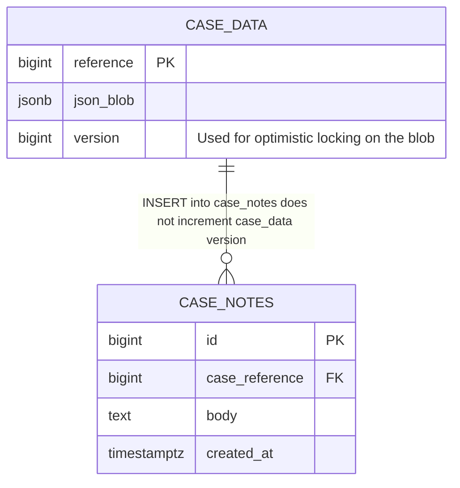

## Goals

* Preserve CCD’s global optimistic lock around the existing case_data JSON blobs.
* Facilitate alternative concurrency models for service-managed data.

## Unchanged: Global optimistic lock on the case_data JSON blob

As now, concurrent modifications to the case_data blob are prevented via an optimistic locking strategy; stale events will be rejected with an HTTP 409 Conflict.

A refinement is that the case_data version number is only incremented if the JSON blob actually changes, providing the foundation for the next section.

## New: Concurrent events

It is now possible to implement events that submit concurrently, i.e. enabling multiple parties to upload evidence at the same time or staff to add case notes without causing conflicts for other users working on the case.

Such scenarios are possible by managing portions of case data _outside_ of the case_data JSON blob using an appropriate concurrency model (e.g. dedicated tables and INSERT statements).

Such events must necessarily avoid modifying the case_data blob or 409 conflicts will continue to arise.

### Concurrency — but not parallelism

All case events execute under a case-level lock wrapped in a database transaction.

Viewers still get a coherent, monotonic history (“what happened, and in what order”), regardless of which tables an event touched.

If, for example, a blob update and a case note insertion were to race, one acquires the case lock first. The other waits, then runs, and both succeed. The event log reflects the order they committed and accurately reflects the changes each made.

Note that this is a tightening of CCD's current implementation which allows multiple event submissions to run in parallel, only one of which will commit.
