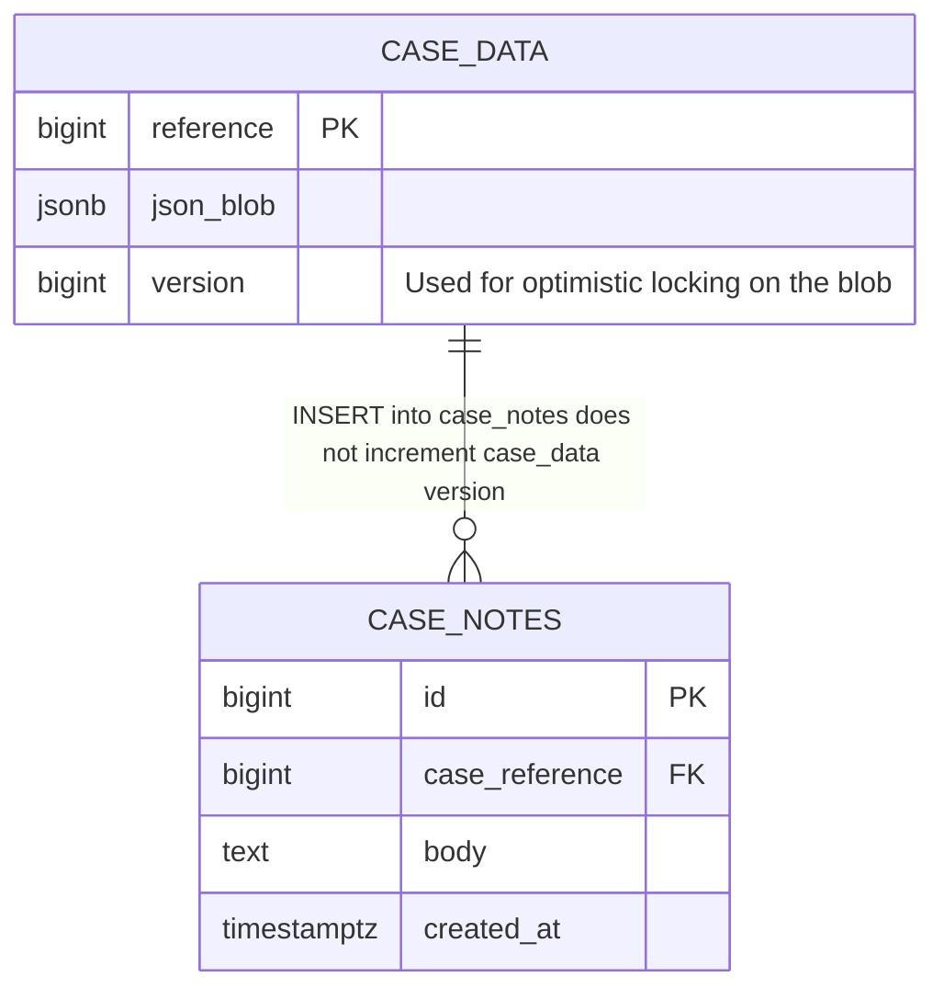

## Goals

* Preserve CCD’s global optimistic lock around the existing case_data JSON blobs.
* Facilitate alternative concurrency models for service-managed data.

## Unchanged: Global optimistic lock on the case_data JSON blob

As now, concurrent modifications to the case_data blob are prevented via an optimistic locking strategy; stale events will be rejected with an HTTP 409 Conflict.

A refinement is that the case_data version number is only incremented if the JSON blob actually changes, providing the foundation for the next section.

## New: Concurrent events

It is now possible to implement events that submit concurrently, i.e. enabling multiple parties to upload evidence at the same time or staff to add case notes without causing conflicts for other users working on the case.

Such scenarios are possible by managing portions of case data _outside_ of the case_data JSON blob using an appropriate concurrency model (e.g. dedicated tables and INSERT statements).

Such events must necessarily avoid modifying the case_data blob or 409 conflicts will continue to arise.

```mermaid
erDiagram
  CASE_DATA ||--o{ CASE_NOTES : "INSERT into case_notes does not increment case_data version"

  CASE_DATA {
    bigint reference PK
    jsonb  json_blob
    bigint version "Used for optimistic locking on the blob"
  }
  CASE_NOTES {
    bigint id PK
    bigint case_reference FK
    text   body
    timestamptz created_at
  }
```

### Concurrency — but not parallelism

All case events execute under a case-level lock wrapped in a database transaction.

Viewers still get a coherent, monotonic history (“what happened, and in what order”), regardless of which tables an event touched.

If, for example, a blob update and a case note insertion were to race, one acquires the case lock first. The other waits, then runs, and both succeed. The event log reflects the order they committed and accurately reflects the changes each made.

Note that this is a tightening of CCD's current implementation which allows multiple event submissions to run in parallel, only one of which will commit.

### TTL updates

The resolved expiry date is stored in the `case_data.resolved_ttl` column and is written in the same transaction as the
rest of the event. The case-level lock serialises these writes, and `case_revision` advances for every committed update so
that the resulting event history and CCD's case pointer can be processed in commit order. CCD only applies a returned
resolved TTL to its case pointer when the service revision is newer than the revision it has already processed, preventing
out-of-order responses from restoring an older value.

The `case_data.version` column remains the optimistic lock for the legacy JSON blob; a TTL column update does not, by
itself, increment that version. Events configured using CCD's TTL increment are not normally column-only updates: CCD also
updates `data.TTL.SystemTTL`, and the SDK's legacy submission path persists that changed JSON. If two such events start from
the same blob version, the first event acquires the lock and advances the version when it commits. The second event then
fails the version condition and the whole update, including `resolved_ttl`, is rejected with HTTP 409. TTL events that
change case state receive the same protection through the state change.

A native submit handler can instead produce a genuine metadata-only TTL update by leaving the legacy blob, state and
security classification unchanged. Such updates are serialised and ordered by `case_revision`, but they do not invalidate
the unchanged blob version: if more than one is accepted, the last committed TTL wins. Services must apply any stronger
concurrency policy required by data they manage outside the legacy blob.
