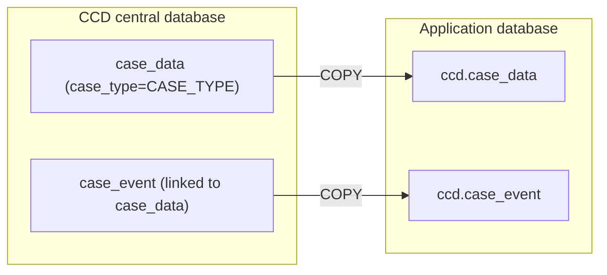

# Data migration guide

This page outlines the steps necessary to migrate an existing centralised CCD case type from CCD's database into the service's own database.



# Pre-migration checklist

## Service team

Your application must be either shuttered or put into a read-only state for the migrating case type(s), to prevent further case events being created during the migration.

### 1. Ensure your shuttered CCD definition is ready to import.

### 2. Ready any frontends for shuttering.

See [guide](https://hmcts.github.io/cloud-native-platform/path-to-live/shutter.html#shutter-implementation-and-design)

### 3. Prepare CCD Flux PR to flag your case type as decentralised.

[Example for special tribunals](https://github.com/hmcts/cnp-flux-config/pull/42025)

### 4. Prepare CCD Flux rollback PR to revert the above (for use if needed).

[Example for special tribunals](https://github.com/hmcts/cnp-flux-config/pull/42030)

## Platops

### 1. Copy migration script to bastion
  ```bash
  scp ./scripts/migrate-ccd-data.sh <bastion-host>:
  scp ./scripts/clean-target-case-data.sh <bastion-host>:
  ```

### 2. Obtain read-only source (CCD) and write (migrating application) Postgres connection strings

### 3. Prepare environment variables:
  ```bash
  export SRC_DSN=postgresql://.../datastore   # central CCD DB
  export DST_DSN=postgresql://.../myapp       # app DB
  export CASE_TYPE=MyCaseTypeId               # case type to migrate
  ```

### 4. Run script's validation checks

Validation is the scripts default mode and does **not** move data. It:

* Verifies `psql` is present.
* Confirms connectivity to both source and destination databases
* Ensures the target has zero `ccd.case_data`/`ccd.case_event` rows for `CASE_TYPE`.

Run from bastion:
```bash
./scripts/migrate-ccd-data.sh
```

If the target is not empty, run the cleanup helper then re-validate:
```bash
./scripts/clean-target-case-data.sh
./scripts/migrate-ccd-data.sh
```

## On the night

### 1. Shutter the migrating application (service team)

Import the application's shuttered CCD definition to ensure the migrating application is read-only to all other clients.

### 2. Create a test case (service team)

Create a test case in the central CCD database for use in post-migration smoke tests.

### 3. Run data migration script (platops):
   ```bash
   ./scripts/migrate-ccd-data.sh --apply
   ```
   The script:
   * Copies `public.case_data` and linked `case_event` rows for `CASE_TYPE` into `ccd.case_data` / `ccd.case_event`.
   * Synchronises sequences (to ensure new service case event ids do not collide with existing ccd case events)
   * Prints source vs target row counts for the case type.

Benchmark: ~3,000 cases / 30,000 events completed in ~2 minutes in Perftest. Size the shutter window accordingly.

### 4. Merge CCD flux config PR to flag case type as decentralised ([example](https://github.com/hmcts/cnp-flux-config/pull/42025)).

### 5. Smoke test (Service team):
   * View a migrated case.
   * Edit a migrated case (callback round-trip to the new service).
   * Create a new case.
   * Elasticsearch indexing.
   * Service Bus message publishing (if applicable).

### 6. Go / No-go decision

### Go: 

Unshutter (service team).

### No-go: 

1. Merge the [pre-prepared](https://github.com/hmcts/cnp-flux-config/pull/42030) CCD flux revert (service team)
2. Unshutter (service team)

Note that the migration is non-destructive; the migrating CCD cases remain intact in CCD's database so the migration can be rolled back with a configuration change.
