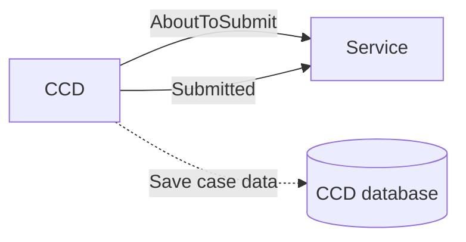
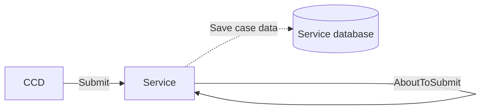

# CCD Event submission

## As-is recap

### AboutToSubmit callbacks

During event submission, CCD invokes the service's AboutToSubmit callback (if defined).

The callback is passed the complete case data as the payload, and the modified response is persisted by CCD verbatim.

### Submitted callbacks

Submitted callbacks (if defined) are invoked by CCD after CCD's database transaction commits.

## Decentralised

AboutToSubmit and Submitted callbacks are consolidated into a single 'Submit' operation.

Submit combines validation and persistence in a single step; services can validate the incoming event payload, rejecting it or accepting and persisting it.

## Callback emulation

To keep existing applications working without large-scale changes, the SDK provides callback emulation.

Under this model, case events proceed as follows:

* In a database transaction
  * AboutToSubmit callbacks are invoked (if defined)
  * The resultant case data is persisted
  * A case_event audit history is written
* Post-transaction commit
  * Submitted callbacks are invoked (if defined)

From the perspective of application development, callbacks therefore continue to function as before.

> **Note**
>
> Emulated AboutToSubmit callbacks cannot add documents to cases.
>
> Decentralised services should add documents as input parameters to the event submission (eg. with a chained asynchronous event).
