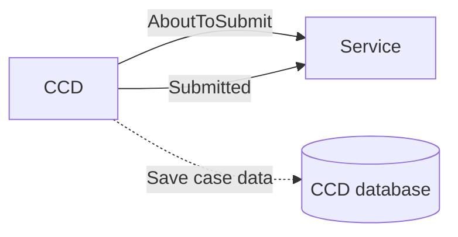
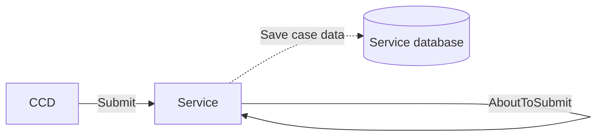

# CCD Event submission

## As-is

In the current CCD-hosted flow, CCD performs both callback invocations and persists the resulting case data snapshot directly into its own database.

### AboutToSubmit callbacks

Upon event submission CCD invokes the service's AboutToSubmit callback (if defined).

AboutToSubmit callbacks are passed the complete case data as payload and may return a modified response at will.

The resulting modified case data is persisted verbatim by CCD to its database as a singular JSON document.

### Submitted callbacks

Submitted callbacks (if defined) are invoked by CCD after database transaction commit.

## Decentralised

AboutToSubmit & Submitted callbacks are consolidated into a single 'Submit' operation.

Since the service now owns the database transaction a two phase before/after model is unnecessary.

Submit combines validation & persistence in a single step; services can validate the incoming event payload, reject or accept & persist it.

## Callback emulation

To keep existing applications working without large scale changes the SDK provides callback emulation.

Under this model case events proceed as follows:

* In a database transaction
  * AboutToSubmit callbacks are invoked (if defined)
  * The resultant case data is persisted
  * A case_event audit history is written
* Post transaction commit
  * Submitted callbacks are invoked (if defined)

From the perspective of application development callbacks therefore continue to function as before.
