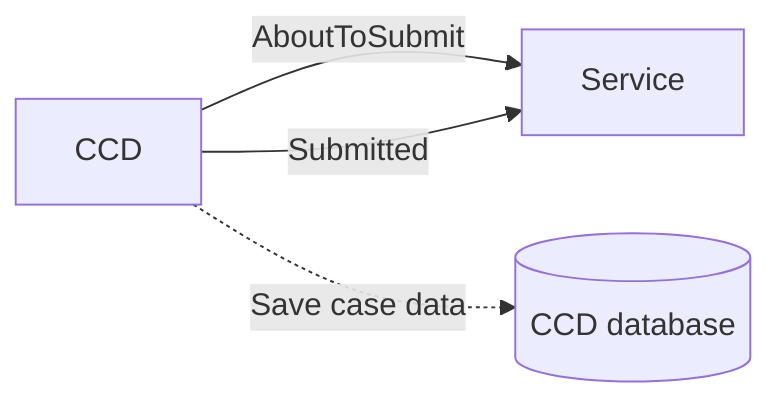
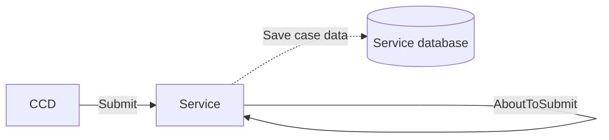

# CCD Event submission

## As-is recap

```mermaid
graph LR
    CCDNode[CCD]
    ServiceNode[Service]
    CCDDatabase[(CCD database)]

    CCDNode -- AboutToSubmit --> ServiceNode
    CCDNode -- Submitted --> ServiceNode
    CCDNode -. Save case data .-> CCDDatabase
```

### AboutToSubmit callbacks

During event submission, CCD invokes the service's AboutToSubmit callback (if defined).

The callback is passed the complete case data as the payload, and the modified response is persisted by CCD verbatim.

### Submitted callbacks

Submitted callbacks (if defined) are invoked by CCD after CCD's database transaction commits.

## Decentralised

```mermaid
graph LR
    CCDNode[CCD]
    ServiceNode[Service]
    ServiceDatabase[(Service database)]

    CCDNode -- Submit --> ServiceNode
    ServiceNode -->|Submitted callback| ServiceNode
    ServiceNode -->|AboutToSubmit| ServiceNode
    ServiceNode -. Save case data .-> ServiceDatabase
```

AboutToSubmit and Submitted callbacks are consolidated into a single 'Submit' operation.

Submit combines validation and persistence in a single step; services can validate the incoming event payload, rejecting it or accepting and persisting it.

## Callback emulation

To keep existing applications working without large-scale changes, the SDK provides callback emulation.

Under this model, case events proceed as follows:

* In a database transaction
  * AboutToSubmit callbacks are invoked (if defined)
  * The resultant case data is persisted
  * A case_event audit history is written
* Post-transaction commit
  * Submitted callbacks are invoked (if defined)

From the perspective of application development, callbacks therefore continue to function as before.

> **Note**
>
> CDAM attachment is separate from upload/storage. A document can be uploaded before it is attached to a case.
>
> CCD can attach documents it can see before it delegates a decentralised submit to the service. If the service
> generates, uploads, bundles, or otherwise introduces a new durable document reference during its own submit handling,
> the service must own CDAM attach for that document before committing the case data.
>
> The invariant is: do not commit case data containing a new document reference until CDAM attach has succeeded for the
> same case id, case type and jurisdiction. Where possible, add documents as event input so CCD can attach them before
> delegation. Where that is not possible, the decentralised service needs scoped CDAM `ATTACH` permission. See the
> [decentralised runtime transaction boundary](./decentralised-runtime.md#transaction-control), and the ET/SP Tribs
> permission example:
> [hmcts/ccd-case-document-am-api#776](https://github.com/hmcts/ccd-case-document-am-api/pull/776).
