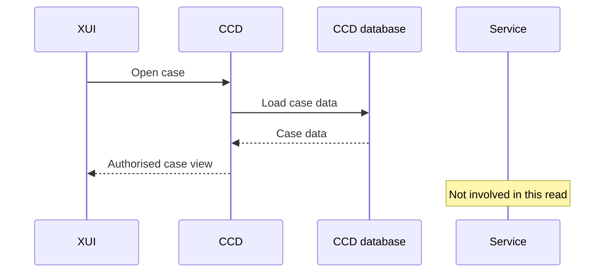
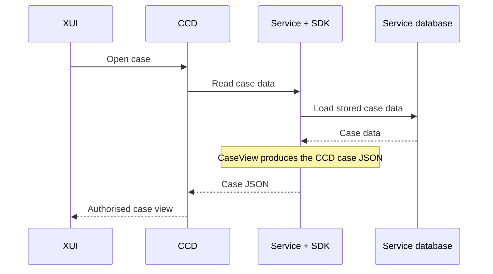
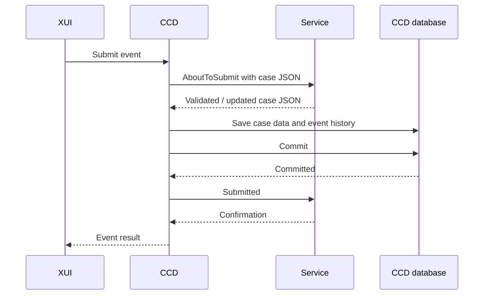
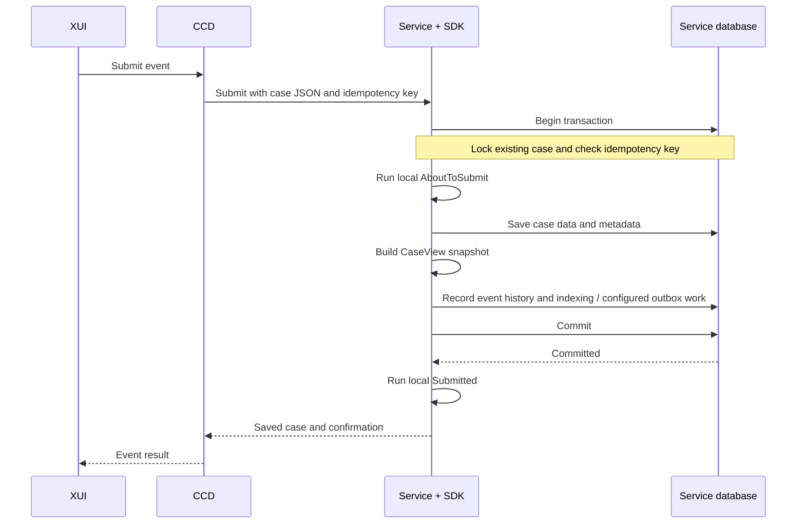

# Decentralisation for existing services

Decentralisation changes both how CCD saves a case and how it reads one. Your service becomes part of the read path,
including when a user simply opens a case in XUI without triggering an event or callback.

## Reading case data

### As-is: CCD reads from its database

When a user opens a case, XUI requests it from CCD. CCD loads the case data from its own database and returns the
authorised case view to XUI. The service is not involved in this case-data read; it is called separately when an event
requires a callback.


```mermaid
sequenceDiagram
    participant XUI
    participant CCD
    participant CCDDB as CCD database
    participant Service

    XUI->>CCD: Open case
    CCD->>CCDDB: Load case data
    CCDDB-->>CCD: Case data
    CCD-->>XUI: Authorised case view
    Note over Service: Not involved in this read
```

### Decentralised: CCD reads through your service

XUI continues to request the case from CCD. For a decentralised case type, CCD delegates the case-data read to your
service's persistence API. The SDK loads the stored case and uses your `CaseView` to produce the case JSON that CCD
needs. CCD continues to enforce access rules before returning the case view to XUI.


```mermaid
sequenceDiagram
    participant XUI
    participant CCD
    participant Service as Service + SDK
    participant ServiceDB as Service database

    XUI->>CCD: Open case
    CCD->>Service: Read case data
    Service->>ServiceDB: Load stored case data
    ServiceDB-->>Service: Case data
    Note over Service: CaseView produces the CCD case JSON
    Service-->>CCD: Case JSON
    CCD-->>XUI: Authorised case view
```

An existing service can initially have its `CaseView` return the stored JSON unchanged. It can later assemble the same
CCD JSON shape from service-owned tables. See [Case views](./decentralised-runtime.md#case-views).

### Your service is now in the read path

Case reads now depend on your service, its database and its `CaseView` implementation, even when no callback is running.

* Service or database downtime can prevent users from opening cases, even if CCD is healthy.
* Slow database queries or additional dependencies in `CaseView` affect how quickly users can open a case. Keep views
  read-only and account for read traffic when sizing the service and its database connection pool.
* Monitor case-read errors and latency alongside callback and submission failures. Include existing-case reads in
  release checks alongside callback tests.

CCD's [routing configuration](./routing-configuration.md) determines which case types use this path. These diagrams
describe loading an individual case; search is covered [below](#case-search).

## CCD Event submission

The following diagrams show a successful submission with AboutToSubmit and Submitted callbacks configured. Both
callbacks are optional. AboutToStart and MidEvent continue through their existing CCD callback paths.

### As-is: CCD saves to its database

XUI submits the event to CCD. CCD enforces the configured access and event rules, calls the service's AboutToSubmit
callback, and saves the returned case data and event history in the central database. Once that transaction commits,
CCD calls Submitted and returns the result to XUI.


```mermaid
sequenceDiagram
    participant XUI
    participant CCD
    participant Service
    participant CCDDB as CCD database

    XUI->>CCD: Submit event
    CCD->>Service: AboutToSubmit with case JSON
    Service-->>CCD: Validated / updated case JSON
    CCD->>CCDDB: Save case data and event history
    CCD->>CCDDB: Commit
    CCDDB-->>CCD: Committed
    CCD->>Service: Submitted
    Service-->>CCD: Confirmation
    CCD-->>XUI: Event result
```

The service supplies the updated JSON, but CCD owns the case commit. Any writes the callback makes to the service's
own database are in a separate transaction from CCD's case persistence.

### Decentralised: your service saves to its database

XUI still submits the event to CCD, which continues to enforce the configured access and event rules. CCD delegates
persistence through a single Submit operation. The SDK runs the existing callbacks around the service's database
transaction: AboutToSubmit before the commit, then Submitted after it.


```mermaid
sequenceDiagram
    participant XUI
    participant CCD
    participant Service as Service + SDK
    participant ServiceDB as Service database

    XUI->>CCD: Submit event
    CCD->>Service: Submit with case JSON and idempotency key
    Service->>ServiceDB: Begin transaction
    Note over Service,ServiceDB: Lock existing case and check idempotency key
    Service->>Service: Run local AboutToSubmit
    Service->>ServiceDB: Save case data and metadata
    Service->>Service: Build CaseView snapshot
    Service->>ServiceDB: Record event history and indexing / configured outbox work
    Service->>ServiceDB: Commit
    ServiceDB-->>Service: Committed
    Service->>Service: Run local Submitted
    Service-->>CCD: Saved case and confirmation
    CCD-->>XUI: Event result
```

This shows callbacks implemented in the service itself. For JSON-backed services such as ET, the SDK invokes local
controller methods directly so AboutToSubmit can share the persistence transaction. Callbacks to other services remain
HTTP calls. See [JSON runtime](./json-runtime.md#local-and-external-callbacks).

### Your service now owns the case commit

* Service-owned table writes made in the same transaction as AboutToSubmit can commit or roll back with case data and
  history. Validation errors or persistence failures roll back that transaction.
* Keep work inside the transaction short: existing-case submissions hold a case lock, so slow callbacks can delay other
  events on the same case. Stale updates to the shared JSON blob still receive a 409 conflict; moving persistence does
  not remove that protection. See [concurrency](./concurrency.md).
* Submitted runs after the case has committed. Its failure cannot undo the saved case. External effects such as emails
  or remote API calls are outside the database transaction and need their own retry and recovery handling.
* Indexing and message delivery happen asynchronously after commit. A successful save does not mean search or a
  downstream consumer has caught up.

The SDK checks the idempotency key so a retry of a committed submission can return the saved event result without
running the callbacks again. This prevents repeating the case change; it does not guarantee completion of external
work from Submitted. See [the decentralised runtime](./decentralised-runtime.md#idempotency).

## Case search

CCD Data Store still exposes a legacy case-search path backed by the central Postgres `case_data` table.

The following CCD endpoints cannot be used to search for cases owned by a decentralised service:

| Method and path |
| --- |
| [`GET /caseworkers/{uid}/jurisdictions/{jid}/case-types/{ctid}/cases`](https://github.com/hmcts/ccd-data-store-api/blob/master/src/main/java/uk/gov/hmcts/ccd/endpoint/std/CaseDetailsEndpoint.java#L431) |
| [`GET /citizens/{uid}/jurisdictions/{jid}/case-types/{ctid}/cases`](https://github.com/hmcts/ccd-data-store-api/blob/master/src/main/java/uk/gov/hmcts/ccd/endpoint/std/CaseDetailsEndpoint.java#L451) |
| [`GET /caseworkers/{uid}/jurisdictions/{jid}/case-types/{ctid}/cases/pagination_metadata`](https://github.com/hmcts/ccd-data-store-api/blob/master/src/main/java/uk/gov/hmcts/ccd/endpoint/std/CaseDetailsEndpoint.java#L475) |
| [`GET /citizens/{uid}/jurisdictions/{jid}/case-types/{ctid}/cases/pagination_metadata`](https://github.com/hmcts/ccd-data-store-api/blob/master/src/main/java/uk/gov/hmcts/ccd/endpoint/std/CaseDetailsEndpoint.java#L487) |
| [`GET /aggregated/caseworkers/{uid}/jurisdictions/{jid}/case-types/{ctid}/cases`](https://github.com/hmcts/ccd-data-store-api/blob/master/src/main/java/uk/gov/hmcts/ccd/endpoint/ui/QueryEndpoint.java#L156) |

Decentralised services should either use CCD's elasticsearch endpoints or, for system access, query their database directly.

## Callback emulation

To keep existing applications working without large-scale changes, the SDK provides callback emulation.

Under this model, case events proceed as follows:

* In a database transaction
  * AboutToSubmit callbacks are invoked (if defined)
  * The resultant case data is persisted
  * A case_event audit history is written
* Post-transaction commit
  * Submitted callbacks are invoked (if defined)

From the perspective of application development, callbacks therefore continue to function as before.

> **Note**
>
> CDAM attachment is separate from upload/storage. A document can be uploaded before it is attached to a case.
>
> CCD can attach documents it can see before it delegates a decentralised submit to the service. The SDK also mirrors
> CCD's central attach behaviour for documents newly introduced by an about-to-submit callback response, provided the
> callback returns the CDAM `document_hash` alongside the document reference.
>
> The invariant is: do not commit case data containing a new document reference until CDAM attach has succeeded for the
> same case id, case type and jurisdiction. The SDK only attaches documents that are new in the about-to-submit callback
> result; documents already present as event input are not re-attached by the SDK.
>
> When CDAM attach is enabled, the decentralised runtime requires the service application to provide an
> `AuthTokenGenerator` bean. The SDK does not create an S2S token generator itself; it uses the service's configured S2S
> identity for the `ServiceAuthorization` header on the CDAM attach call. The attach call itself uses the standard
> `ccd-case-document-am-client`; services do not need to implement their own CDAM attach client. That service identity
> still needs scoped CDAM `ATTACH` permission. See the
> [decentralised runtime transaction boundary](./decentralised-runtime.md#transaction-control), and the ET/SP Tribs
> permission example:
> [hmcts/ccd-case-document-am-api#776](https://github.com/hmcts/ccd-case-document-am-api/pull/776).
>
> A typical service configuration is:
>
> ```java
> @Bean
> AuthTokenGenerator serviceAuthTokenGenerator(
>     @Value("${idam.s2s-auth.secret}") String secret,
>     @Value("${idam.s2s-auth.microservice}") String microService,
>     ServiceAuthorisationApi serviceAuthorisationApi
> ) {
>   return AuthTokenGeneratorFactory.createDefaultGenerator(
>       secret,
>       microService,
>       serviceAuthorisationApi,
>       Duration.ofMinutes(5)
>   );
> }
> ```
