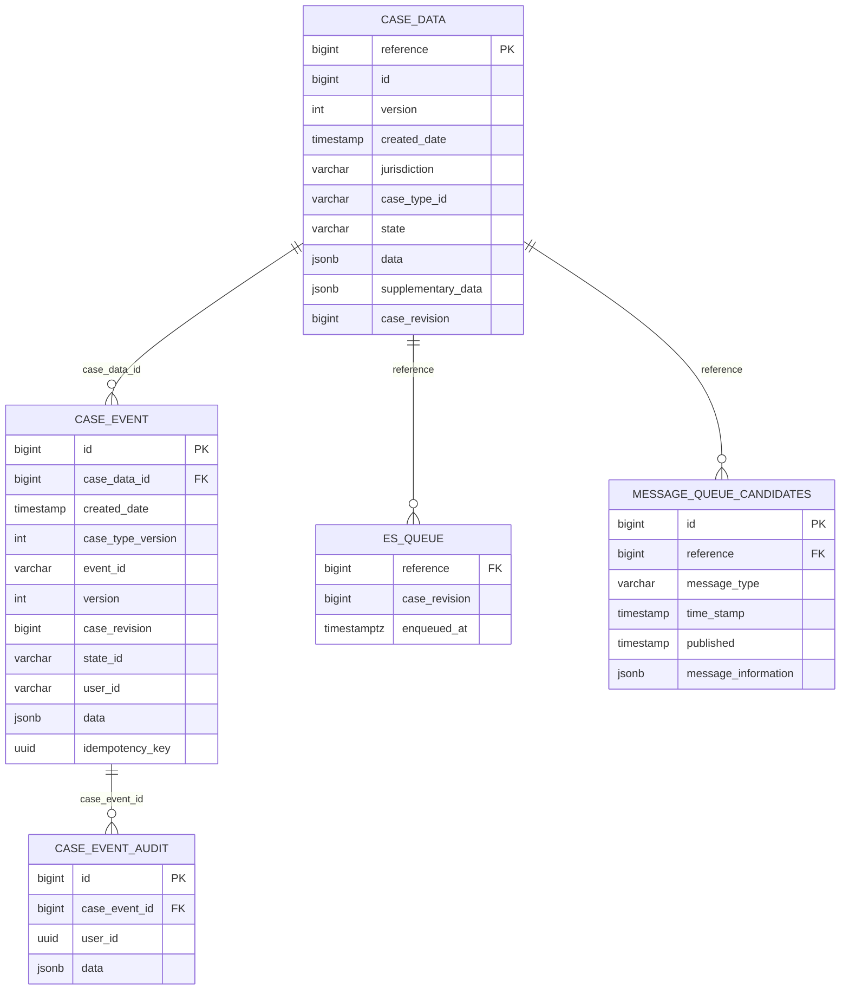
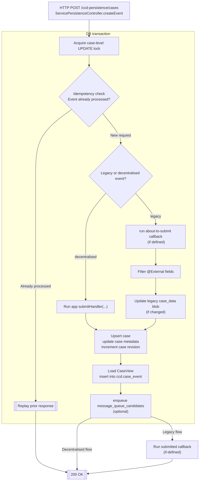

# Decentralised Runtime

The decentralised runtime provides an out-of-the-box implementation of CCD’s decentralised persistence APIs so service
teams can shift case ownership without rebuilding everything from scratch.

## Onboarding

Opt in via the Gradle `ccd {}` block:

```groovy
ccd {
  configDir = file('build/definitions')
  decentralised = true
}
```

Setting `decentralised = true` adds the [decentralised-runtime](../sdk/decentralised-runtime) as a dependency to your project.

## Case views

Services must provide a [`CaseView<CaseType, StateEnum>`](../sdk/decentralised-runtime/src/main/java/uk/gov/hmcts/ccd/sdk/CaseView.java) implementation per case type.

Your CaseView is the mechanism through which CCD accesses your case data: CCD provides a case reference, and your view must return a result in the format defined by your CCD definition.

How your view does this is an implementation detail; it could load a JSON blob, enrich the existing blob, or compose it from a
fully structured set of tables; the CaseView is now an API contract rather than a literal data model.

Case views can also inject dynamically rendered HTML/Markdown at runtime, avoiding the need to store presentation
fragments in the database.

> **Mandatory:** Every decentralised case type must have an associated `CaseView`. Register separate beans per case type;
> the runtime fails fast if it cannot match a case type to a view or if multiple views match the same case type.

## Data persistence

The runtime provides a data persistence layer to handle the functions previously performed centrally by CCD.

### case_data & metadata persistence

Case records are persisted and updated in the `ccd.case_data` table, including legacy JSON blobs and other case metadata.

### Event history

Snapshots are recorded in the `ccd.case_event` table upon conclusion of each case event.

### Optimistic locking of legacy JSON blobs

The SDK implements optimistic locking on the legacy JSON blob in `ccd.case_data` via the `version` column.

Concurrent changes to these blobs will be rejected as they are now by centralised CCD.

> Decentralised services are responsible for implementing appropriate concurrency controls for data persisted outside of this blob


### Idempotency

The SDK implements the required idempotency model for CCD's persistence API.

Completed requests are associated with their idempotency key in the `ccd.case_event.idempotency_key` column.

If an incoming request has already been processed, the runtime replays the stored response.

### SDK managed database schema

To fulfil the aforementioned responsibilities, the SDK provisions and manages a dedicated `ccd` schema within your application's database.

- `case_data` mirrors CCD’s `case_data` table, including metadata such as state, security classification, TTL and the JSON payload.
- `case_event` mirrors CCD’s `case_event` table and adds an idempotency key.
- `es_queue` tracks cases that require Elasticsearch indexing 
- `message_queue_candidates` mirrors CCD’s Service Bus transactional outbox table.




## Elasticsearch indexing

The SDK maintains a queue of cases requiring Elasticsearch indexing in `ccd.es_queue`.


## Transaction control

The SDK wraps every case event inside a database transaction covering:

- idempotency check and case-level lock acquisition
- Invocation of the AboutToSubmit callback (if defined)
- upsert of `ccd.case_data`
- insert into `ccd.case_event` (audit history)
- insert into the Elasticsearch queue table

The orchestration lives in [`CaseSubmissionService`](../sdk/decentralised-runtime/src/main/java/uk/gov/hmcts/ccd/sdk/impl/CaseSubmissionService.java). If a concurrent update to `ccd.case_data` is detected, a `409 CONFLICT` is returned and the transaction rolls back, aligning behaviour with CCD.

## Supplementary data

Supplementary data operations are implemented and persisted in the `ccd.case_data` table via [`SupplementaryDataService`](../sdk/decentralised-runtime/src/main/java/uk/gov/hmcts/ccd/sdk/impl/SupplementaryDataService.java), using PostgreSQL’s JSON functions to apply `$set`/`$inc` style updates atomically.

## Message publishing to Azure Service Bus

A transactional outbox-based `message_queue_candidates` table is maintained and written to based on your CCD definition, mirroring CCD's implementation.

The SDK's `ccd-servicebus-support` module provides:

- a `JmsTemplate` configured for Azure Service Bus
- a scheduled publisher (`CcdCaseEventScheduler`) governed by the `ccd.servicebus.*` properties
- a startup validator that simply opens a producer on the configured destination and closes it immediately.

The validator runs during application boot and fails the service fast if the topic does not exist or the supplied credentials lack `Send` rights.

## Event submission flow


