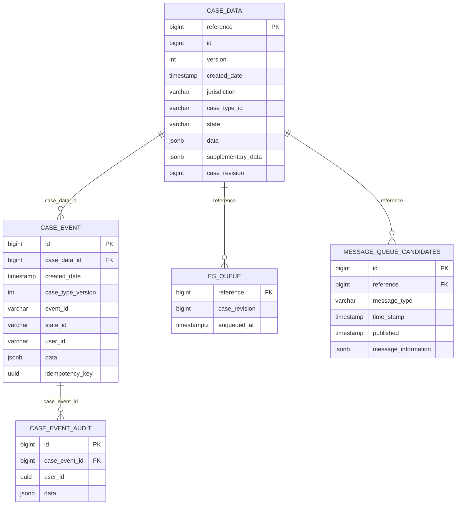

# Decentralised Runtime

The decentralised runtime provides an out-of-the-box implementtion of CCD’s decentralised persistence APIs so service
teams can shift case ownership without rebuilding everything from scratch.

## Onboarding

Opt in via the Gradle `ccd {}` block:

```groovy
ccd {
  configDir = file('build/definitions')
  decentralised = true
  // optional: runtimeIndexing = true // pulls in the SDK Elasticsearch indexer
}
```

Setting `decentralised = true` adds the [decentralised-runtime](../sdk/decentralised-runtime) as a dependency to your project.

## Case views

Services must provide a [`CaseView<ViewType, StateEnum>`](../sdk/decentralised-runtime/src/main/java/uk/gov/hmcts/ccd/sdk/CaseView.java)
implementation.

Your view implementation is the mechanism by which CCD reads case data for your case type; CCD provides the case reference to retrieve and your view must return a result in the format defined by your CCD definition.

How your view does this is an implementation detail; it could load a JSON blob, enrich the existing blob, or compose it from a
fully structured set of tables; the CaseView is now an API contract rather than a literal data model.

Case views can also inject dynamically rendered HTML/Markdown at runtime, avoiding the need to store presentation
fragments in the database.

> **Mandatory:** decentralised services must expose exactly one Spring-managed `CaseView` bean. The application fails fast
> at startup if no view is registered.

## Database schema

Flyway migrations under [`sdk/decentralised-runtime/src/main/resources/dataruntime-db`](../sdk/decentralised-runtime/src/main/resources/dataruntime-db)
provision a dedicated `ccd` schema within your application with the structures needed to mirror existing CCD behaviour under the decentralised model:

- `case_data` mirrors CCD’s `case_data` table, including metadata such as state, security classification, TTL and the JSON payload.
- `case_event` mirrors CCD’s `case_event` table and adds an idempotency key
- `es_queue` tracks cases that require Elasticsearch indexing 
- `message_queue_candidates` mirrors CCD’s Service Bus transactional outbox table.

### SDK managed Schema overview

The SDK managed database schema is illustrated here for reference. Note that it is created & maintained by the SDK automatically, serving as an 'out of the box' implementation for the new responsibilities your service assumes under decentralised persistence.



## Elasticsearch indexing

The SDK maintains a queue of cases requiring Elasticsearch indexing in `ccd.es_queue`.

## Idempotency

The SDK implements the required idempotency model of CCD's persistence API.

If an incoming idempotency key has already been processed the runtime replays the stored response; otherwise the request continues and the ide
mpotency key is persisted alongside
-the new event.

## Transaction control

The SDK wraps every case event inside a database transaction covering:

- idempotency check & case-level lock acquisition
- Invocation of AboutToSubmit callback (if defined)
- upsert of ccd.case_data,
- insert into ccd.case_event (audit history)
- insert into Elasticsearch queue table

The orchestration lives in [`CaseSubmissionService`](../sdk/decentralised-runtime/src/main/java/uk/gov/hmcts/ccd/sdk/CaseSubmissionService.java). If a concurrent update to `ccd.case_data` is detected a `409 CONFLICT` is returned and the transaction rolls back, aligning behaviour with CCD.

## Supplementary data

Supplementary data operations are implemented and persisted in the `ccd.case_data` table via [`SupplementaryDataService`](../sdk/decentralised-runtime/src/main/java/uk/gov/hmcts/ccd/sdk/SupplementaryDataService.java), using PostgreSQL’s JSON functions to apply `$set`/`$inc` style updates atomically.

## Message publishing to Azure Servicebus

A transactional-outbox based `message_queue_candidates` table is maintained and written to based upon your CCD definition, mirroring CCD's implementation.
