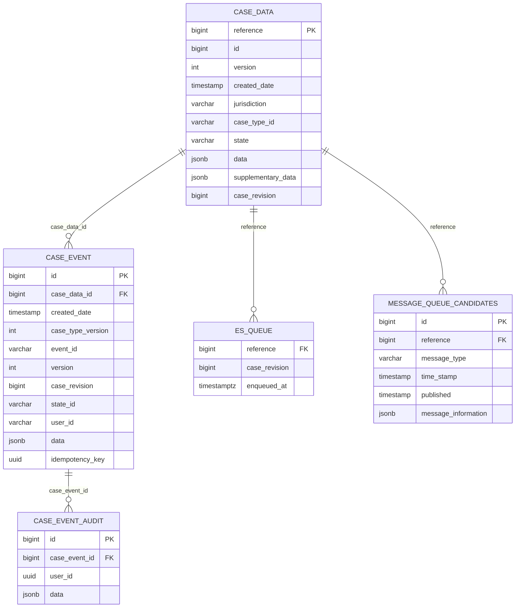
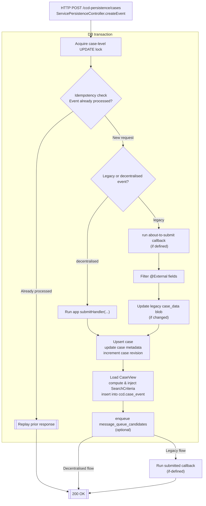

# Decentralised Runtime

The decentralised runtime provides an out-of-the-box implementation of CCD’s decentralised persistence APIs so service
teams can shift case ownership without rebuilding everything from scratch.

## Onboarding

Opt in via the Gradle `ccd {}` block:

```groovy
ccd {
  configDir = file('build/definitions')
  decentralised = true
}
```

Setting `decentralised = true` adds the [decentralised-runtime](../sdk/decentralised-runtime) as a dependency to your project.

## Case views

Services must provide a [`CaseView<CaseType, StateEnum>`](../sdk/decentralised-runtime/src/main/java/uk/gov/hmcts/ccd/sdk/CaseView.java) implementation per case type.

Your CaseView is the mechanism through which CCD accesses your case data: CCD provides a case reference, and your view must return a result in the format defined by your CCD definition.

How your view does this is an implementation detail; it could load a JSON blob, enrich the existing blob, or compose it from a
fully structured set of tables; the CaseView is now an API contract rather than a literal data model.

Case views can also inject dynamically rendered HTML/Markdown at runtime, avoiding the need to store presentation
fragments in the database.

If configured in your CCD definition, the SDK computes and sets `SearchCriteria` for Global Search following CaseView loading, based on your CCD definition and the data returned by your view, which will subsequently be indexed into Elasticsearch.

> **Mandatory:** Every decentralised case type must have an associated `CaseView`. Register separate beans per case type;
> the runtime fails fast if it cannot match a case type to a view or if multiple views match the same case type.

## Data persistence

The runtime provides a data persistence layer to handle the functions previously performed centrally by CCD.

### case_data & metadata persistence

Case records are persisted and updated in the `ccd.case_data` table, including legacy JSON blobs and other case metadata.

### Event history

Snapshots are recorded in the `ccd.case_event` table upon conclusion of each case event.

### Event metadata

Decentralised services can set the event history summary and description from server-side event handling. This is useful
when the metadata should be derived from the selected case data rather than typed manually in XUI.

For an emulated AboutToSubmit callback:

```java
return AboutToStartOrSubmitResponse.<CaseData, State>builder()
    .data(caseData)
    .eventMetadata(EventMetadata.builder()
        .summary("Selected documents added")
        .description("Documents: application.pdf, evidence.pdf")
        .build())
    .build();
```

For a decentralised submit handler:

```java
return SubmitResponse.<State>builder()
    .eventMetadata(EventMetadata.builder()
        .summary("Selected documents added")
        .description("Documents: application.pdf, evidence.pdf")
        .build())
    .build();
```

`EventMetadata` is consumed by the decentralised runtime when it writes `ccd.case_event`. It is SDK-internal metadata and
is not included in the callback response JSON returned to CCD.

### Optimistic locking of legacy JSON blobs

The SDK implements optimistic locking on the legacy JSON blob in `ccd.case_data` via the `version` column.

Concurrent changes to these blobs will be rejected as they are now by centralised CCD.

> Decentralised services are responsible for implementing appropriate concurrency controls for data persisted outside of this blob


### Idempotency

The SDK implements the required idempotency model for CCD's persistence API.

Completed requests are associated with their idempotency key in the `ccd.case_event.idempotency_key` column.

If an incoming request has already been processed, the runtime replays the stored response.

### SDK managed database schema

To fulfil the aforementioned responsibilities, the SDK provisions and manages a dedicated `ccd` schema within your application's database.

- `case_data` mirrors CCD’s `case_data` table, including metadata such as state, security classification, TTL and the JSON payload.
- `case_event` mirrors CCD’s `case_event` table and adds an idempotency key.
- `es_queue` tracks cases that require Elasticsearch indexing
- `message_queue_candidates` mirrors CCD’s Service Bus transactional outbox table.



```mermaid
erDiagram
    CASE_DATA {
        bigint reference PK
        bigint id
        int version
        timestamp created_date
        varchar jurisdiction
        varchar case_type_id
        varchar state
        jsonb data
        jsonb supplementary_data
        bigint case_revision
    }
    CASE_EVENT {
        bigint id PK
        bigint case_data_id FK
        timestamp created_date
        int case_type_version
        varchar event_id
        int version
        bigint case_revision
        varchar state_id
        varchar user_id
        jsonb data
        uuid idempotency_key
    }
    CASE_EVENT_AUDIT {
        bigint id PK
        bigint case_event_id FK
        uuid user_id
        jsonb data
    }
    ES_QUEUE {
        bigint reference FK
        bigint case_revision
        timestamptz enqueued_at
    }
    MESSAGE_QUEUE_CANDIDATES {
        bigint id PK
        bigint reference FK
        varchar message_type
        timestamp time_stamp
        timestamp published
        jsonb message_information
    }

    CASE_DATA ||--o{ CASE_EVENT : "case_data_id"
    CASE_EVENT ||--o{ CASE_EVENT_AUDIT : "case_event_id"
    CASE_DATA ||--o{ ES_QUEUE : "reference"
    CASE_DATA ||--o{ MESSAGE_QUEUE_CANDIDATES : "reference"
```

## Elasticsearch indexing

The SDK maintains a queue of cases requiring Elasticsearch indexing in `ccd.es_queue`.

- **Reindex helper:** `CaseReindexingService` (in `sdk/decentralised-runtime`) lets you count and enqueue cases modified since a given date. Autowire the bean and call `enqueueCasesModifiedSince(LocalDate)` to repopulate `ccd.es_queue` without bumping `case_revision`; the decentralised indexer uses `EXTERNAL_GTE` so same-revision rewrites are accepted while older revisions still conflict. A successful reindex automatically clears older `ccd.es_dead_letter_queue` rows for the same case reference and `index_id`.

The runtime indexer is provided by the `ccd-runtime-indexing` module when `runtimeIndexing = true`.
Configure the target cluster with `ELASTIC_SEARCH_HOSTS`; multiple hosts can be supplied as a comma-separated
list, for example `ELASTIC_SEARCH_HOSTS=http://es-1:9200,http://es-2:9200`.


## Transaction control

The SDK wraps every case event inside a database transaction covering:

- idempotency check and case-level lock acquisition
- Invocation of the AboutToSubmit callback (if defined)
- upsert of `ccd.case_data`
- insert into `ccd.case_event` (audit history)
- insert into the Elasticsearch queue table

The orchestration lives in [`CaseSubmissionService`](../sdk/decentralised-runtime/src/main/java/uk/gov/hmcts/ccd/sdk/impl/CaseSubmissionService.java). If a concurrent update to `ccd.case_data` is detected, a `409 CONFLICT` is returned and the transaction rolls back, aligning behaviour with CCD.

## Supplementary data

Supplementary data operations are implemented and persisted in the `ccd.case_data` table via [`SupplementaryDataService`](../sdk/decentralised-runtime/src/main/java/uk/gov/hmcts/ccd/sdk/impl/SupplementaryDataService.java), using PostgreSQL’s JSON functions to apply `$set`/`$inc` style updates atomically.

## Retention and disposal

The runtime provides an opt-in retention task for decentralised services that need to garbage-collect their local
`ccd.case_data` rows after CCD has removed the upstream pointer row.

Enable it explicitly:

```yaml
ccd:
  decentralised-runtime:
    retention:
      enabled: true
      disposal:
        case-type-ids: "MyCaseType"
        simulation-case-type-ids: ""
        batch-size: 100
      system-user:
        username: "system-update@example.com"
        password: "${SYSTEM_UPDATE_PASSWORD}"
  data-store:
    api:
      url: "http://ccd-data-store-api"
```

The task selects cases by `case_data.resolved_ttl < current_date`. It does not inspect case-link fields or expand linked
case groups.

Before local deletion it checks that CCD has already removed the upstream pointer row. The candidate query reads
`reference`, `case_type_id`, `jurisdiction` and `resolved_ttl` from each matching local `ccd.case_data` row, so the
jurisdiction used for the upstream check is inferred from the case row itself rather than configured separately. Cases
are grouped by that stored jurisdiction and de-duplicated before the upstream checks are made.

The upstream check currently uses CCD Data Store's existing caseworker retrieve-case endpoint, authenticated with the
configured system user's IDAM token plus the service's S2S token:

```http
GET /caseworkers/{uid}/jurisdictions/{jurisdiction}/case-types/{caseTypeId}/cases/{caseReference}
Authorization: Bearer <system-user-idam-token>
ServiceAuthorization: Bearer <s2s-token>
```

For each candidate case, a `200` response means CCD still has the pointer row, so local deletion is skipped. A `404`
response means CCD no longer has the pointer row, so the local row can be deleted. Any other CCD response is treated as
uncertain and the local row is skipped so the service does not delete local data while CCD may still have a pointer to
it.

Consumers must provide the retention system user's username and password, and S2S token generation either via an
`AuthTokenGenerator` bean or via the standard `ServiceAuthorisationApi` plus `idam.s2s-auth.secret` and
`idam.s2s-auth.microservice` properties.

### Running as a scheduled job

Retention is exposed as a `Runnable` bean named `caseRetentionTask`. In services that use the standard HMCTS scheduled
task runner pattern, the Kubernetes job should set `TASK_NAME: CaseRetentionTask`; the runner lowercases the first
character and resolves the Spring bean.

In `cnp-flux-config`, add a cron HelmRelease alongside the consuming service, following the typical pattern.
The cron should run the same service image as the API so it has the same application code,
database migrations and Spring configuration:

```yaml
apiVersion: helm.toolkit.fluxcd.io/v2
kind: HelmRelease
metadata:
  name: my-service-cron-retention-disposal
spec:
  releaseName: my-service-cron-retention-disposal
  values:
    job:
      image: hmctsprod.azurecr.io/my-service/case-api:prod-abc123 #{"$imagepolicy": "flux-system:my-service-case-api"}
      keyVaults:
        my-service:
          secrets:
            - name: s2s-case-api-secret
              alias: S2S_SECRET
            - name: idam-systemupdate-username
              alias: IDAM_SYSTEM_UPDATE_USERNAME
            - name: idam-systemupdate-password
              alias: IDAM_SYSTEM_UPDATE_PASSWORD
            - name: my-service-POSTGRES-HOST
              alias: POSTGRES_HOST
            - name: my-service-POSTGRES-PORT
              alias: POSTGRES_PORT
            - name: my-service-POSTGRES-DATABASE
              alias: POSTGRES_NAME
            - name: my-service-POSTGRES-USER
              alias: POSTGRES_USERNAME
            - name: my-service-POSTGRES-PASS
              alias: POSTGRES_PASSWORD
      environment:
        TASK_NAME: CaseRetentionTask
        CCD_DECENTRALISED_RUNTIME_RETENTION_ENABLED: true
        CCD_DECENTRALISED_RUNTIME_RETENTION_DISPOSAL_CASE_TYPE_IDS: MyCaseType
        CCD_DECENTRALISED_RUNTIME_RETENTION_DISPOSAL_BATCH_SIZE: 100
        CCD_DECENTRALISED_RUNTIME_RETENTION_SYSTEM_USER_USERNAME: $(IDAM_SYSTEM_UPDATE_USERNAME)
        CCD_DECENTRALISED_RUNTIME_RETENTION_SYSTEM_USER_PASSWORD: $(IDAM_SYSTEM_UPDATE_PASSWORD)
        CCD_DATA_STORE_API_URL: http://ccd-data-store-api
        IDAM_S2S_AUTH_SECRET: $(S2S_SECRET)
        IDAM_S2S_AUTH_MICROSERVICE: my_service_case_api
      schedule: 0 2 * * *
  chart:
    spec:
      chart: my-service-cron
      version: 1.0.0
      sourceRef:
        kind: HelmRepository
        name: hmctspublic
        namespace: flux-system
```

Add the base HelmRelease to the environment base kustomization, then patch the schedule and job kind per environment:

```yaml
apiVersion: helm.toolkit.fluxcd.io/v2
kind: HelmRelease
metadata:
  name: my-service-cron-retention-disposal
spec:
  releaseName: my-service-cron-retention-disposal
  values:
    job:
      schedule: "0 2 * * *"
    global:
      jobKind: CronJob
      enableKeyVaults: true
```

For a first rollout, configure `simulation-case-type-ids` instead of `case-type-ids` so the task logs the cases it would
delete without removing local rows. Move those case types to `case-type-ids` only after the schedule, credentials and CCD
pointer checks have been verified.

## Message publishing to Azure Service Bus

A transactional outbox-based `message_queue_candidates` table is maintained and written to based on your CCD definition, mirroring CCD's implementation.

The SDK's `ccd-servicebus-support` module provides:

- a `JmsTemplate` configured for Azure Service Bus
- a scheduled publisher (`CcdCaseEventScheduler`) governed by the `ccd.servicebus.*` properties
- a startup validator that simply opens a producer on the configured destination and closes it immediately.

The validator runs during application boot and fails the service fast if the topic does not exist or the supplied credentials lack `Send` rights.

## Event submission flow


```mermaid
flowchart TB
  A["HTTP POST /ccd-persistence/cases<br/>ServicePersistenceController.createEvent"] --> LOCK["Acquire case-level UPDATE lock"]

  subgraph TX [DB transaction]
    LOCK --> LCK{Idempotency check<br/>Event already processed?}
    LCK -->|Already processed| HIT[[Replay prior response]]
    LCK -->|New request| HANDLER{Legacy or decentralised event?}

    HANDLER -->|decentralised| NEW["Run app submitHandler(...)"]
    HANDLER -->|legacy| LEG["run about-to-submit callback</br> (if defined)"]

    LEG --> SNAP["Filter @External fields"]
    SNAP --> BLOB["Update legacy case_data blob</br>(if changed)"]
    NEW --> UPS
    BLOB --> UPS["Upsert case<br/>update case metadata</br>increment case revision"]

    UPS --> VIEW["Load CaseView</br>compute & inject SearchCriteria</br>insert into ccd.case_event"]
    VIEW --> BUS["enqueue message_queue_candidates</br>(optional)"]
  end

  HIT --> HTTP200[[200 OK]]
  BUS -->|Legacy flow| SUBM["Run submitted callback</br>(if-defined)"]
  BUS -->|Decentralised flow| HTTP200
  SUBM --> HTTP200

  click A "https://github.com/hmcts/dtsse-ccd-config-generator/blob/master/sdk/decentralised-runtime/src/main/java/uk/gov/hmcts/ccd/sdk/impl/ServicePersistenceController.java#L58" "ServicePersistenceController.java" _blank
  click C "https://github.com/hmcts/dtsse-ccd-config-generator/blob/master/sdk/decentralised-runtime/src/main/java/uk/gov/hmcts/ccd/sdk/impl/CaseSubmissionService.java#L36" "CaseSubmissionService.java" _blank
  click LOCK "https://github.com/hmcts/dtsse-ccd-config-generator/blob/master/sdk/decentralised-runtime/src/main/java/uk/gov/hmcts/ccd/sdk/impl/IdempotencyEnforcer.java#L31" "Acquire lock" _blank
  click LCK "https://github.com/hmcts/dtsse-ccd-config-generator/blob/master/sdk/decentralised-runtime/src/main/java/uk/gov/hmcts/ccd/sdk/impl/IdempotencyEnforcer.java#L22" "IdempotencyEnforcer.lockCaseAndGetExistingEvent" _blank
  click NEW "https://github.com/hmcts/dtsse-ccd-config-generator/blob/master/sdk/decentralised-runtime/src/main/java/uk/gov/hmcts/ccd/sdk/impl/DecentralisedSubmissionHandler.java#L27" "DecentralisedSubmissionHandler.apply" _blank
  click LEG "https://github.com/hmcts/dtsse-ccd-config-generator/blob/master/sdk/decentralised-runtime/src/main/java/uk/gov/hmcts/ccd/sdk/impl/LegacyCallbackSubmissionHandler.java#L51" "LegacyCallbackSubmissionHandler.apply" _blank
  click SNAP "https://github.com/hmcts/dtsse-ccd-config-generator/blob/master/sdk/decentralised-runtime/src/main/java/uk/gov/hmcts/ccd/sdk/impl/LegacyCallbackSubmissionHandler.java#L195" "snapshotWithFilteredFields" _blank
  click UPS "https://github.com/hmcts/dtsse-ccd-config-generator/blob/master/sdk/decentralised-runtime/src/main/java/uk/gov/hmcts/ccd/sdk/impl/CaseDataRepository.java#L105" "CaseDataRepository.upsertCase" _blank
  click VIEW "https://github.com/hmcts/dtsse-ccd-config-generator/blob/master/sdk/decentralised-runtime/src/main/java/uk/gov/hmcts/ccd/sdk/impl/CaseProjectionService.java#L52" "CaseProjectionService.load" _blank
  click AUD "https://github.com/hmcts/dtsse-ccd-config-generator/blob/master/sdk/decentralised-runtime/src/main/java/uk/gov/hmcts/ccd/sdk/impl/AuditEventService.java#L67" "AuditEventService.saveAuditRecord" _blank
  click BUS "https://github.com/hmcts/dtsse-ccd-config-generator/blob/master/sdk/decentralised-runtime/src/main/java/uk/gov/hmcts/ccd/sdk/impl/MessagePublisher.java#L79" "MessagePublisher.publishEvent" _blank
  click HANDLER "https://github.com/hmcts/dtsse-ccd-config-generator/blob/9fe79e8e30e98faf96dc3411d069b09a08a2a295/sdk/decentralised-runtime/src/main/java/uk/gov/hmcts/ccd/sdk/impl/CaseSubmissionService.java#L42" _blank
```
