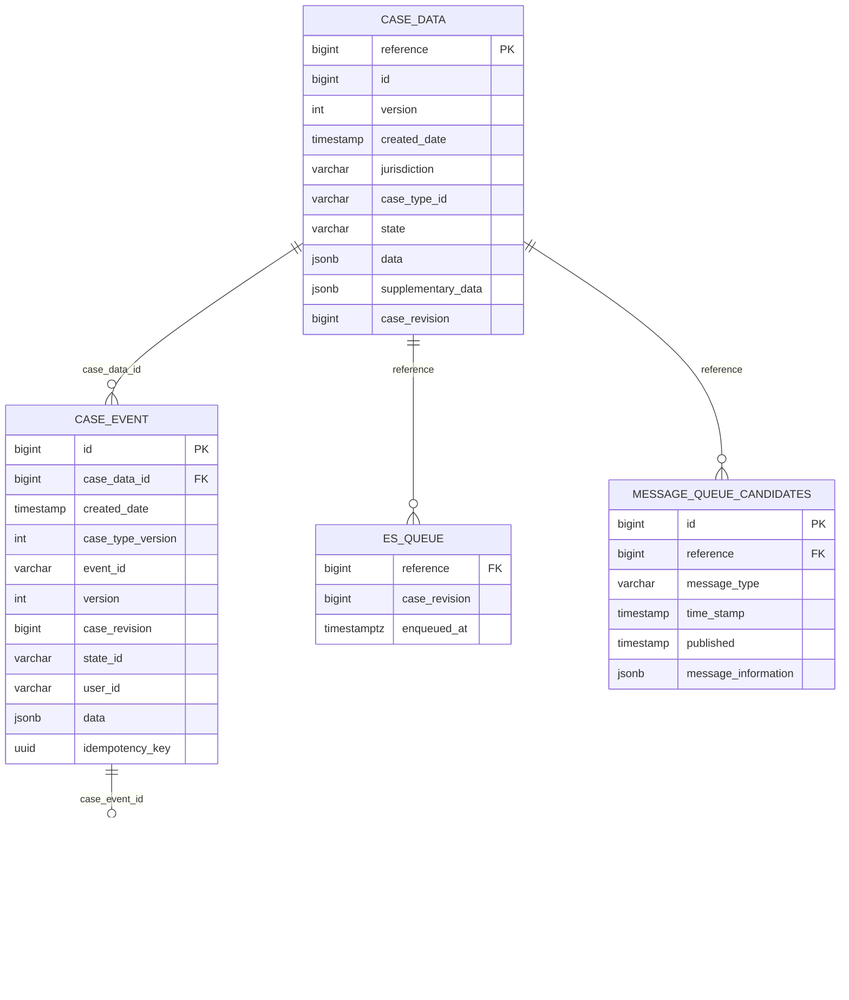
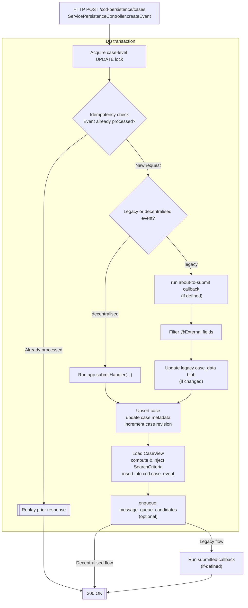

# Decentralised Runtime

The decentralised runtime provides an out-of-the-box implementation of CCD’s decentralised persistence APIs so service
teams can shift case ownership without rebuilding everything from scratch.

## Onboarding

Apply the `hmcts.ccd.sdk` Gradle plugin and declare the runtime library without a version:

```groovy
ccd {
  configDir = file('build/definitions')
}

dependencies {
  implementation 'com.github.hmcts:decentralised-runtime'
  // For indexing in the local cftlib stack (requires the cftlib plugin):
  cftlibImplementation 'com.github.hmcts:ccd-runtime-indexing'
}
```

The SDK plugin imports its BOM to supply library versions and detects the declared runtime dependency to configure
decentralised cftlib support. The old `ccd.decentralised` flag is deprecated and logs a warning.
See [SDK libraries](../README.md#sdk-libraries) for configuration choices and migration from the old flags.

## Native Notice of Change endpoints

The native Notice of Change controller is disabled by default, so applications that do not use the feature do not register
the `/noc/verify-noc-answers` or `/noc/noc-requests` routes.

Applications providing both `validate(...)` and `submit(...)` handlers through `builder.noticeOfChange()` must explicitly
enable the controller:

```yaml
ccd:
  decentralised-runtime:
    noc:
      enabled: true
```

## Case views

Services must provide a [`CaseView<CaseType, StateEnum>`](../sdk/decentralised-runtime/src/main/java/uk/gov/hmcts/ccd/sdk/CaseView.java) implementation per case type.

Your CaseView is the mechanism through which CCD accesses your case data: CCD provides a case reference, and your view must return a result in the format defined by your CCD definition.

How your view does this is an implementation detail; it could load a JSON blob, enrich the existing blob, or compose it from a
fully structured set of tables; the CaseView is now an API contract rather than a literal data model.

Case views can also inject dynamically rendered HTML/Markdown at runtime, avoiding the need to store presentation
fragments in the database.

If configured in your CCD definition, the SDK computes and sets `SearchCriteria` for Global Search following CaseView loading, based on your CCD definition and the data returned by your view, which will subsequently be indexed into Elasticsearch.

> **Mandatory:** Every decentralised case type must have an associated `CaseView`. Register separate beans per case type;
> the runtime fails fast if it cannot match a case type to a view or if multiple views match the same case type.

## Data persistence

The runtime provides a data persistence layer to handle the functions previously performed centrally by CCD.

### case_data & metadata persistence

Case records are persisted and updated in the `ccd.case_data` table, including legacy JSON blobs and other case metadata.

### Event history

Snapshots are recorded in the `ccd.case_event` table upon conclusion of each case event.

### Event metadata

Decentralised services can set the event history summary and description from server-side event handling. This is useful
when the metadata should be derived from the selected case data rather than typed manually in XUI.

For an emulated AboutToSubmit callback:

```java
return AboutToStartOrSubmitResponse.<CaseData, State>builder()
    .data(caseData)
    .eventMetadata(EventMetadata.builder()
        .summary("Selected documents added")
        .description("Documents: application.pdf, evidence.pdf")
        .build())
    .build();
```

For a decentralised submit handler:

```java
return SubmitResponse.<State>builder()
    .eventMetadata(EventMetadata.builder()
        .summary("Selected documents added")
        .description("Documents: application.pdf, evidence.pdf")
        .build())
    .build();
```

`EventMetadata` is consumed by the decentralised runtime when it writes `ccd.case_event`. It is SDK-internal metadata and
is not included in the callback response JSON returned to CCD.

### Optimistic locking of legacy JSON blobs

The SDK implements optimistic locking on the legacy JSON blob in `ccd.case_data` via the `version` column.

Concurrent changes to these blobs will be rejected as they are now by centralised CCD.

> Decentralised services are responsible for implementing appropriate concurrency controls for data persisted outside of this blob


### Idempotency

The SDK implements the required idempotency model for CCD's persistence API.

Completed requests are associated with their idempotency key in the `ccd.case_event.idempotency_key` column.

If an incoming request has already been processed, the runtime replays the stored response.

### SDK managed database schema

To fulfil the aforementioned responsibilities, the SDK provisions and manages a dedicated `ccd` schema within your application's database.

The SDK targets PostgreSQL 15 for the decentralised runtime. Service-owned databases should use PostgreSQL 15 as the supported baseline.

The SDK runs its Flyway migrations before the application's Flyway migrations. This allows an application-owned migration
to add service-specific indexes or constraints to SDK-managed tables while keeping the two migration histories separate.
Spring Boot `@JdbcTest`, `@DataJdbcTest`, `@DataJpaTest` and `@JooqTest` slices automatically include the same ordering,
so tests do not need to import the SDK Flyway auto-configuration explicitly.

An application that supplies its own `FlywayMigrationStrategy` takes ownership of migration execution and must preserve
the SDK-before-application ordering.

- `case_data` mirrors CCD’s `case_data` table, including metadata such as state, security classification, TTL and the JSON payload.
- `case_event` mirrors CCD’s `case_event` table and adds an idempotency key.
- `es_queue` tracks cases that require Elasticsearch indexing 
- `message_queue_candidates` mirrors CCD’s Service Bus transactional outbox table.



```mermaid
erDiagram
    CASE_DATA {
        bigint reference PK
        bigint id
        int version
        timestamp created_date
        varchar jurisdiction
        varchar case_type_id
        varchar state
        jsonb data
        jsonb supplementary_data
        bigint case_revision
    }
    CASE_EVENT {
        bigint id PK
        bigint case_data_id FK
        timestamp created_date
        int case_type_version
        varchar event_id
        int version
        bigint case_revision
        varchar state_id
        varchar user_id
        jsonb data
        uuid idempotency_key
    }
    CASE_EVENT_AUDIT {
        bigint id PK
        bigint case_event_id FK
        uuid user_id
        jsonb data
    }
    ES_QUEUE {
        bigint reference FK
        bigint case_revision
        timestamptz enqueued_at
    }
    MESSAGE_QUEUE_CANDIDATES {
        bigint id PK
        bigint reference FK
        varchar message_type
        timestamp time_stamp
        timestamp published
        jsonb message_information
    }

    CASE_DATA ||--o{ CASE_EVENT : "case_data_id"
    CASE_EVENT ||--o{ CASE_EVENT_AUDIT : "case_event_id"
    CASE_DATA ||--o{ ES_QUEUE : "reference"
    CASE_DATA ||--o{ MESSAGE_QUEUE_CANDIDATES : "reference"
```

## Elasticsearch indexing

The SDK maintains a queue of cases requiring Elasticsearch indexing in `ccd.es_queue`.

- **Reindex helper:** `CaseReindexingService` (in `sdk/decentralised-runtime`) lets you count and enqueue cases modified since a given date. Autowire the bean and call `enqueueCasesModifiedSince(LocalDate)` to repopulate `ccd.es_queue` without bumping `case_revision`; the decentralised indexer uses `EXTERNAL_GTE` so same-revision rewrites are accepted while older revisions still conflict. A successful reindex automatically clears older `ccd.es_dead_letter_queue` rows for the same case reference and `index_id`.

To run the indexer in your application, declare it on `implementation` instead of `cftlibImplementation`:

```groovy
dependencies {
  implementation 'com.github.hmcts:ccd-runtime-indexing'
}
```

Configure the target cluster with `ELASTIC_SEARCH_HOSTS`; multiple hosts can be supplied as a comma-separated
list, for example `ELASTIC_SEARCH_HOSTS=http://es-1:9200,http://es-2:9200`.


## Transaction control

The SDK wraps every case event inside a database transaction covering:

- idempotency check and case-level lock acquisition
- Invocation of the AboutToSubmit callback (if defined)
- upsert of `ccd.case_data`
- insert into `ccd.case_event` (audit history)
- insert into the Elasticsearch queue table

The common transaction ordering lives in [`CaseEventTransactionCoordinator`](../sdk/decentralised-runtime/src/main/java/uk/gov/hmcts/ccd/sdk/impl/CaseEventTransactionCoordinator.java) and is used by both CCD submissions and [local system events](./system-events.md). If a concurrent update to `ccd.case_data` is detected, a `409 CONFLICT` is returned and the transaction rolls back, aligning behaviour with CCD.

## Supplementary data

Supplementary data operations are implemented and persisted in the `ccd.case_data` table via [`SupplementaryDataService`](../sdk/decentralised-runtime/src/main/java/uk/gov/hmcts/ccd/sdk/impl/SupplementaryDataService.java), using PostgreSQL’s JSON functions to apply `$set`/`$inc` style updates atomically.

## Message publishing to Azure Service Bus

A transactional outbox-based `message_queue_candidates` table is maintained and written to based on your CCD definition, mirroring CCD's implementation.

The SDK's `ccd-servicebus-support` module provides:

- a `JmsTemplate` configured for Azure Service Bus
- a scheduled publisher (`CcdCaseEventScheduler`) governed by the `ccd.servicebus.*` properties
- a startup validator that simply opens a producer on the configured destination and closes it immediately.

Add it without a version; the SDK plugin's BOM supplies it:

```groovy
dependencies {
  implementation 'com.github.hmcts:ccd-servicebus-support'
}
```

This replaces the deprecated `ccd.caseEventServiceBus` flag.

The validator runs during application boot and fails the service fast if the topic does not exist or the supplied credentials lack `Send` rights.

## External events

An external event is one a bespoke frontend, such as a citizen or judicial journey, drives through CCD's API instead of EXUI's event pages. It has states, a name, the roles that may use it and a show condition for when EXUI offers it, but no pages, fields or end button: the frontend and the handlers exchange typed payloads instead of case data. What the frontend is sent when it starts the event and what it submits are usually different, so each has its own type.

An `ExternalEventId` states the event's contract once: its id, the type the frontend is sent on start and the type it submits. The same constant configures the event and drives it in tests.

```java
public static final ExternalEventId<MakeOrderStart, MakeOrderRequest> MAKE_ORDER =
    ExternalEventId.of("ext:makeOrder", MakeOrderStart.class, MakeOrderRequest.class);

configBuilder.externalEvent(MAKE_ORDER, this::submit)
    .forStates(State.CASE_ISSUED)
    .name("Make an order")
    .grant(Permission.CRUD, UserRole.JUDGE)
    .onStart(this::start);

private ExternalStartResponse<MakeOrderStart> start(ExternalStart start) {
    return ExternalStartResponse.started(orders.startFor(start.caseReference()));
}

private ExternalSubmitResponse<State> submit(ExternalSubmit<MakeOrderRequest> submit) {
    orders.apply(submit.caseReference(), submit.payload());
    return ExternalSubmitResponse.accepted("Order draft saved", "Saved an order as a draft");
}
```

The id must start `ext:`: that is how EXUI knows to hand the user off to the service's frontend rather than render the event itself. External events act on existing cases. An event that sends its frontend nothing on start declares only the submit type, `ExternalEventId.of(id, Request.class)`, and has no start handler.

The submit handler is required. It is given the case reference and the payload the frontend sent, not case data; a handler that needs the case loads it by `caseReference()`. It answers `ExternalSubmitResponse.accepted(summary, description)`, which records the event in the case history with that summary and description and can also move the case with `.movingTo(state)`, or `rejected(errors)`, which records and changes nothing.

The start handler is optional. It is given the case reference and loads whatever it needs to send the frontend, and answers `ExternalStartResponse.started(payload)` or `rejected(errors)` to stop the event starting. Without one the event has no about-to-start callback and the frontend is sent no payload. Both handlers take and return types of their own so they can grow without changing handler signatures.

The payloads travel in the case field named by `DecentralisedConfigBuilder.PAYLOAD_FIELD`, `eventPayload`, which the SDK defines for the case type with create and read permission for the event's roles. The frontend reads the start payload from that field of the start-event response, as a JSON string, and posts its own payload back in the same field. The SDK deserialises it with the application's `ObjectMapper` as the submit type; a submission whose payload is missing, not a JSON string, or not that type is rejected like a handler rejection: CCD answers 422 with the reason in `callbackErrors`, and nothing is written. The field never reaches the case: submission of a decentralised event does not write case data, and the case model needs no field for it.

## Event submission flow


```mermaid
flowchart TB
  A["HTTP POST /ccd-persistence/cases<br/>ServicePersistenceController.createEvent"] --> LOCK["Acquire case-level UPDATE lock"]

  subgraph TX [DB transaction]
    LOCK --> LCK{Idempotency check<br/>Event already processed?}
    LCK -->|Already processed| HIT[[Replay prior response]]
    LCK -->|New request| HANDLER{Legacy or decentralised event?}

    HANDLER -->|decentralised| NEW["Run app submitHandler(...)"]
    HANDLER -->|legacy| LEG["run about-to-submit callback</br> (if defined)"]

    LEG --> SNAP["Filter @External fields"]
    SNAP --> BLOB["Update legacy case_data blob</br>(if changed)"]
    NEW --> UPS
    BLOB --> UPS["Upsert case<br/>update case metadata</br>increment case revision"]

    UPS --> VIEW["Load CaseView</br>compute & inject SearchCriteria</br>insert into ccd.case_event"]
    VIEW --> BUS["enqueue message_queue_candidates</br>(optional)"]
  end

  HIT --> HTTP200[[200 OK]]
  BUS -->|Legacy flow| SUBM["Run submitted callback</br>(if-defined)"]
  BUS -->|Decentralised flow| HTTP200
  SUBM --> HTTP200

  click A "https://github.com/hmcts/dtsse-ccd-config-generator/blob/master/sdk/decentralised-runtime/src/main/java/uk/gov/hmcts/ccd/sdk/impl/ServicePersistenceController.java#L58" "ServicePersistenceController.java" _blank
  click C "https://github.com/hmcts/dtsse-ccd-config-generator/blob/master/sdk/decentralised-runtime/src/main/java/uk/gov/hmcts/ccd/sdk/impl/CaseSubmissionService.java#L36" "CaseSubmissionService.java" _blank
  click LOCK "https://github.com/hmcts/dtsse-ccd-config-generator/blob/master/sdk/decentralised-runtime/src/main/java/uk/gov/hmcts/ccd/sdk/impl/IdempotencyEnforcer.java#L31" "Acquire lock" _blank
  click LCK "https://github.com/hmcts/dtsse-ccd-config-generator/blob/master/sdk/decentralised-runtime/src/main/java/uk/gov/hmcts/ccd/sdk/impl/IdempotencyEnforcer.java#L22" "IdempotencyEnforcer.lockCaseAndGetExistingEvent" _blank
  click NEW "https://github.com/hmcts/dtsse-ccd-config-generator/blob/master/sdk/decentralised-runtime/src/main/java/uk/gov/hmcts/ccd/sdk/impl/DecentralisedSubmissionHandler.java#L27" "DecentralisedSubmissionHandler.apply" _blank
  click LEG "https://github.com/hmcts/dtsse-ccd-config-generator/blob/master/sdk/decentralised-runtime/src/main/java/uk/gov/hmcts/ccd/sdk/impl/LegacyCallbackSubmissionHandler.java#L51" "LegacyCallbackSubmissionHandler.apply" _blank
  click SNAP "https://github.com/hmcts/dtsse-ccd-config-generator/blob/master/sdk/decentralised-runtime/src/main/java/uk/gov/hmcts/ccd/sdk/impl/LegacyCallbackSubmissionHandler.java#L195" "snapshotWithFilteredFields" _blank
  click UPS "https://github.com/hmcts/dtsse-ccd-config-generator/blob/master/sdk/decentralised-runtime/src/main/java/uk/gov/hmcts/ccd/sdk/impl/CaseDataRepository.java#L105" "CaseDataRepository.upsertCase" _blank
  click VIEW "https://github.com/hmcts/dtsse-ccd-config-generator/blob/master/sdk/decentralised-runtime/src/main/java/uk/gov/hmcts/ccd/sdk/impl/CaseProjectionService.java#L52" "CaseProjectionService.load" _blank
  click AUD "https://github.com/hmcts/dtsse-ccd-config-generator/blob/master/sdk/decentralised-runtime/src/main/java/uk/gov/hmcts/ccd/sdk/impl/AuditEventService.java#L67" "AuditEventService.saveAuditRecord" _blank
  click BUS "https://github.com/hmcts/dtsse-ccd-config-generator/blob/master/sdk/decentralised-runtime/src/main/java/uk/gov/hmcts/ccd/sdk/impl/MessagePublisher.java#L79" "MessagePublisher.publishEvent" _blank
  click HANDLER "https://github.com/hmcts/dtsse-ccd-config-generator/blob/9fe79e8e30e98faf96dc3411d069b09a08a2a295/sdk/decentralised-runtime/src/main/java/uk/gov/hmcts/ccd/sdk/impl/CaseSubmissionService.java#L42" _blank
```
