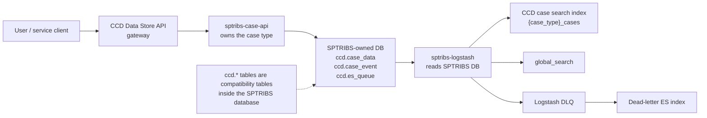
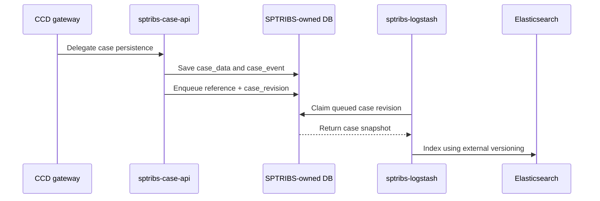
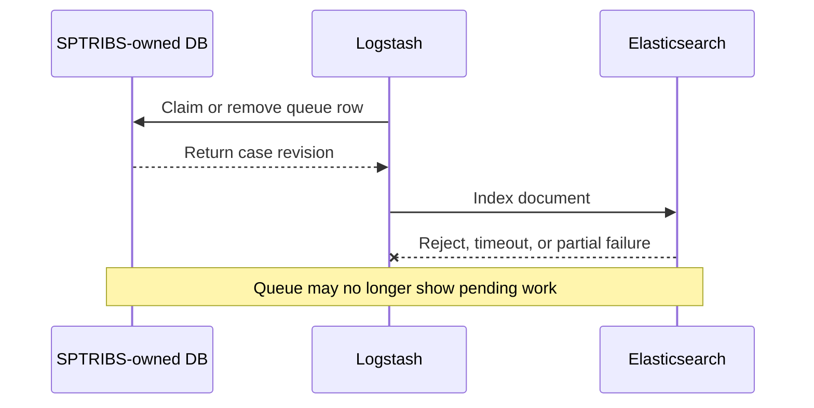

# Elasticsearch indexing

## Overview

This document describes the Elasticsearch indexing model for decentralised case types. SPTRIBS is
used as the concrete example.

For a decentralised case type, CCD is the public API/front door. The owning service is responsible
for persistence. In the SPTRIBS model, `sptribs-case-api` owns the case data in its own database,
and `sptribs-logstash` reads that database to index cases into CCD's Elasticsearch indexes.

The important distinction is ownership. CCD routes the request into the service, while the service
owns the case state and the queue of case revisions requiring indexing. When this document refers
to `ccd.case_data`, `ccd.case_event` or `ccd.es_queue`, those tables are in the service database
for the decentralised runtime, not the central CCD database.

## Indexing Requirements

The indexing model has the following requirements:

* Correctness: case updates must not be lost. The index may skip intermediate versions, for example
  indexing revision `N + 2` without first indexing `N + 1`, but an older revision must not overwrite
  a newer one.
* Robustness: indexer failure should be avoided where possible. Where failure is unavoidable, the
  indexer should fail safe so that the application is restarted by AKS rather than continuing in an
  unknown state.
* Reindexing: reindexing should be straightforward and should use the same queue contract as live
  indexing. If reindexing bumps case revision, in-flight indexing work for older revisions should be
  invalidated by the versioning model.
* Non-blocking events: a case that is pending indexing or currently being indexed must not block
  subsequent case events.

## Design Responsibilities

The decentralised model separates responsibilities as follows:

* CCD routes persistence and read operations for the decentralised case type to the owning service.
* The decentralised service owns the case data and event history in its own database.
* The service database includes an SDK-managed `ccd` schema for CCD-compatible persistence data.
* `ccd.es_queue` records case revisions that require indexing.
* The service's Logstash deployment reads the service database and writes to Elasticsearch.
* Elasticsearch remains the search backend used by CCD and XUI.

This keeps the source of truth with the service that owns the case type. However, where Logstash
is still used, some of the indexing behaviour remains in infrastructure configuration rather than
application code.

## Live Indexing Flow

In the SPTRIBS-style Logstash setup, a case update is persisted by `sptribs-case-api` and an
indexing queue entry is written in the same SPTRIBS-owned database.

SPTRIBS Logstash reads from `ccd.es_queue`, joins to the service-owned `ccd.case_data` and
`ccd.case_event` tables, and writes documents to Elasticsearch using a stable document id and
external versioning.

This means an older indexed document should not overwrite a newer one. Elasticsearch can compare
the supplied version and reject stale writes.

## Global Search

The same Logstash pipeline also emits `global_search` documents where the case data includes
`SearchCriteria`. This mirrors the central CCD search model so that decentralised cases can still
appear in the shared global search experience.

In this design, the service is responsible for producing the data shape that CCD search expects.
CCD remains the consumer-facing gateway, but the case projection used for search comes from data
owned by the service.

## Reindexing

Reindexing should be treated as a service-owned operation. The decentralised runtime provides a
`CaseReindexingService` helper that can enqueue cases modified since a given date into
`ccd.es_queue`.

That is preferable to ad hoc bulk Logstash SQL because it keeps the reindexing request aligned
with the service-owned queue. The queue can then be processed using the same indexing path as live
updates.

## Remaining Infrastructure Surface

The SPTRIBS Logstash setup is still configured in Flux. That means the indexing implementation is
split between the service database schema and Logstash SQL/filter configuration.

This has a maintenance cost for service teams:

* Logstash SQL depends on service-owned CCD tables such as `ccd.es_queue` and `ccd.case_data`.
* The query and transformation logic live in environment-specific infrastructure configuration.
* Changes require Flux updates across environments rather than a normal dependency bump.
* Local development does not naturally exercise the same Logstash path.
* Service teams need to understand both the application model and the Logstash indexing model.

Examples of the existing configuration surface:

* [`apps/sptribs/sptribs-logstash`](https://github.com/hmcts/cnp-flux-config/tree/master/apps/sptribs/sptribs-logstash)
* [`apps/ccd/ccd-logstash`](https://github.com/hmcts/cnp-flux-config/tree/master/apps/ccd/ccd-logstash)
* [`apps/ccd/ccd-logstash-indexer`](https://github.com/hmcts/cnp-flux-config/tree/master/apps/ccd/ccd-logstash-indexer)
* [`ccd-logstash-indexer6`](https://github.com/hmcts/cnp-flux-config/tree/master/apps/ccd/ccd-logstash-indexer6)
* [`charts/ccd-data-store-api`](https://github.com/hmcts/ccd-data-store-api/tree/master/charts/ccd-data-store-api)

## Design Limitations

### Queue Acknowledgement

Using `ccd.es_queue` gives the service an explicit database queue of case revisions to index.

However, with a Logstash-based implementation, care is still needed around when a queue item is
removed. If the Logstash input deletes or claims queue rows before Elasticsearch has accepted the
write, there can still be an acknowledgement gap:

A runtime-owned indexer can make this stronger by removing queue entries only after Elasticsearch
indexing succeeds, or by rolling back queue removal when non-version-conflict failures occur.

### Concurrency And Reindexing

A service-owned queue can support concurrent indexers when rows are claimed safely, for example by
using database row locks and skipping rows already claimed by another worker. That is a stronger
coordination point than multiple indexers independently scanning case tables.

The risk is that all indexing paths have to follow the same contract. One-off bulk indexers or ad
hoc SQL reindexing can bypass the service-owned queue and write older case snapshots after newer
ones unless Elasticsearch versioning prevents that. Reindexing should therefore enqueue work back
into `ccd.es_queue` wherever possible, so live updates and reindexing share the same path.

### Elasticsearch Versioning

SPTRIBS Logstash is configured to write documents with Elasticsearch external versioning. That is
important because it allows Elasticsearch to reject stale writes where an older event reaches the
index after a newer event.

This remains a configuration-level contract. If another service Logstash pipeline, one-off bulk
indexer or repair path writes to the same index without the same versioning behaviour, stale
documents can still overwrite newer state. The safer direction is to make versioned writes part of
the runtime/library contract rather than something each Flux configuration has to reproduce.

### Failure Observability

SPTRIBS Logstash has a dead-letter pipeline. Failed events can be copied to a dead-letter
Elasticsearch index, but that remains a side channel outside the service-owned case data model.

This is difficult for service teams to monitor directly:

* failures are not naturally presented as service-level indexing metrics
* dead-letter documents are separate from normal case history
* there is no simple alert such as "SPTRIBS cases are no longer being indexed"
* repair requires knowledge of Logstash, the DLQ and the service-owned queue
* DLQ storage and backup behaviour is an infrastructure concern rather than part of the service API

The dead-letter index is useful for investigation, but it is not a complete retry or ownership
model.

### Infrastructure-Owned Indexing Logic

The service owns the data, but Logstash configuration still owns much of the indexing behaviour.
That is the remaining split in the design.

The more indexing logic lives in Flux, the harder it is to ship fixes consistently. A library or
runtime-owned indexer can be tested locally, versioned, released and adopted by services through a
dependency bump. Flux-only indexing changes require every affected environment to carry the right
SQL and filter configuration.

## Preferred Direction

The preferred direction is for decentralised services to keep the indexing contract close to the
application/runtime that owns the case data:

* write pending index work to `ccd.es_queue` in the service database
* include the case revision or event revision in the queued work
* process queue items with explicit success/failure handling
* remove queue entries only after Elasticsearch accepts the write
* use Elasticsearch external versioning so stale documents cannot overwrite newer ones
* expose queue depth, indexing failures and retry counts as service-level metrics
* make reindexing a service/runtime capability rather than one-off Flux SQL

SPTRIBS already demonstrates important parts of this model: service-owned case data, an explicit
`ccd.es_queue`, and Elasticsearch external versioning. The remaining improvement is to reduce the
amount of indexing behaviour that has to live in environment-specific Logstash configuration.
