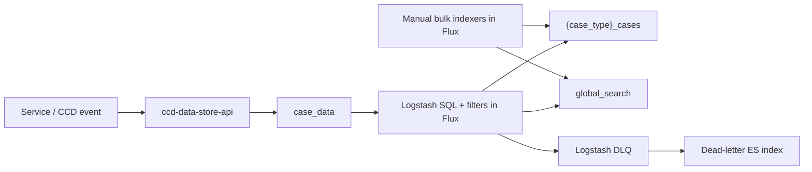
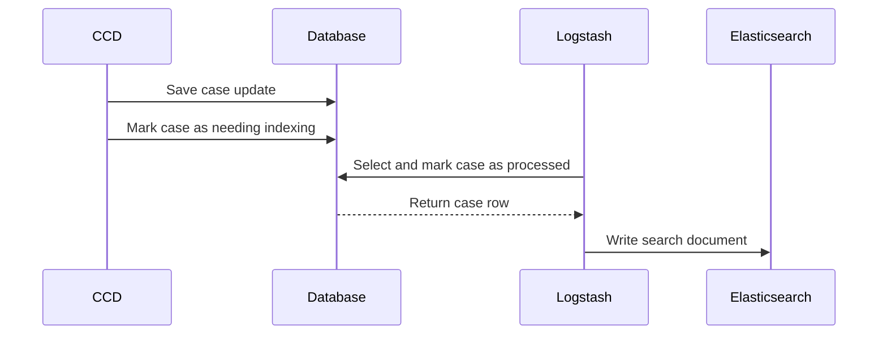
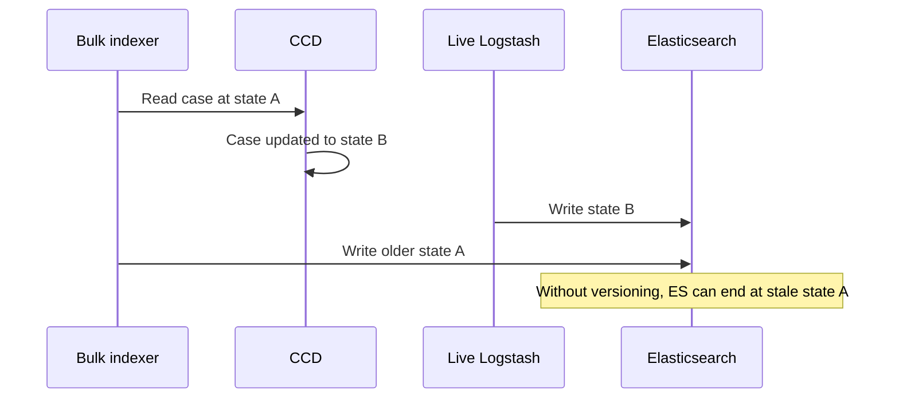
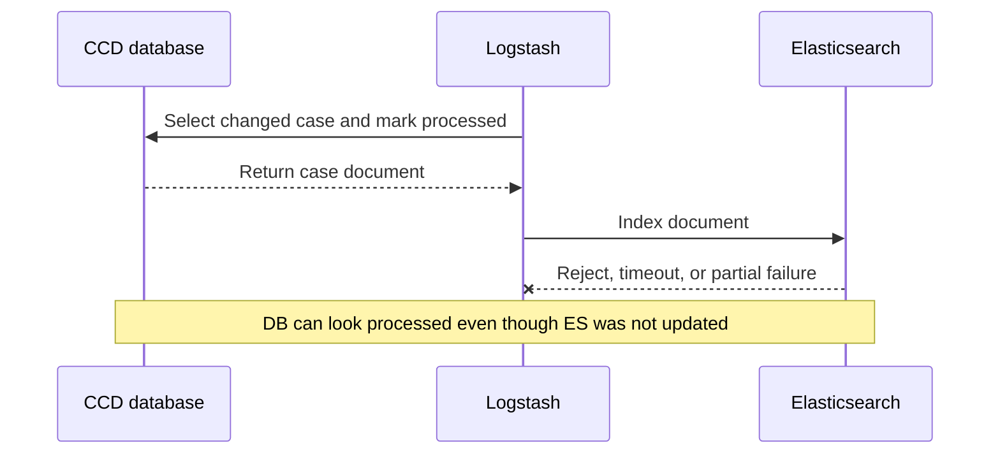

# Elasticsearch indexing

## Overview

CCD case search is currently indexed by Logstash. Case data is written to the CCD database,
Logstash polls that database, transforms the row into an Elasticsearch document, and writes to the
case-type index and sometimes the shared `global_search` index.

The design separates the case write path from the search indexing path. This keeps Elasticsearch
outside the main case transaction, but it also means the indexing contract is distributed across
CCD database state, Flux/Helm Logstash configuration, Elasticsearch write semantics, and
operational monitoring.

## Design Responsibilities

The current indexing design has several ownership boundaries:

* CCD owns the source database tables and `marked_by_logstash` flag.
* Logstash config in Flux owns the SQL that reads CCD internals.
* Logstash config in Flux owns the document transformation.
* Elasticsearch owns the final searchable state.
* Operational monitoring owns detection and recovery of indexing failures.
* Service teams rely on the resulting indexes for case search.

This separation creates a split ownership model. No single component owns the full invariant:
"this case revision has been indexed successfully, and no older revision can overwrite it".

## Current Live Indexing

Live indexing uses `case_data.marked_by_logstash` as a hand-off flag. CCD marks new or updated
rows as needing indexing, and Logstash later picks them up.

Conceptually:

The important detail is that the database hand-off happens before Elasticsearch has accepted the
document. The flag records that Logstash picked the row up, not that the row is searchable.

Production is also partitioned operationally. The main `ccd-logstash` deployment handles most
jurisdictions, with separate Logstash deployments for some high-volume jurisdictions. That split
is an infrastructure partition, not a per-service or per-case-type indexing API.

## Bulk Indexing

There are also `ccd-logstash-indexer*` deployments for bulk or one-off reindexing. These are
normally scaled to zero and can be enabled by changing Flux.

Unlike live indexing, the bulk indexers do not claim work through `marked_by_logstash`. They read
from CCD tables with broad SQL queries over a case type or id range and write directly to the same
Elasticsearch indexes as the live poller.

This creates a possible stale-write race:

Central CCD Logstash writes do not use Elasticsearch external versioning based on a case revision,
so Elasticsearch cannot reject an older document when it arrives late. This is effectively a lack
of optimistic locking at the search-document boundary.

## Development And Maintenance Considerations

The current approach has a significant maintenance surface for developers and service teams.

Indexing behaviour lives in complex infrastructure configuration rather than in a library or
application component. That means teams end up changing Logstash SQL and filters in Flux for
behaviour that depends on CCD database internals.

This has several consequences:

* the SQL depends on internal CCD tables and columns
* the transformation logic is duplicated or patched across environments
* fixes require Flux changes rather than a normal dependency bump
* local development does not naturally exercise the same indexing path
* environment drift is easy because AAT, demo, perftest and prod can all carry different patches
* bulk reindexing becomes an operational config change rather than an application capability

If this logic lived behind a library or runtime component, fixes could be versioned and consumed
like normal application code. With the current split, a behavioural change often means finding and
updating Logstash config in multiple places.

Examples of the existing configuration surface:

* [`apps/ccd/ccd-logstash`](https://github.com/hmcts/cnp-flux-config/tree/master/apps/ccd/ccd-logstash)
* [`apps/ccd/ccd-logstash-indexer`](https://github.com/hmcts/cnp-flux-config/tree/master/apps/ccd/ccd-logstash-indexer)
* [`ccd-logstash-indexer6`](https://github.com/hmcts/cnp-flux-config/tree/master/apps/ccd/ccd-logstash-indexer6)
* [`apps/sptribs/sptribs-logstash`](https://github.com/hmcts/cnp-flux-config/tree/master/apps/sptribs/sptribs-logstash)
* [`charts/ccd-data-store-api`](https://github.com/hmcts/ccd-data-store-api/tree/master/charts/ccd-data-store-api)

## Design Limitations

### Non-End-To-End Acknowledgement

The live path has an acknowledgement gap:

The source database does not hold a durable "pending until Elasticsearch succeeds" queue for the
central CCD Logstash path. Recovery depends on dead-letter inspection, manual unmarking, a later
case update, or a separate reindex.

### Limited Failure Observability

CCD has a Logstash dead-letter pipeline. Failed events can be copied to a dead-letter
Elasticsearch index, but that is still a side channel.

This is difficult for service teams to monitor directly:

* failures are not naturally grouped by owning service or case type
* dead-letter documents are separate from normal case history
* there is no simple service-level alert that search indexing has degraded
* repair requires knowledge of Logstash, the DLQ, and the CCD indexing pipeline

The dead-letter index is useful for investigation, but it is not a complete retry or ownership
model.

### Logstash Queues Are Not The Source Of Truth

Logstash persistent queues and dead-letter queues are filesystem state under Logstash's data
directory. From the Flux and chart configuration checked, CCD Logstash does not explicitly mount
that data directory as backed-up persistent storage.

That means the Logstash queue can help with transient back pressure, but it should not be treated
as the authoritative record of indexing work.

### Concurrency Is Coarse-Grained

Live indexing is partitioned by a small number of Logstash deployments and by Logstash worker
threads inside each pod. It is not a database-backed queue where many workers safely claim
independent units of work.

Scaling Logstash may improve throughput, but it does not fix the acknowledgement gap, the
observability gap, or the lack of optimistic locking in Elasticsearch.

## Potential Improvements

A more cohesive model would put the indexing contract behind application-owned code:

* write pending index work to a durable queue table
* include the case revision or event revision in the queued work
* remove queue entries only after Elasticsearch accepts the write
* use Elasticsearch external versioning so stale documents cannot overwrite newer ones
* expose queue depth, failures and retries as service-level metrics
* keep reindexing as a versioned runtime capability rather than one-off Flux SQL changes

The SPTRIBS Logstash configuration is closer to this direction because it reads from `ccd.es_queue`
and uses Elasticsearch external versioning. It still has Logstash and a dead-letter pipeline, but
the main indexing contract is less split than central CCD's `marked_by_logstash` polling model.
