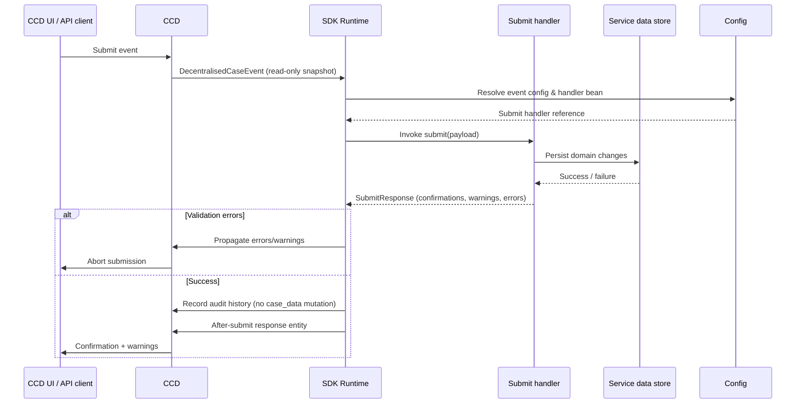

# Decentralised Submit-Handler Events

Decentralised events move business persistence out of CCD. Your service owns the authoritative data store, while CCD continues to provide auditing, event history and UI confirmation handling.

## When to choose the decentralised flow

- You already maintain a dedicated database for the case type.
- CCD should behave like an orchestrator, not the primary data store.
- The legacy callbacks keep causing merge conflicts or performance issues when mutating large JSON blobs.

## Sequence at a glance

## Developer responsibilities

- **Treat CCD data as read-only**  
  The `EventPayload` mirrors the case view at submission time. Use it for validation, but never attempt to mutate or rely on CCD updating its `case_data` JSON.

- **Persist to your data store**  
  Apply all changes inside your service (using repositories, transactions, etc.). CCD will not mirror those updates automatically.

- **Return a meaningful `SubmitResponse`**  
  Provide confirmation message copy along with warnings or errors. Leave the data field empty—decentralised handlers must not supply a replacement blob. If CCD still needs a state transition or security classification update, set `SubmitResponse.state` (your enum) and/or `SubmitResponse.securityClassification` and the SDK will apply them before it records the audit entry.

- **Handle your own rollbacks**  
  Run the persistence logic inside a transaction you control. Throw an exception or return errors to abort the submission; the SDK will surface the failure and keep CCD unchanged.

- **Expose read APIs where needed**  
  Because CCD’s blob no longer reflects the canonical state, ensure downstream systems read from your service (or via search indexes) rather than relying on CCD exports.

## What the SDK guarantees

- Selects the correct submit handler from the resolved configuration.
- Enforces idempotency, returning the original response for repeated idempotency keys.
- Writes CCD audit and event history entries even though it leaves `case_data` untouched.
- Builds the after-submit response entity using the values you returned.
- Propagates warnings/errors back to CCD without exposing internal persistence details.

## Implementation checklist

1. Register the event with a `submit` handler in your configuration builder.  
2. Implement the handler to:
   - Validate the incoming payload.  
   - Load/update your service data within a transaction.  
   - Return `SubmitResponse` with confirmation text or validation feedback.  
3. Add integration tests that assert the service database changes while CCD blob remains stable.  
4. Monitor audit logs to confirm events are recorded without unnecessary blob mutations.  
5. Communicate to downstream consumers that CCD will no longer expose up-to-date domain data.

If you still rely on CCD’s JSON blob as the case’s source of truth, stick with the [legacy callback flow](events-legacy.md) until you can migrate your persistence layer.
