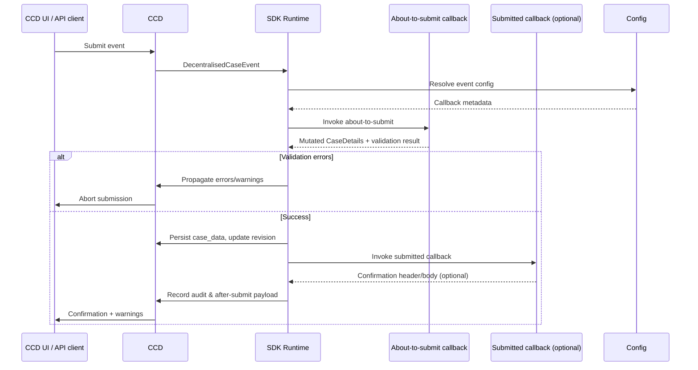

# Legacy Callback Events

Legacy events use CCD’s historic callback pipeline (`about-to-submit` and `submitted`). They are the right choice when the CCD `case_data` JSON blob remains your source of truth and you are comfortable mutating that payload directly.

## When to choose the legacy flow

- The case type has existing callback logic that already mutates `CaseDetails`.
- CCD must continue to own the persisted case state.
- Your team is not yet ready to move the data into a decentralised store.

## Sequence at a glance

## Developer responsibilities

- **Mutate the payload intentionally**  
  Update `CaseDetails.data`, `state`, and `securityClassification` to represent the final case view. The SDK will serialise this snapshot back into `case_data` and mirror the metadata changes when replaying the event.

- **Return accurate validation feedback**  
  - Errors stop the submission and leave CCD unchanged.  
  - Warnings surface to the UI but do not block persistence.  
  - Use ignore-warning behaviour where appropriate.

- **Set confirmation messages**  
  Either return `SubmittedCallbackResponse` during the submitted callback or populate `AfterSubmitCallbackResponse` yourself before finishing the about-to-submit callback.

- **Respect optimistic locking**  
  The SDK only writes the blob when the case version matches. If you see conflict responses, re-fetch the case data and retry with the up-to-date revision.

## What the SDK guarantees

- Resolves configuration and selects the correct callback hooks.
- Enforces idempotency via the supplied idempotency key and replays the previous outcome when required.
- Serialises your mutated `CaseDetails.data` using the configured projection filters before writing to `case_data`.
- Updates CCD event history, audit tables and the after-submit response object.
- Propagates validation errors/warnings and confirmation copy back to CCD/UI.

## Implementation checklist

1. Implement `aboutToSubmit` to validate and mutate the case snapshot.  
2. Optionally implement `submitted` to supply confirmation text; otherwise the SDK reuses `AfterSubmitCallbackResponse`.  
3. Ensure all mandatory fields remain present on the mutated `CaseDetails`.  
4. Write automated tests around validation and case-data mutations (e.g. verifying state transitions).  
5. Monitor CCD audit logs for unexpected version bumps or conflicts.

Once you are ready to move the data state outside CCD, see [Decentralised submit-handler events](events-decentralised.md) for the transition path.
