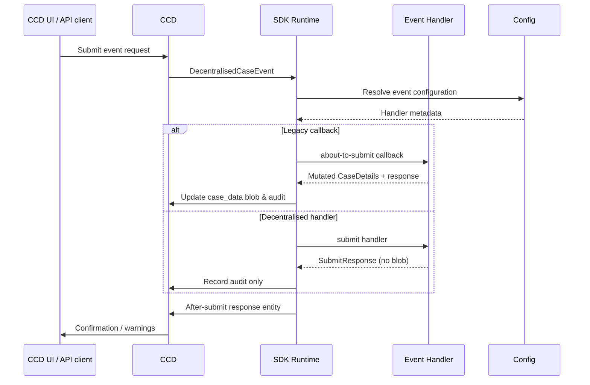

# CCD Event Submission Overview

This guide explains how the SDK orchestrates CCD event submissions and how it differentiates between the legacy callback pipeline and decentralised submit handlers. Use it as the starting point before diving into the detailed guides:

- [Legacy callback events](events-legacy.md)
- [Decentralised submit-handler events](events-decentralised.md)

## CCD refresher

- **Case data** sits in CCD’s `case_data` JSON blob alongside state, security classification and audit history.
- **Events** mutate the case or emit confirmation messages. CCD delegates the business rules to services that are built on top of this SDK.
- **The SDK runtime** receives the inbound `DecentralisedCaseEvent`, resolves the event configuration, enforces idempotency and ensures CCD’s audit tables remain consistent.

## Event handling modes

| Mode | Where the case data of record lives | Typical usage | Key responsibilities |
|------|------------------------------------|----------------|----------------------|
| Legacy callbacks | CCD `case_data` JSON blob | Existing case types that still rely on `about-to-submit` and `submitted` callbacks | Mutate the supplied `CaseDetails` snapshot so the SDK can persist it back into CCD |
| Decentralised submit handlers | Your own service database | Newer case types that own their data and simply use CCD for orchestration | Treat the incoming payload as read-only; persist to your store and return confirmation copy. Use `SubmitResponse` to signal state / security-classification changes when CCD still needs to reflect those |

## High-level flow

## Choosing an approach

1. **Need CCD to remain the source of truth?** Stay on the legacy callbacks flow. See [events-legacy.md](events-legacy.md) for mutation rules and callback sequencing.
2. **Owning your own persistence layer?** Implement a decentralised submit handler. See [events-decentralised.md](events-decentralised.md) for responsibilities and sample handler structure.

Both flows share the same operational guarantees (idempotency, event history, audit logging, after-submit response wiring). The difference lies in who owns the case data snapshot and where business persistence happens. Choose one model per event and let the SDK handle the rest. 
