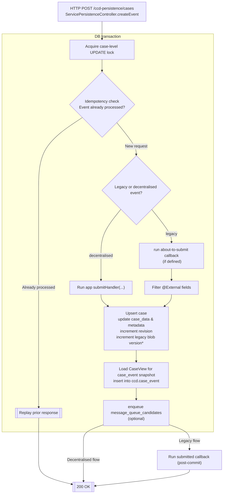

```mermaid
flowchart TB
  A["HTTP POST /ccd-persistence/cases<br/>ServicePersistenceController.createEvent"] --> LOCK["Acquire case-level UPDATE lock"]

  subgraph TX [DB transaction]
    LOCK --> LCK{Idempotency check<br/>Event already processed?}
    LCK -->|Already processed| HIT[[Replay prior response]]
    LCK -->|New request| HANDLER{Legacy or decentralised event?}

    HANDLER -->|decentralised| NEW["Run app submitHandler(...)"]
    HANDLER -->|legacy| LEG["run about-to-submit callback</br> (if defined)"]

    LEG --> SNAP["Filter @External fields"]
    NEW --> UPS
    SNAP --> UPS["Upsert case<br/>update case_data & metadata</br>increment revision</br>increment legacy blob version*"]

%%    APPL --> UPS["CaseDataRepository.upsertCase<br/>persist state/security<br/>(data only if legacy snapshot)"]
    UPS --> VIEW["Load CaseView for case_event snapshot</br>insert into ccd.case_event"]
    VIEW --> BUS["enqueue message_queue_candidates</br>(optional)"]
  end

  HIT --> HTTP200[[200 OK]]
  BUS -->|Legacy flow| SUBM["Run submitted callback (post-commit)"]
  BUS -->|Decentralised flow| HTTP200
  SUBM --> HTTP200

  click A "https://github.com/hmcts/dtsse-ccd-config-generator/blob/master/sdk/decentralised-runtime/src/main/java/uk/gov/hmcts/ccd/sdk/impl/ServicePersistenceController.java" "ServicePersistenceController.java" _blank
  click C "https://github.com/hmcts/dtsse-ccd-config-generator/blob/master/sdk/decentralised-runtime/src/main/java/uk/gov/hmcts/ccd/sdk/impl/CaseSubmissionService.java" "CaseSubmissionService.java" _blank
  click LOCK "https://github.com/hmcts/dtsse-ccd-config-generator/blob/master/sdk/decentralised-runtime/src/main/java/uk/gov/hmcts/ccd/sdk/impl/IdempotencyEnforcer.java" "IdempotencyEnforcer.java" _blank
  click LCK "https://github.com/hmcts/dtsse-ccd-config-generator/blob/master/sdk/decentralised-runtime/src/main/java/uk/gov/hmcts/ccd/sdk/impl/IdempotencyEnforcer.java" "IdempotencyEnforcer.java" _blank
  click NEW "https://github.com/hmcts/dtsse-ccd-config-generator/blob/master/sdk/decentralised-runtime/src/main/java/uk/gov/hmcts/ccd/sdk/impl/DecentralisedSubmissionHandler.java" "DecentralisedSubmissionHandler.java" _blank
  click LEG "https://github.com/hmcts/dtsse-ccd-config-generator/blob/master/sdk/decentralised-runtime/src/main/java/uk/gov/hmcts/ccd/sdk/impl/LegacyCallbackSubmissionHandler.java" "LegacyCallbackSubmissionHandler.java" _blank
  click SNAP "https://github.com/hmcts/dtsse-ccd-config-generator/blob/master/sdk/decentralised-runtime/src/main/java/uk/gov/hmcts/ccd/sdk/impl/FilterExternalFieldsInspector.java" "FilterExternalFieldsInspector.java" _blank
  click UPS "https://github.com/hmcts/dtsse-ccd-config-generator/blob/master/sdk/decentralised-runtime/src/main/java/uk/gov/hmcts/ccd/sdk/impl/CaseDataRepository.java" "CaseDataRepository.java" _blank
  click VIEW "https://github.com/hmcts/dtsse-ccd-config-generator/blob/master/sdk/decentralised-runtime/src/main/java/uk/gov/hmcts/ccd/sdk/impl/CaseProjectionService.java" "CaseProjectionService.java" _blank
  click AUD "https://github.com/hmcts/dtsse-ccd-config-generator/blob/master/sdk/decentralised-runtime/src/main/java/uk/gov/hmcts/ccd/sdk/impl/AuditEventService.java" "AuditEventService.java" _blank
  click BUS "https://github.com/hmcts/dtsse-ccd-config-generator/blob/master/sdk/decentralised-runtime/src/main/java/uk/gov/hmcts/ccd/sdk/impl/MessagePublisher.java" "MessagePublisher.java" _blank
```
