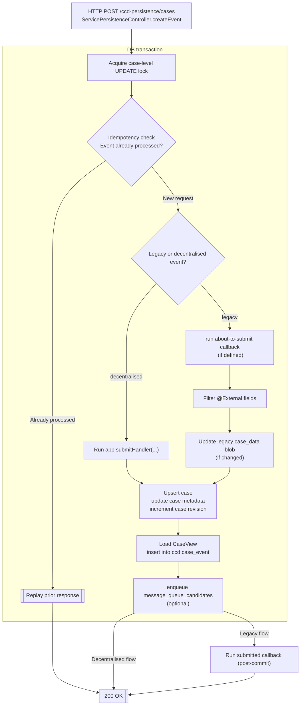

```mermaid
flowchart TB
  A["HTTP POST /ccd-persistence/cases<br/>ServicePersistenceController.createEvent"] --> LOCK["Acquire case-level UPDATE lock"]

  subgraph TX [DB transaction]
    LOCK --> LCK{Idempotency check<br/>Event already processed?}
    LCK -->|Already processed| HIT[[Replay prior response]]
    LCK -->|New request| HANDLER{Legacy or decentralised event?}

    HANDLER -->|decentralised| NEW["Run app submitHandler(...)"]
    HANDLER -->|legacy| LEG["run about-to-submit callback</br> (if defined)"]

    LEG --> SNAP["Filter @External fields"]
    SNAP --> BLOB["Update legacy case_data blob</br>(if changed)"]
    NEW --> UPS
    BLOB --> UPS["Upsert case<br/>update case metadata</br>increment case revision"]

    UPS --> VIEW["Load CaseView</br>insert into ccd.case_event"]
    VIEW --> BUS["enqueue message_queue_candidates</br>(optional)"]
  end

  HIT --> HTTP200[[200 OK]]
  BUS -->|Legacy flow| SUBM["Run submitted callback (post-commit)"]
  BUS -->|Decentralised flow| HTTP200
  SUBM --> HTTP200

  click A "https://github.com/hmcts/dtsse-ccd-config-generator/blob/master/sdk/decentralised-runtime/src/main/java/uk/gov/hmcts/ccd/sdk/impl/ServicePersistenceController.java#L58" "ServicePersistenceController.java" _blank
  click C "https://github.com/hmcts/dtsse-ccd-config-generator/blob/master/sdk/decentralised-runtime/src/main/java/uk/gov/hmcts/ccd/sdk/impl/CaseSubmissionService.java#L36" "CaseSubmissionService.java" _blank
  click LOCK "https://github.com/hmcts/dtsse-ccd-config-generator/blob/master/sdk/decentralised-runtime/src/main/java/uk/gov/hmcts/ccd/sdk/impl/IdempotencyEnforcer.java#L31" "Acquire lock" _blank
  click LCK "https://github.com/hmcts/dtsse-ccd-config-generator/blob/master/sdk/decentralised-runtime/src/main/java/uk/gov/hmcts/ccd/sdk/impl/IdempotencyEnforcer.java#L22" "IdempotencyEnforcer.lockCaseAndGetExistingEvent" _blank
  click NEW "https://github.com/hmcts/dtsse-ccd-config-generator/blob/master/sdk/decentralised-runtime/src/main/java/uk/gov/hmcts/ccd/sdk/impl/DecentralisedSubmissionHandler.java#L27" "DecentralisedSubmissionHandler.apply" _blank
  click LEG "https://github.com/hmcts/dtsse-ccd-config-generator/blob/master/sdk/decentralised-runtime/src/main/java/uk/gov/hmcts/ccd/sdk/impl/LegacyCallbackSubmissionHandler.java#L51" "LegacyCallbackSubmissionHandler.apply" _blank
  click SNAP "https://github.com/hmcts/dtsse-ccd-config-generator/blob/master/sdk/decentralised-runtime/src/main/java/uk/gov/hmcts/ccd/sdk/impl/LegacyCallbackSubmissionHandler.java#L195" "snapshotWithFilteredFields" _blank
  click UPS "https://github.com/hmcts/dtsse-ccd-config-generator/blob/master/sdk/decentralised-runtime/src/main/java/uk/gov/hmcts/ccd/sdk/impl/CaseDataRepository.java#L105" "CaseDataRepository.upsertCase" _blank
  click VIEW "https://github.com/hmcts/dtsse-ccd-config-generator/blob/master/sdk/decentralised-runtime/src/main/java/uk/gov/hmcts/ccd/sdk/impl/CaseProjectionService.java#L52" "CaseProjectionService.load" _blank
  click AUD "https://github.com/hmcts/dtsse-ccd-config-generator/blob/master/sdk/decentralised-runtime/src/main/java/uk/gov/hmcts/ccd/sdk/impl/AuditEventService.java#L67" "AuditEventService.saveAuditRecord" _blank
  click BUS "https://github.com/hmcts/dtsse-ccd-config-generator/blob/master/sdk/decentralised-runtime/src/main/java/uk/gov/hmcts/ccd/sdk/impl/MessagePublisher.java#L79" "MessagePublisher.publishEvent" _blank
  click HANDLER "https://github.com/hmcts/dtsse-ccd-config-generator/blob/9fe79e8e30e98faf96dc3411d069b09a08a2a295/sdk/decentralised-runtime/src/main/java/uk/gov/hmcts/ccd/sdk/impl/CaseSubmissionService.java#L42" _blank
```
