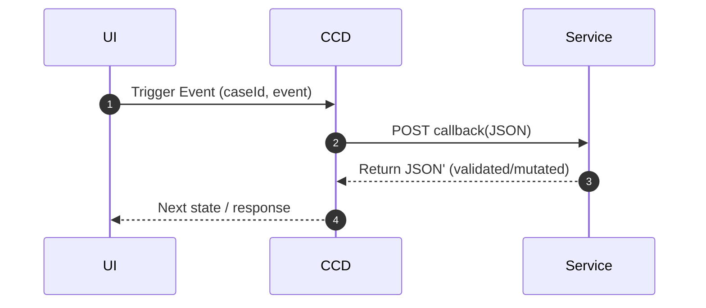
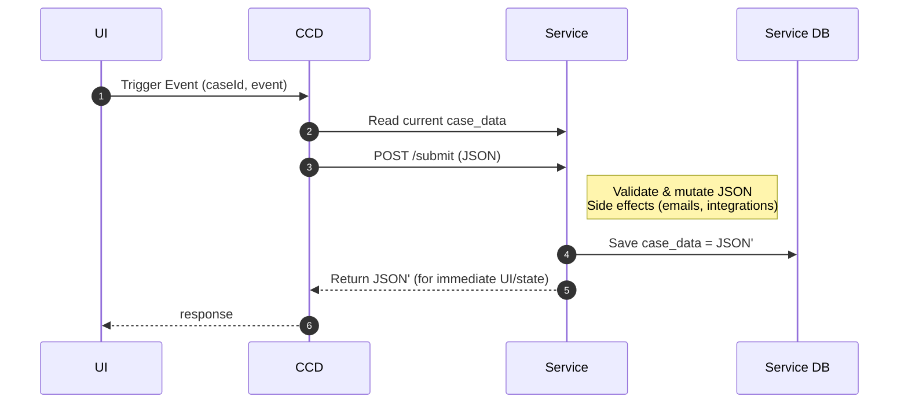

# Decentralised Data Persistence — Conceptual Introduction

TL;DR

* You can opt‑in to store case data in a service‑owned database rather than CCD’s case_data table.

* No big bang rewrite: your application can remain 'callback' driven (AboutToStart / MidEvent / AboutToSubmit / Submitted).

* The same JSON blob flows through callbacks; the difference is where and how it is persisted

* This lets service teams own their data, make effective use of databases and evolve at their own pace.
* Updates to this SDK are designed to help you handle these new responsibilities

## As-is: centralised persistence

CCD orchestrates events and invokes service callbacks.

Each callback receives the full case JSON blob, performs validation, mutation, and side effects (emails, integrations, etc.), then returns a (possibly) changed blob to CCD for persistence.

CCD persists this blob verbatim in its case_data table.

# The decentralised option: keep callbacks, move data ownership

With decentralised persistence, the callback model remains the same. The difference is that, for opted-in case types, the service becomes the source of truth for case data.

