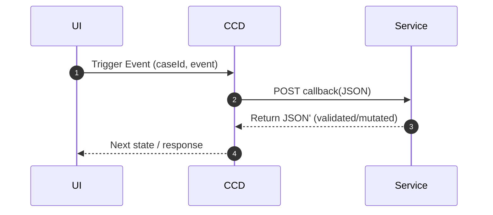
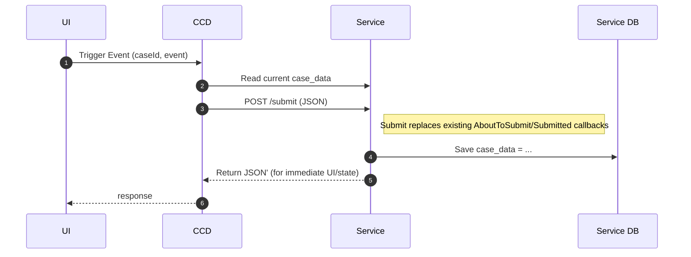

# Decentralised Data Persistence — Conceptual Introduction

- Persist case data in a service-owned database while CCD continues to orchestrate callbacks and authorisation.
- No big-bang rewrite: keep the familiar AboutToStart / MidEvent / AboutToSubmit / Submitted flow.
- The JSON payload stays intact—only the storage location and responsibility boundaries change.
- Data ownership aligns with business domain ownership.
- The SDK supplies migrations, transaction orchestration, idempotency, and optional Elasticsearch sync to smooth onboarding.

## As-is: centralised persistence

CCD orchestrates events and invokes service callbacks.

Each callback receives the full case JSON blob, performs validation, mutation, and side effects (emails, integrations, etc.), then returns a (possibly) changed blob to CCD for persistence.

CCD persists this blob verbatim in its case_data table.

## The decentralised option

CCD continues to orchestrate events and invokes service callbacks, but the service becomes the source of truth for case data.

- CCD loads your case type's data from your service instead of its case_data table.
- Your service persists both the authoritative case record and the event history inside your database (see schema overview).
- CCD still enforces authorisation, event definitions, and callback sequencing; you take on data modelling, retention, and migrations.

### What changes for teams

- **Database provisioning:** Allocate a PostgreSQL database for your service to persist its case data.
- **Schema migrations:** The SDK provides Flyway scripts to create and manage a 'ccd' schema that resides in your database.
- **Read APIs:** Implement `CaseView<CaseType, StateEnum>` so CCD can read case data from your service.
- **Write to your database:** You can write to your database during the standard CCD event lifecycle callbacks.

## Read next

- [Decentralised runtime in detail](./decentralised-runtime.md)
- [Concurrency considerations](./concurrency.md)
- [Migrating existing services](./data-migration.md)
