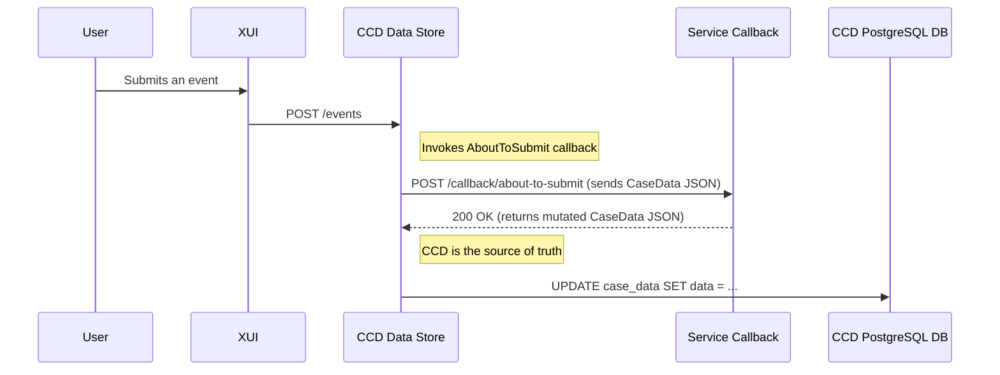

# Decentralised Data Persistence

## Introduction

Decentralised Data Persistence is a new architectural approach within CCD that empowers service teams by giving them full ownership and control over their case data. It aligns with modern domain-driven design principles, allowing each service to manage its data in a way that is best suited to its specific needs, while still leveraging the core case management capabilities of CCD.

This feature enables an incremental migration path for services to move their case data from CCD's central database into a dedicated, service-owned database. For developers, this means greater flexibility, improved performance, and the ability to use the full power of relational databases to ensure data integrity and simplify data management.

## The Centralised Model (As-Is)

Currently, CCD acts as the central repository for all case data. The data for every case type is stored as a JSON blob within the `case_data` table in CCD's PostgreSQL database.

When a user triggers an event, CCD orchestrates the process:
1.  It receives the event from the UI (e.g., XUI).
2.  It invokes a series of synchronous HTTP callbacks to the responsible service (e.g., `about-to-start`, `about-to-submit`).
3.  The service performs validation and business logic, returning a potentially modified JSON blob of case data.
4.  CCD saves this new JSON blob back into its central database.

In this model, CCD is the single source of truth for case data persistence.



# The Decentralised Model

The decentralised model shifts responsibility for storing and managing mutable case data to the service itself.

Consequently:

1. AboutToSubmit & Submitted callbacks can be consolidated into a single 'Submit'
   2. The service can validate, accept or reject the submission in one step.
   3. Any required post-submission processing can be handled asynchronously (eg. using a database backed job queue)
2. Instead of persisting the data itself, CCD delegates the entire submission to the service via a new, transactional persistence API.
3. The service runs its business logic and is now responsible for persisting the final case state into its own database.

```mermaid
sequenceDiagram
    participant User
    participant XUI
    participant CCD Data Store
    participant Service (with Persistence API)
    participant Service Database

    User->>XUI: Submits an event
    XUI->>CCD Data Store: POST /events
    note right of CCD Data Store: Identifies case type as decentralise 
    CCD Data Store->>Service (with Persistence API): POST /ccd-persistence/cases (sends event payload)
    note right of Service (with Persistence API): Service is the source of truth
    Service (with Persistence API)->>Service (with Persistence API): Runs business logic (replaces AboutToSubmit/Submitted)
    Service (with Persistence API)->>Service Database: INSERT/UPDATE... 
    Service (with Persistence API)-->>CCD Data Store: 201 Created (returns final case state)
