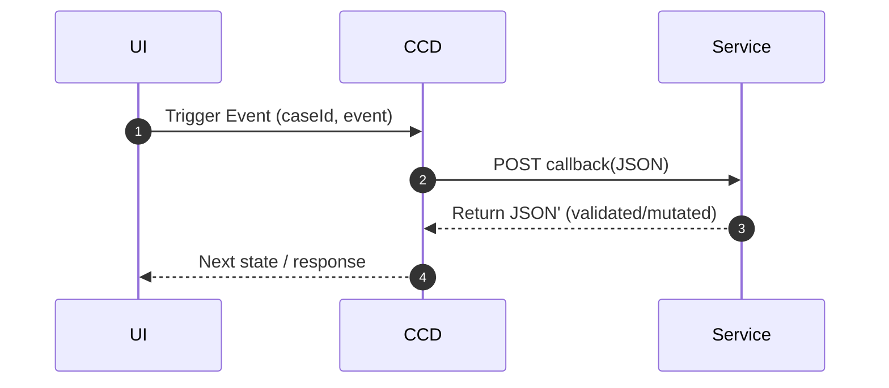
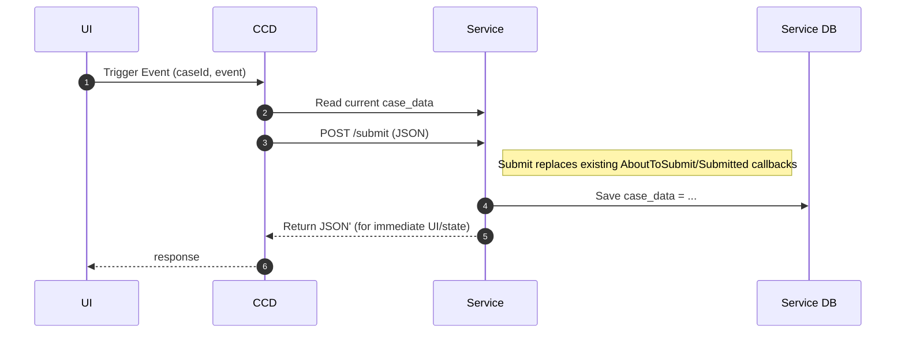

# Decentralised Data Persistence — Conceptual Introduction

- Persist case data in a service-owned database while CCD continues to orchestrate callbacks and authorisation.
- No big-bang rewrite: keep the familiar AboutToStart / MidEvent / AboutToSubmit / Submitted flow.
- The JSON payload stays intact—only the storage location and responsibility boundaries change.
- Data ownership aligns with business domain ownership.
- The SDK supplies migrations, transaction orchestration, idempotency, and optional Elasticsearch sync to smooth onboarding.


## As-is: centralised persistence

CCD orchestrates events and invokes service callbacks.

Each callback receives the full case JSON blob, performs validation, mutation, and side effects (emails, integrations, etc.), then returns a (possibly) changed blob to CCD for persistence.

CCD persists this blob verbatim in its case_data table.


```mermaid
sequenceDiagram
autonumber
participant UI as UI
participant CCD
participant Svc as Service

    UI->>CCD: Trigger Event (caseId, event)
    CCD->>Svc: POST callback(JSON)
    Svc-->>CCD: Return JSON' (validated/mutated)
    CCD-->>UI: Next state / response
```

## The decentralised option

CCD continues to orchestrate events and invokes service callbacks, but the service becomes the source of truth for case data.


```mermaid
sequenceDiagram
autonumber
participant UI as UI
participant CCD
participant Svc as Service
participant SDB as Service DB

    UI->>CCD: Trigger Event (caseId, event)
    CCD->>Svc: Read current case_data
    CCD->>Svc: POST /submit (JSON)
    Note right of Svc: Submit replaces existing AboutToSubmit/Submitted callbacks
    Svc->>SDB: Save case_data = ... 
    Svc-->>CCD: Return JSON' (for immediate UI/state)
    CCD-->>UI: response
```

- CCD loads your case type's data from your service instead of its case_data table.
- Your service persists both the authoritative case record and the event history inside your database (see schema overview).
- CCD still enforces authorisation, event definitions, and callback sequencing; you take on data modelling, retention, and migrations.

### Routing: telling CCD where your service lives

CCD Data Store uses a Spring-parsed multimap to discover which case types are decentralised and where their service is hosted. This is configured via environment variables with the naming convention:

```
CCD_DECENTRALISED_CASE-TYPE-SERVICE-URLS_<CaseType>: <service-url>
```

For example, to decentralise the `ET_EnglandWales` case type:

```yaml
CCD_DECENTRALISED_CASE-TYPE-SERVICE-URLS_ET_EnglandWales: https://et-cos-preview.service.core-compute-preview.internal
```

Spring automatically parses the suffix after `CASE-TYPE-SERVICE-URLS_` as the map key (the case type ID) and the value as the service URL. Multiple case types can be decentralised independently by adding additional env vars:

```yaml
CCD_DECENTRALISED_CASE-TYPE-SERVICE-URLS_ET_EnglandWales: https://et-cos.service.internal
CCD_DECENTRALISED_CASE-TYPE-SERVICE-URLS_ET_Scotland: https://et-cos.service.internal
CCD_DECENTRALISED_CASE-TYPE-SERVICE-URLS_CriminalInjuriesCompensation: https://cica-service.internal
```

These env vars are set on the **CCD Data Store API** deployment (not your service). In practice this means:

- **Preview / PR environments:** Add the env var to the CCD Data Store section of your service's preview Helm chart.
- **Higher environments (AAT, prod, etc.):** Add the env var via [Flux configuration](https://github.com/hmcts/cnp-flux-config/blob/master/apps/ccd/ccd-data-store-api/aat.yaml#L49) for the CCD Data Store API in the relevant environment.

When CCD Data Store receives a request for a case type that appears in this map, it delegates persistence and read operations to the configured service URL instead of using its own database. Case types not present in the map continue to use centralised CCD persistence.

#### Parameterised URLs for preview environments

Routing supports prefix matching with a `%s` template placeholder in the URL. This lets a single configuration entry on the AAT CCD Data Store route to any preview PR, removing the need to spin up a dedicated CCD instance per PR and saving preview resources.

For example, configuring the AAT CCD Data Store with:

```yaml
CCD_DECENTRALISED_CASE-TYPE-SERVICE-URLS_PCS-PR-: "https://pcs-api-pr-%s.preview.platform.hmcts.net"
```

When CCD receives a request for case type `PCS-PR-123`, it matches the prefix `PCS-PR-` and substitutes the suffix `123` into the template, routing to `https://pcs-api-pr-123.preview.platform.hmcts.net`.

The matching rules are:
- Keys are matched as **prefixes** against the case type ID (case-insensitive).
- If the URL contains `%s`, it is replaced with the case type suffix (the part after the prefix).
- If multiple prefixes match, the longest prefix wins. Ambiguous equal-length matches are rejected.

The routing logic lives in `PersistenceStrategyResolver` in the [ccd-data-store-api](https://github.com/hmcts/ccd-data-store-api) repository.

### What changes for teams

- **Database provisioning:** Allocate a PostgreSQL database for your service to persist its case data.
- **Schema migrations:** The SDK provides Flyway scripts to create and manage a 'ccd' schema that resides in your database.
- **Read APIs:** Implement `CaseView<CaseType, StateEnum>` so CCD can read case data from your service.
- **Write to your database:** You can write to your database during the standard CCD event lifecycle callbacks.
- **CCD Data Store routing:** Configure the `CCD_DECENTRALISED_CASE-TYPE-SERVICE-URLS_<CaseType>` env var on CCD Data Store to point at your service (see [Routing](#routing-telling-ccd-where-your-service-lives) above).

## Read next

- [Decentralised runtime in detail](./decentralised-runtime.md)
- [Concurrency considerations](./concurrency.md)
- [Migrating existing services](./data-migration.md)
