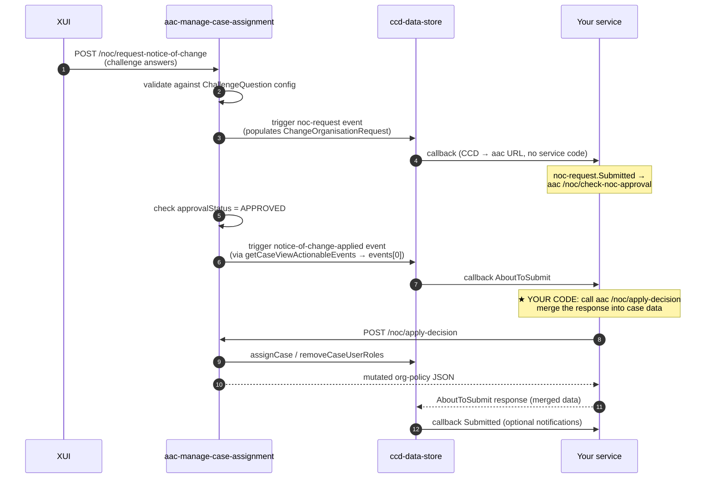

# Notice of Change — Implementation Guide

This guide explains how a service team adds Notice of Change (NoC) to their CCD case type using the SDK's `noticeOfChange()` builder.

## What NoC does

Notice of Change lets a solicitor take over representation of a party on an existing case. The incoming solicitor:

1. Visits the XUI NoC form, picks the case, and answers a set of **challenge questions** that prove they represent the right party (e.g. "what is your client's last name?").
2. If the answers match the case data, aac (`aac-manage-case-assignment`) records a `ChangeOrganisationRequest` on the case.
3. Once approved (auto-approval, or a caseworker review), aac triggers the **apply** event on the case, which flips the role assignments and updates the relevant `OrganisationPolicy` field.

The end result: the new solicitor's organisation has access to the case, the previous one is removed.

## Architecture overview

Three external services collaborate. Your service implements the highlighted portion:



Most of this is wiring the SDK does for you. The only piece of business code you write is the `aboutToSubmit` handler that calls aac's `/noc/apply-decision` and merges the response.

## What the SDK auto-generates

When you declare `builder.noticeOfChange().challenge(...)`, the SDK emits:

| CCD artifact | Purpose |
|---|---|
| `ChallengeQuestion.json` | The questions XUI asks the incoming solicitor. |
| `CaseEvent/notice-of-change-applied.json` | The "apply decision" event aac triggers via data-store. Wired with your `aboutToSubmitCallback` URL. |
| `CaseEvent/noc-request.json` | The "request" event aac fires to populate `ChangeOrganisationRequest`. `CallBackURLSubmittedEvent` is auto-wired to `${CCD_DEF_AAC_URL}/noc/check-noc-approval`. |
| `AuthorisationCaseEvent/<event>.json` rows | CRU grant for `[NOCAPPROVER]` on the apply event, and `caseworker-caa` on the request event. |
| `AuthorisationCaseState.json` rows | CRU grants for `[NOCAPPROVER]` and `caseworker-caa` across all states. |
| `CaseRoles.json` row | Declares `[NOCAPPROVER]` as a case role on the case type. |

`AuthorisationComplexType.json` is generated by `grantComplexType(...)` calls (separate API, used to grant CAA / approver roles CRU on the `OrganisationPolicy` sub-fields).

## Step-by-step setup

### 1. Add required role enum constants

Your `HasRole` enum **must** contain two constants the SDK detects by their `getRole()` value:

- `[NOCAPPROVER]` — the platform case role aac auto-assigns when triggering the apply event.
- `caseworker-caa` — the case access administrator role aac uses to populate the request field.

```java
public enum UserRole implements HasRole {
    // ... existing roles ...

    NOC_APPROVER("[NOCAPPROVER]", Permission.CRU, RAS),
    CASEWORKER_CAA("caseworker-caa", Permission.CRU, IDAM),

    // Per solicitor "slot" — one for each OrganisationPolicy you define.
    // The string identifies the case role aac assigns when this slot is taken.
    CLAIMANT_SOLICITOR("[CLAIMANTSOLICITOR]", Permission.CRU, RAS),
    DEFENDANT_SOLICITOR("[DEFENDANTSOLICITOR]", Permission.CRU, RAS);

    // ...
}
```

Build-time errors if missing:

- `noticeOfChange() requires <YourRole> to declare a constant with getRole() == "[NOCAPPROVER]" — …`
- `noticeOfChange() requires <YourRole> to declare a constant with getRole() == "caseworker-caa" — …`

### 2. Add case-data fields

Two field types on your case data class:

```java
@Data @Builder
public class MyCase {
    // ... existing fields ...

    // Required: aac populates this when a NoC request comes in.
    @CCD(label = "Notice of change request")
    private ChangeOrganisationRequest<UserRole> changeOrganisationRequestField;

    // One OrganisationPolicy per "slot" a solicitor can take over.
    // OrgPolicyCaseAssignedRole pre-bound to the case role string from your enum.
    @CCD(label = "Claimant solicitor")
    private OrganisationPolicy<UserRole> claimantOrganisationPolicy;

    @CCD(label = "Defendant solicitor")
    private OrganisationPolicy<UserRole> defendantOrganisationPolicy;
}
```

Both `ChangeOrganisationRequest` and `OrganisationPolicy` are built-in SDK complex types — CCD knows their shape, you don't need to declare it.

### 3. Declare challenge questions and the apply callback

```java
builder.noticeOfChange()
    .challenge("NoCChallenge")
        .question("claimantName", "What is the claimant's name?")
            .answer(UserRole.CLAIMANT_SOLICITOR)
                .complex(MyCase::getClaimantInformation).field(ClaimantInformation::getFullName)
                .or(MyCase::getClaimantTradingName)
            .done()
        .question("defendantFirstName", "What is the defendant's first name?")
            .answer(UserRole.DEFENDANT_SOLICITOR).complex(MyCase::getDefendant1).field(Party::getFirstName)
            .done()
    .aboutToSubmitCallback(this::applyNoticeOfChange)   // ★ MANDATORY
    .submittedCallback(this::notifyOutgoingSolicitor);  // optional
```

#### Answer builder cheat-sheet

| You write | CCD `Answer` expression |
|---|---|
| `.answer(R).field(MyCase::getX)` | `${x}:[R]` |
| `.answer(R).complex(MyCase::getA).field(A::getB)` | `${a.b}:[R]` |
| `.answer(R).complex(MyCase::getA).complex(A::getB).field(B::getC)` | `${a.b.c}:[R]` |
| `.answer(R).field(MyCase::getX).or(MyCase::getY)` | `${x}\|${y}:[R]` (matches either) |
| `.answer(R1, R2).field(MyCase::getX)` | `${x}:[R1],${x}:[R2]` (same field unlocks for either role) |
| `.answer(R).selectedLabelOf(MyCase::getDynList)` | `${dynList.value.label}:[R]` |
| `.answer(R).selectedValueOf(MyCase::getDynList)` | `${dynList.value.code}:[R]` |
| `.answer(R).field("literalFieldName")` | `${literalFieldName}:[R]` (escape hatch) |

`@JsonUnwrapped` complex fields are detected automatically — `.complex(MyCase::getUnwrappedComplex).field(Sub::getX)` produces `${x}` (or `${prefixX}` if `prefix=` is set on the annotation), not the wrong `${unwrappedComplex.x}`.

### 4. Implement the `aboutToSubmit` handler — the real work

The handler must call aac's `/noc/apply-decision` endpoint to actually flip role assignments and merge the resulting org-policy data back into the case. **Without this, NoC is a no-op — the SDK refuses to build** (`IllegalStateException: noticeOfChange() requires an aboutToSubmitCallback …`).

Write a Feign client (or use whichever HTTP client your service prefers):

```java
@FeignClient(name = "aac-client", url = "${aac.api.url}")
public interface AssignCaseAccessClient {
    @PostMapping(path = "/noc/apply-decision", consumes = APPLICATION_JSON_VALUE)
    AboutToStartOrSubmitCallbackResponse applyNoticeOfChange(
        @RequestHeader(AUTHORIZATION) String authorisation,
        @RequestHeader("ServiceAuthorization") String serviceAuthorisation,
        @RequestBody AcaRequest request);
}
```

Then in your `CCDConfig` (or a separate `@Component`):

```java
private AboutToStartOrSubmitResponse<MyCase, State> applyNoticeOfChange(
        CaseDetails<MyCase, State> details, CaseDetails<MyCase, State> before) {

    String sysToken = idamService.systemUserToken();
    String s2sToken = authTokenGenerator.generate();

    AboutToStartOrSubmitCallbackResponse aacResponse =
        assignCaseAccessClient.applyNoticeOfChange(sysToken, s2sToken, AcaRequest.from(details));

    if (aacResponse.getErrors() != null && !aacResponse.getErrors().isEmpty()) {
        return AboutToStartOrSubmitResponse.<MyCase, State>builder()
            .errors(aacResponse.getErrors())
            .build();
    }

    // Merge aac's mutated org-policy data into the typed case
    MyCase updated = objectMapper.convertValue(aacResponse.getData(), MyCase.class);

    // Optional: any service-specific resets / mirroring
    // e.g. clear stale draft fields the previous solicitor was working on
    // updated.setDraftStatementOfTruth(null);

    return AboutToStartOrSubmitResponse.<MyCase, State>builder()
        .data(updated)
        .build();
}
```

This pattern is taken from `apps/nfdiv/nfdiv-case-api/.../SystemApplyNoticeOfChange.java` — clone it as a starting point. The aac client class itself is also worth copying verbatim (it's stable across services).

### 5. (Optional) `aboutToStartCallback` for validation

If you want to refuse certain requests before they get applied — nfdiv rejects judicial-separation cases this way — add an `aboutToStartCallback`:

```java
.aboutToStartCallback(this::validateNoticeOfChangeRequest)
```

Important: **`aboutToStart` is for validation only**. Don't mutate persistent state from this hook — it can be re-invoked, fail mid-flight, and leave you in an inconsistent state. Return errors in the response if the request should be refused; let `aboutToSubmit` do the real work.

### 6. (Optional) `submittedCallback` for notifications

```java
.submittedCallback(this::notifyOutgoingSolicitor)
```

Used after the org-policy change is committed. Common uses: emailing the outgoing/incoming solicitors, sending audit events, kicking off downstream workflows. Read-only — the case has already been persisted, you can't mutate from here.

### 7. Grant CRU on the OrganisationPolicy sub-fields

The CAA and approver roles need CRU on every sub-field of every `OrganisationPolicy` so the NoC UI can read/write them during approval. Use `grantComplexType(...)`:

```java
private static final String[] ORG_POLICY_SUBFIELDS = {
    "OrgPolicyCaseAssignedRole",
    "OrgPolicyReference",
    "Organisation",
    "Organisation.OrganisationID",
    "Organisation.OrganisationName",
    "PrepopulateToUsersOrganisation",
    "PreviousOrganisations"
};

private static <S> void grantOrgPolicy(
        ConfigBuilder<MyCase, S, UserRole> builder,
        TypedPropertyGetter<MyCase, ?> policyField) {
    for (String sub : ORG_POLICY_SUBFIELDS) {
        builder.grantComplexType(policyField, sub, Permission.CRU,
            UserRole.CASEWORKER_CAA, UserRole.CASEWORKER_APPROVER);
    }
}

// In configure(...):
grantOrgPolicy(builder, MyCase::getClaimantOrganisationPolicy);
grantOrgPolicy(builder, MyCase::getDefendantOrganisationPolicy);
```

### 8. The `noc-request` event (auto-generated)

The SDK also auto-generates the second required NoC event, `noc-request`, that aac fires to populate `ChangeOrganisationRequest`. Its `CallBackURLSubmittedEvent` is wired to point directly at aac (`${CCD_DEF_AAC_URL}/noc/check-noc-approval`) — no service-team Java required.

For this to work, your role enum **must** also contain a constant whose `getRole()` returns `caseworker-caa` (the case access administrator role aac uses to populate the field). The SDK detects it by name, same way it detects `[NOCAPPROVER]`.

```java
public enum UserRole implements HasRole {
    // ...
    CASEWORKER_CAA("caseworker-caa", Permission.CRU, IDAM),
}
```

Build-time error if missing: `IllegalStateException: noticeOfChange() requires <YourRole> to declare a constant with getRole() == "caseworker-caa" — caseworker-caa is the case access administrator role aac uses to populate the ChangeOrganisationRequest field`.

**Customisation:** override the event id or name via the builder:

```java
builder.noticeOfChange()
    .challenge(...).done()
    .requestEventId("nocRequest")              // default: "noc-request"
    .requestEventName("Custom request name")   // default: "Notice of Change Request"
    .aboutToSubmitCallback(this::applyNoticeOfChange);
```

**Manual override:** if you need custom hooks on the request event (nfdiv-style domain-specific validation), declare it manually via `builder.event("noc-request")…` — the SDK detects the manual declaration and skips auto-registration. You then own the `CallBackURLSubmittedEvent` wiring yourself.

## End-to-end verification

After wiring everything up:

1. **Generate the config:** `./gradlew generateCCDConfig`. Inspect `build/definitions/<CASE_TYPE>/`:
   - `ChallengeQuestion.json` matches your `.challenge(...)` declaration
   - `CaseEvent/notice-of-change-applied.json` exists with `CallBackURLAboutToSubmitEvent` pointing to your service
   - `AuthorisationCaseEvent` includes a `[NOCAPPROVER]` row for the apply event
   - `AuthorisationComplexType.json` has CRU rows for every org-policy sub-field × CAA/approver
2. **Boot cftlib** with your config and trigger the NoC flow from XUI. Confirm:
   - The challenge form shows your questions
   - Submitting valid answers triggers the apply event
   - Your `aboutToSubmit` handler runs and the org-policy fields update
3. **Check `OrganisationPolicy.OrgPolicyCaseAssignedRole`** on the case after — it should hold the right `[CLAIMANTSOLICITOR]`/`[DEFENDANTSOLICITOR]` value, and the new solicitor's user should appear in `dataStoreRepository.getCaseAssignments()`.

## Common build-time errors

| Error | Fix |
|---|---|
| `noticeOfChange() requires <Enum> to declare a constant with getRole() == "[NOCAPPROVER]"` | Add the `NOC_APPROVER` constant to your role enum (step 1). |
| `noticeOfChange() requires <Enum> to declare a constant with getRole() == "caseworker-caa"` | Add the `CASEWORKER_CAA` constant to your role enum (step 1). |
| `noticeOfChange() requires <CaseClass> to declare a ChangeOrganisationRequest<R> field …` | Add the `changeOrganisationRequestField` to your case data class (step 2). |
| `noticeOfChange() requires an aboutToSubmitCallback …` | Add `.aboutToSubmitCallback(this::applyNoticeOfChange)` (step 4). |
| `aac-manage-case-assignment requires exactly one event visible to [NOCAPPROVER], but found: [eventA, eventB]` | You've granted `[NOCAPPROVER]` access to a second event somewhere. Find and remove the duplicate grant. aac's flow only works when the apply event is uniquely identifiable for the NOCAPPROVER role. |

## Open caveats

- **Collection-typed parties are not supported in challenge answers.** If your case has a `List<ListValue<Defendant>>` and you want "any defendant's first name" to unlock, CCD's challenge matcher does not natively expand collections. The standard workaround (used by FPL) is to copy each collection element into flat `noticeOfChangeAnswers0`, `noticeOfChangeAnswers1`, ... fields at request time. See `docs/noc/notice-of-change.md` for the FPL pattern.
- **`aac /noc/apply-decision` is not transactional with your CCD submit.** aac flips role assignments before your submit completes. If your submit then fails, role assignments are still flipped — investigate before relying on it for sensitive cases.
