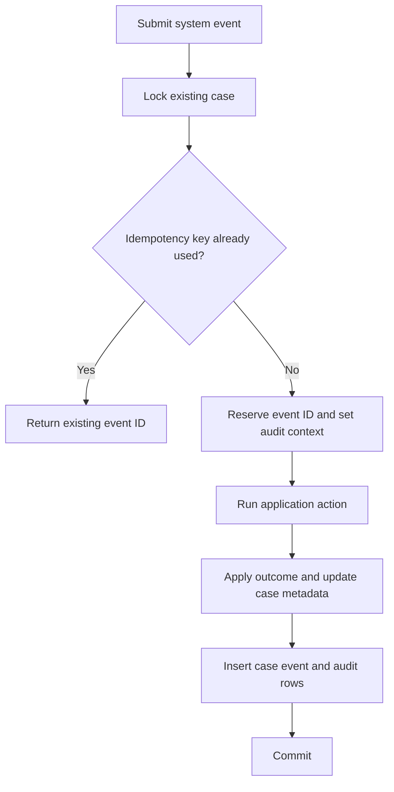

# System case events

Some work caused by a case event completes after the original event transaction. For example, a background task may
render and upload a document before attaching it to a case. Persisting the result directly would create case data
changes without a corresponding `ccd.case_event` or the database audit context described in
[Database auditing](audit.md).

The decentralised runtime provides an in-process Java API for recording this work as a new system case event. It
does not authenticate an artificial user or submit the event through CCD.

## Scope

The first version supports system-initiated events on existing decentralised cases. It does not support:

- user-initiated events;
- case creation;
- submission over HTTP;
- IDAM or S2S authentication inside the system-event API;
- CCD event definitions or authorisation grants; or
- publication to the CCD case-event topic.

System events are recorded in normal case history and provide the context required by database auditing.

## API

Applications inject `SystemCaseEventService` and supply the event metadata, an idempotency key and an action to execute
inside the event transaction:

```java
systemCaseEvents.submit(
    caseReference,
    new SystemCaseEvent("claimFormGenerated", "Claim form generated"),
    idempotencyKey,
    context -> {
        claimFormPersistence.attach(caseReference, documentUrl);
        return SystemCaseEventOutcome.noStateChange();
    }
);
```

The public API consists of:

```java
public interface SystemCaseEventService {
    <T, S> SystemCaseEventResult submit(
        long caseReference,
        SystemCaseEvent event,
        UUID idempotencyKey,
        SystemCaseEventAction<T, S> action
    );

    <T, S> SystemCaseEventResult submitOnBehalfOf(
        long caseReference,
        SystemCaseEvent event,
        UUID idempotencyKey,
        SystemCaseEventActor actor,
        SystemCaseEventAction<T, S> action
    );
}

public record SystemCaseEvent(String id, String name) {
}

public sealed interface SystemCaseEventActor {
    record IdamUser(UserInfo identity) implements SystemCaseEventActor {}
    record Service(String serviceId) implements SystemCaseEventActor {}
}

@FunctionalInterface
public interface SystemCaseEventAction<T, S> {
    SystemCaseEventOutcome<S> execute(SystemCaseEventContext<T, S> context);
}

public record SystemCaseEventContext<T, S>(
    long caseReference,
    T caseData,
    S state
) {
}

public record SystemCaseEventResult(
    long caseReference,
    long eventInstanceId,
    boolean replayed
) {
}
```

`SystemCaseEventOutcome` optionally supplies a new state, summary and description. The default outcome leaves case
metadata unchanged.

The event is not registered beforehand. `SystemCaseEvent` provides the ID and display name stored in case history for
that invocation. The action can capture task-specific inputs such as a generated document URL.

`SystemCaseEventActor` is a trusted attribution assertion, not an authentication credential. The application must only
construct an `IdamUser` from the `UserInfo` established by its authenticated user context, and a `Service` from the
service name established by its validated S2S context. The SDK does not accept or revalidate bearer tokens here:
authentication and endpoint authorisation remain at the application's HTTP boundary. This keeps tokens out of domain
services, avoids repeated authentication calls and allows automated tests to construct identities directly.

## Transaction

`SystemCaseEventService` uses the same transaction infrastructure as an ordinary decentralised submission:



The case lock is acquired before the current raw case snapshot is supplied to the action as the configured case and
state types. A normal `CaseView` is not used: projections may depend on the authenticated user, while a system event has
no IDAM security context. The action may update service-owned tables through the application's normal repositories. It
must not perform document rendering, network calls or other slow external work; those operations complete before the
system event is submitted.

The runtime updates `ccd.case_data` when the outcome changes case metadata and inserts the system event into
`ccd.case_event`. Because the event is not registered in the CCD definition, it is not published to the case-event
message outbox in the first version.

The action, its row audit entries, case metadata and case history commit or roll back together. Calling the service from
an existing transaction is rejected so that a system event cannot be nested inside another unit of work.

## Idempotency and concurrency

An idempotency key is mandatory because background tasks may be retried. The existing per-case idempotency constraint
and case lock are reused.

If the key has already been committed for the case, the action is not invoked and the service returns the existing event
instance ID with `replayed` set to `true`. Concurrent events for the same case are serialised by the case lock.

The action receives the latest raw case snapshot after the lock is acquired. With no preregistered event definition, the
runtime does not impose pre-state transition rules. The action is responsible for its business preconditions. If the
outcome requests a new state, the runtime verifies that it is a known state for the case type.

## System identity

Applications enable the bean by configuring a stable service identifier:

```yaml
ccd:
  decentralised-runtime:
    system-events:
      service-id: pcs-api
```

No IDAM request is made. The history record uses:

| Field | Value |
| --- | --- |
| `user_id` | `system:<service-id>` |
| `user_first_name` | `System` |
| `user_last_name` | `<service-id>` |
| `proxied_by` | `null` |

The runtime validates the configured identity against the existing `ccd.case_event` column lengths. This identifies the
originating service without requiring a synthetic IDAM account.

### On behalf of another actor

Some system-initiated work is caused directly by a user outside a CCD submission. For example, PCS links a party after
a citizen presents an access code. The application can retain that attribution without authenticating through CCD:

```java
systemCaseEvents.submitOnBehalfOf(
    caseReference,
    new SystemCaseEvent("partyLinkedByAccessCode", "Party linked by access code"),
    idempotencyKey,
    new SystemCaseEventActor.IdamUser(authenticatedUserInfo),
    context -> {
        partyAccessCodeLinker.link(caseReference, userId);
        return SystemCaseEventOutcome.noStateChange();
    }
);
```

An authenticated service can also be retained as the originating actor. For example, when `payment_app` invokes a PCS
payment webhook, PCS supplies the service name extracted from the validated S2S context:

```java
systemCaseEvents.submitOnBehalfOf(
    caseReference,
    new SystemCaseEvent("feePaymentStatusUpdated", "Fee payment status updated"),
    idempotencyKey,
    new SystemCaseEventActor.Service(authenticatedServiceName),
    context -> {
        paymentPersistence.apply(callback);
        return SystemCaseEventOutcome.noStateChange();
    }
);
```

This is still a system event: the configured service owns the transaction and no event definition or CCD authorisation
is applied. History stores the supplied actor in `user_id` and the configured `system:<service-id>` identity in
`proxied_by`. IDAM users use their `uid`, given name and family name; when either name is absent the SDK falls back to
the IDAM display name and then `Unknown`. Services use `system:<service-id>`, `System` and the service ID respectively.
Plain `submit` stores the configured service identity in `user_id` and leaves `proxied_by` empty.

For PCS, the expected history attribution is:

| Origin | `user_id` | `proxied_by` |
| --- | --- | --- |
| PCS background work | `system:pcs-api` | `null` |
| Authenticated IDAM user | IDAM `uid` | `system:pcs-api` |
| Payments callback | `system:payment_app` | `system:pcs-api` |

## Failure behaviour

Submission fails without invoking or committing the action when:

- the case does not exist;
- the event ID, event name or idempotency key is missing;
- the service identity is not configured or is invalid;
- a requested state is unknown; or
- another transaction is already active on the calling thread.

An exception from the action or any subsequent persistence step rolls back the whole event. The caller may retry with
the same idempotency key.

## PCS example

Claim form generation currently renders a document in a background task and later updates the claim. The task should
perform the external work first, then submit `claimFormGenerated`:

```text
claimIssuePayment
        |
        +-- schedule claim form generation
                |
                +-- render and upload document
                |
                +-- submit claimFormGenerated system event
                        |
                        +-- insert document
                        +-- update claim.claim_form_document_id
                        +-- write case history and row audit entries
```

The later database changes belong to `claimFormGenerated`, rather than being attributed retrospectively to
`claimIssuePayment`.

## Test support

Testing-support endpoints must use the same API as production background work. They must not disable auditing or write
audited tables in an unrelated transaction. PCS uses system events when its test helpers issue a case, generate access
codes or change party contact details, so end-to-end tests exercise the same transaction and attribution rules as the
runtime paths.

## Test coverage

Implementation must cover:

- a successful action creating case history and linked row audit entries;
- system identity without an IDAM interaction;
- an idempotent replay returning the original event without running the action again;
- the raw typed case data and current state being supplied after locking;
- an optional state, summary and description being persisted;
- IDAM-user and S2S-service attribution storing the actor as `user_id` and the configured service as `proxied_by`;
- rejection of malformed asserted identities;
- rejection of invalid metadata, an unknown state and nested invocation;
- complete rollback when the action or history persistence fails;
- absence of a case-event outbox message; and
- end-to-end background and testing-support writes succeeding with audit triggers enabled.
