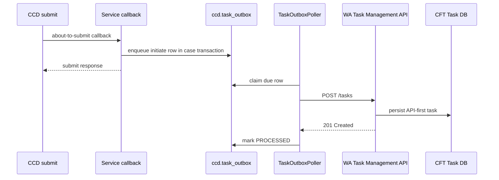
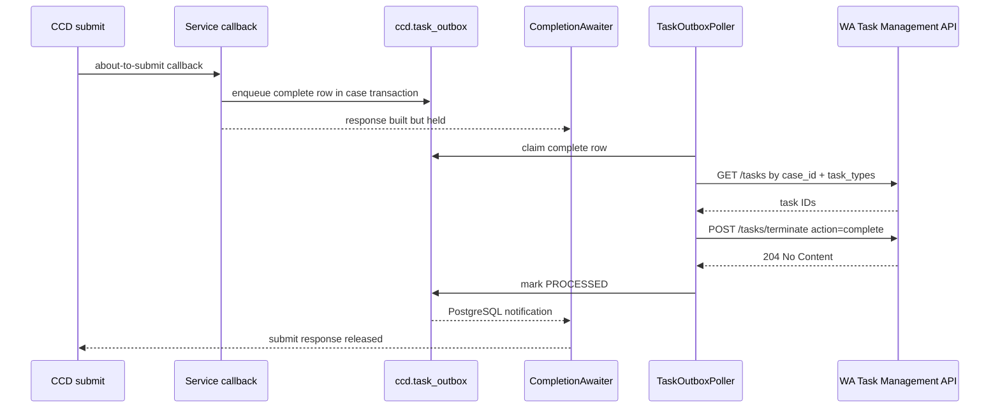

# Task Management API-First LLD

## Scope

This LLD covers the API-first task-management work currently split across:

- `wa-task-management-api`, branch `decentralisation-poc`.
- `dtsse-ccd-config-generator`, branch `task_mgmt_in_order`.
- `sdk/task-management`, which is intended to be consumed as a library by internal services.
- `sdk/decentralised-runtime`, which owns the service-side persistence schema and CCD submission integration.

The design replaces Camunda/DMN-driven task creation for participating services with service-generated task payloads,
persisted through a local task outbox and delivered to Task Management API by a poller.

## WA Task Management API Changes

### New endpoint: `GET /tasks`

Implemented by `TaskPocController#getTasks`.

Purpose:

- Return API-first tasks filtered by `case_id`, `task_types`, or both.
- Support service-side termination flows, where the SDK poller resolves task IDs from business task types before calling
  bulk termination.

Request:

- Header: `ServiceAuthorization` is required.
- Query: `case_id` is optional.
- Query: `task_types` is optional and encoded as CSV by the SDK Feign client.

Validation:

- At least one of `case_id` or `task_types` must be present.
- `case_id`, when present, must not be blank.
- `task_types`, when present, must not be empty and must not contain blank values.
- `ClientAccessControlService#hasExclusiveAccess` must return true for the service token.

Implementation:

- `TaskManagementService#getTasks` delegates to `CFTTaskDatabaseService#findAllBy`.
- The database query builds a JPA specification from the supplied filters.
- `GetTasksResponseMapper` maps persisted `TaskResource` rows to the new response shape.
- Response is `200 OK` with `tasks` and `total_records`.

### New endpoint: `POST /tasks`

Implemented by `TaskPocController#createTask`.

Purpose:

- Create a fully formed task directly in Task Management without Camunda process state or DMN evaluation.
- The caller supplies the task attributes, permissions, routing data, dates, priority, case metadata, and correlation
  identifier.

Request:

- Header: `ServiceAuthorization` is required.
- Body: `CreateTaskRequest`, with a required `task`.
- Required payload fields are defined in `src/main/resources/api-specs/openapi.yaml`.

Implementation:

- `TaskManagementService#addTask` maps the API payload with `CFTTaskMapper#mapToApiFirstTaskResource`.
- Task Management generates the persisted `task_id`; the caller-supplied idempotency/correlation field is
  `external_task_id`.
- The new task starts as `UNCONFIGURED` in the mapper, then goes through existing auto-assignment logic.
- `TaskPocController` calls `updateTaskIndex` after save so the task is marked indexed.
- Response is `201 Created` with the saved task resource.

Idempotency:

- The database adds `external_task_id` to `cft_task_db.tasks`.
- A partial unique index enforces uniqueness for `(external_task_id, case_type_id)` when both values are non-null.
- `TaskManagementService#addTask` catches the Hibernate constraint violation for
  `uq_tasks_external_task_id_case_type_id` and throws `TaskSecondaryKeyConflictException`.

Current contract gap:

- The OpenAPI file documents `204 No Content` for an already existing task.
- The current code throws a new runtime exception, and `ApplicationProblemControllerAdvice` does not explicitly map
  `TaskSecondaryKeyConflictException`.
- Unless handled elsewhere, duplicate create currently risks surfacing as a generic server error rather than the
  documented `204`.

### New endpoint: `POST /tasks/terminate`

Implemented by `TaskPocController#terminateTasks`.

Purpose:

- Bulk-cancel or bulk-complete API-first tasks by Task Management task ID.
- Used by the SDK poller after it resolves task IDs from `GET /tasks`.

Request:

- Header: `ServiceAuthorization` is required.
- Body: `TerminateTasksRequest` with `action` and `task_ids`.
- `action` is `cancel` or `complete` in the OpenAPI enum.

Implementation:

- `TaskManagementService#terminateTasks` converts request IDs to strings and processes each task under a transaction.
- Each task is loaded with a pessimistic write lock via `findByIdAndObtainLock`.
- Repeated or already-terminal work is skipped for idempotency.
- For a cancel request the transient state is set to `CANCELLED`, termination process to
  `EXUI_CASE_EVENT_CANCELLATION`, and reason to `deleted`.
- For a complete request the transient state is set to `COMPLETED`, termination process to
  `EXUI_CASE_EVENT_COMPLETION`, and reason to `completed`.
- The method then calls the existing `terminateTask`, which leaves the final persisted state as `TERMINATED`.

Response:

- `204 No Content` when all requested task IDs are processed or already terminal.

### New endpoint: `PUT /tasks/reconfigure`

Implemented by `TaskPocController#reconfigureTasks`.

Purpose:

- Update existing API-first tasks with service-evaluated replacement attributes.
- Avoid Camunda and DMN reconfiguration for services that own task rules in code.

Request:

- Header: `ServiceAuthorization` is required.
- Body: `TaskReconfigureRequest` with one or more task payloads.

Implementation:

- `TaskManagementService#reconfigureTasks` loads each task by ID using a pessimistic write lock.
- Only tasks currently in `ASSIGNED` or `UNASSIGNED` are reconfigured.
- Missing tasks, or tasks in disallowed states, are logged and skipped rather than failing the whole request.
- `CFTTaskMapper#mapToTaskResourceForReconfigure` updates mutable fields, permissions, work type, hearing fields, and
  additional properties.
- Mandatory task field validation runs after mapping.
- `lastReconfigurationTime` is set, auto-assignment is recalculated, and saved task resources are returned.

Response:

- `200 OK` with a list of tasks that were actually reconfigured.

### More minor API repository changes

Security and exception advice:

- `SecurityConfiguration` permits unauthenticated Spring Security access to `GET /tasks`, `POST /tasks`,
  `POST /tasks/terminate`, and `PUT /tasks/reconfigure`; the controller still enforces S2S exclusive client access.
- `ApplicationProblemControllerAdvice` now includes the POC controller package.

Task entity and Camunda bypass:

- `TaskResource` now has `externalTaskId`.
- `TaskResource#isCamundaTask` returns true only when `externalTaskId` is blank.
- Existing operations such as claim, unclaim, cancel, complete, and terminate now skip Camunda updates for API-first
  tasks.

Mapping and enum handling:

- `CFTTaskMapper` maps API-first create payloads to `TaskResource`.
- It maps API-first permissions into `TaskRoleResource` boolean permission columns.
- It maps API-first reconfigure payloads onto existing `TaskResource` rows.
- `PermissionTypes` and `ExecutionType` now support JSON deserialization from the external API values.

Database:

- Main and replica migrations add `external_task_id`.
- A unique partial index on `(external_task_id, case_type_id)` backs create idempotency.

Build and tests:

- The branch adds an OpenAPI document at `src/main/resources/api-specs/openapi.yaml`.
- The branch adds integration coverage for `GET /tasks`.

## SDK Task Management Module

### Module role

`sdk/task-management` is the service-facing library. It provides:

- Data models for the API-first `/tasks` contract.
- A Feign client for Task Management API.
- A transactional task outbox writer.
- A scheduled poller that claims outbox rows and calls Task Management API.
- Retry, lease, status, and completion-awaiting support.
- Delay-until helper code used by services to compute task timing.

Auto-configuration is conditional on `task-management.api.url`. When that URL is absent the module does not create the
Task Management beans.

### Configuration

`TaskManagementProperties` uses the `task-management` prefix.

Important properties:

- `task-management.api.url`: base URL for Task Management API and the auto-configuration switch.
- `task-management.outbox.poller.batch-size`: number of rows claimed per poll, default `5`.
- `task-management.outbox.poller.processing-timeout`: lease duration for a processing row, default `5m`.
- `task-management.outbox.poller.delay`: scheduled poll delay, default `1000ms`.
- `task-management.outbox.poller.enabled`: enables the poller bean, default true when the property is missing.
- `task-management.outbox.retry.initial-delay`: first retry delay, default `1s`.
- `task-management.outbox.retry.max-delay`: retry delay cap, default `5m`.
- `task-management.outbox.retry.multiplier`: exponential backoff multiplier, default `2.0`.
- `task-management.outbox.retry.max-attempts`: initial attempt plus retries, default `9`; `0` means unlimited.
- `task-management.outbox.completion.await-processed`: whether CCD submissions wait for completion rows, default true.
- `task-management.outbox.completion.timeout`: completion wait timeout, default `30s`.
- `task-management.outbox.completion.poll-interval`: PostgreSQL notification wait interval, default `100ms`.

### Client API calls

`TaskManagementFeignClient` exposes:

- `POST /tasks` for create.
- `GET /tasks?case_id=...&task_types=...` for lookup.
- `POST /tasks/terminate` for complete/cancel.
- `PUT /tasks/reconfigure` for reconfigure.

`TaskManagementApiClient` wraps the Feign client and applies small argument checks, notably requiring a non-blank
`caseId` for `getTasks`.

### Task outbox write path

Services inject `TaskOutboxService` and enqueue task work from their CCD callback transaction.

The outbox exposes one writer per task action, plus a delayed-create overload:

- `enqueueTaskCreateRequest(TaskOutboxTrigger, TaskCreateRequest)`.
- `enqueueTaskCreateRequest(TaskOutboxTrigger, TaskCreateRequest, LocalDateTime nextAttemptAt)`.
- `enqueueTaskCompleteRequest(TaskOutboxTrigger, TerminateTaskOutboxPayload)`.
- `enqueueTaskCancelRequest(TaskOutboxTrigger, TerminateTaskOutboxPayload)`.
- `enqueueTaskReconfigureRequest(TaskOutboxTrigger, ReconfigureTaskOutboxPayload)`.

`TaskOutboxTrigger` carries the CCD event identity:

- `caseId`.
- `caseType`.
- `eventId`.
- `created`.

The same trigger must be reused for all task outbox rows produced by the same CCD event occurrence. The repository uses
`case_id`, `event_id`, and `created` to group rows into one trigger for ordering.

Validation:

- Trigger case ID, case type, event ID, and created timestamp are required.
- Create requests require `task`, `externalTaskId`, `caseId`, and `caseTypeId`.
- Complete and cancel requests require `caseId`, `caseType`, and at least one task type.
- Reconfigure requests require `caseId` and `caseType`.
- Payload case ID and case type must match the trigger.
- `caseId` must be a numeric CCD case reference because the repository stores it as `bigint`.

The service writes JSON payloads to `ccd.task_outbox`. All rows start as `PENDING`, with `available_at` set to either
the supplied delay or current UTC time.

### Outbox database model

The final outbox shape after the decentralised-runtime migrations is:

- `ccd.task_action`: `cancel`, `complete`, `initiate`, `reconfigure`.
- `ccd.task_outbox_status`: `PENDING`, `PROCESSING`, `PROCESSED`, `UNPROCESSABLE`.
- `ccd.task_outbox`: the current row state.
- `ccd.task_outbox_history`: append-only status history with response code and error text.

Important `ccd.task_outbox` columns:

- `case_id`: FK to `ccd.case_data(reference)`, cascade delete.
- `event_id`: CCD event ID; non-blank.
- `created`: trigger timestamp; must be reused across rows from one event occurrence.
- `payload`: JSONB request payload.
- `requested_action`: task action enum.
- `status`: current processing status.
- `attempt_count`: incremented when a row is claimed.
- `available_at`: when a pending row can be claimed.
- `claim_token`: current processing lease token.
- `lease_until`: current processing lease expiry.

Constraints and indexes:

- A unique index on `(case_id, event_id, created, requested_action)` allows at most one row for a given action in a
  trigger.
- Status shape constraints enforce:
  - `PENDING` rows have `available_at` and no lease.
  - `PROCESSING` rows have `claim_token` and `lease_until` and no `available_at`.
  - Terminal rows have no lease and no `available_at`.
- Partial indexes support due pending rows and expired processing leases.
- Trigger-ordering indexes support per-case and per-trigger ordering.

### Poller claim rules

`TaskOutboxPoller#poll` calls `TaskOutboxRepository#claimPending(batchSize, maxAttempts)`.

The claim SQL is the core concurrency control:

- Expired `PROCESSING` rows that have already consumed the final allowed attempt are first marked
  `UNPROCESSABLE`, with history recorded.
- A row is claimable only when it is:
  - `PENDING` and `available_at <= now`, or
  - `PROCESSING` with an expired lease.
- A row is not claimable if `maxAttempts > 0` and `attempt_count >= maxAttempts`.
- A case can have at most one active processing lease at a time.
- Independent cases can progress concurrently because row locking uses `FOR UPDATE SKIP LOCKED`.
- Rows are claimed atomically: status changes to `PROCESSING`, `attempt_count` increments, a new `claim_token` is set,
  and `lease_until` is set from `processing-timeout`.

Per-case trigger ordering:

- Later triggers for the same case are blocked by earlier triggers that are:
  - `PROCESSING`;
  - `UNPROCESSABLE`;
  - `PENDING` and due;
  - `PENDING` with `attempt_count > 0`, even if delayed for retry.
- A future, never-attempted `PENDING` row does not block later triggers. This preserves the delayed-work bypass policy.
- Trigger order is `created`, then the first outbox row ID for that trigger.

Within-trigger action priority:

- The claim query assigns action priority:
  - `complete`: `0`.
  - `cancel`: `10`.
  - `reconfigure`: `20`.
  - `initiate`: `30`.
- A row is blocked until every lower-priority action in the same trigger is `PROCESSED`.
- This means complete work is preferred before cancel, cancel before reconfigure, and reconfigure before create/initiate
  for one CCD event occurrence.

### Poller processing rules

For each claimed row, the poller dispatches by `requested_action`:

- `initiate`: deserialize `TaskCreateRequest` and call `POST /tasks`.
- `complete`: resolve matching tasks with `GET /tasks`, then call `POST /tasks/terminate` with action `complete`.
- `cancel`: resolve matching tasks with `GET /tasks`, then call `POST /tasks/terminate` with action `cancel`.
- `reconfigure`: map stored `TaskPayload` rows into `TaskReconfigurePayload` rows and call `PUT /tasks/reconfigure`.

Termination lookup:

- The outbox payload stores task types, not Task Management task IDs.
- The poller calls `GET /tasks` using `caseId` and `taskTypes`.
- If lookup succeeds and returns no tasks, the poller treats the action as successful and marks the row `PROCESSED`.
- If lookup fails, that response is handled as the row failure.
- If lookup succeeds, the poller sends all returned task IDs to `POST /tasks/terminate`.

Success rules:

- A 2xx response is required.
- `initiate` and `reconfigure` additionally require a non-null response body.
- On success, the repository marks the row `PROCESSED` only if the row is still `PROCESSING` with the same
  `claim_token`.
- History is written with status `PROCESSED` and the HTTP response code.

Failure rules:

- Feign exceptions are classified by HTTP status.
- Recoverable statuses are `408`, `409`, `425`, `429`, all `5xx`, null status, and unexpected statuses below `400`.
- Other `4xx` responses are treated as deterministic request/auth failures and are not retried.
- JSON parse failures and invalid action/request data are not retried.
- Other runtime exceptions are retried.
- Recoverable failures are rescheduled to `PENDING` with `available_at` set by exponential backoff.
- Non-recoverable or exhausted failures are marked `UNPROCESSABLE`.
- Failure updates also require the current `claim_token`; otherwise the poller logs that it lost the lease and does not
  overwrite another worker's result.

### Completion synchronicity

Only complete actions are awaited synchronously by the decentralised runtime.

The flow is:

1. `CaseSubmissionService` resolves the latest task outbox ID for the case before executing the submission transaction.
2. The CCD callback transaction persists case changes and any task outbox rows.
3. The service builds the normal CCD submit response.
4. Before returning that response, the decentralised runtime looks for `complete` rows for the same case with IDs after
   the pre-transaction marker.
5. For each such row, `TaskOutboxCompletionAwaiter` waits until it becomes `PROCESSED` or `UNPROCESSABLE`.

The awaiter:

- Uses PostgreSQL `LISTEN task_outbox_complete_finished`.
- Re-checks the row before waiting to avoid missing an already-finished row.
- Reads notifications emitted by the `ccd.notify_task_outbox_complete_finished` trigger.
- Times out using `task-management.outbox.completion.timeout`.
- Throws `TaskOutboxTimeoutException` on timeout.
- Does nothing when `task-management.outbox.completion.await-processed=false`.

Implications:

- Complete requests are synchronous from the CCD submitter's point of view, up to the configured timeout.
- Cancel, reconfigure, and initiate requests are asynchronous; the case submission response does not wait for them.
- A failed complete row unblocks the awaiter when it reaches `UNPROCESSABLE`; the awaiter logs the failure and releases
  the submit response. Timeout is the case that throws.

## Decentralised Runtime Changes

`sdk/decentralised-runtime` now depends on `sdk/task-management`.

Runtime code:

- `CaseSubmissionService` injects `ObjectProvider<TaskOutboxCompletionAwaiter>` so services without task-management
  configuration still run.
- The latest outbox ID for the case is captured before the submission transaction.
- After a successful new submission or idempotent replay response is built, the runtime awaits newly created complete
  outbox rows for that case.

Database migrations:

- `V0016__task_outbox.sql` creates the initial task outbox, history table, task action enum, and status enum.
- `V0017__task_outbox_case_ordering_indexes.sql` adds early ordering indexes.
- `V0018__task_outbox_waiting_status.sql` adds a now-superseded waiting status.
- `V0019__notify_task_outbox_complete_finished.sql` adds notification support for complete rows.
- `V0020__task_outbox_trigger_ordering.sql` adds `event_id`, uniqueness per trigger/action, and action-priority indexes.
- `V0021__add_task_outbox_unprocessable_status.sql` adds terminal failure status.
- `V0022__notify_terminal_task_outbox_completion.sql` updates notifications to fire for `UNPROCESSABLE`.
- `V0023__add_task_outbox_pending_status.sql` adds `PENDING`.
- `V0024__simplify_task_outbox_status.sql` collapses previous transient statuses into the final
  `PENDING/PROCESSING/PROCESSED/UNPROCESSABLE` model, adds leases, and enforces status shape constraints.

## End-to-End Flow

### Create task

### Complete task

## For Devs: Implicit Outbox Rules

Use this section as the short version when integrating the library.

1. Create one `TaskOutboxTrigger` for one CCD event occurrence and reuse it for every task outbox call caused by that
   event.
2. Do not create two outbox rows with the same action for the same trigger; the database has a unique index on
   `(case_id, event_id, created, requested_action)`.
3. Use numeric CCD case references as `caseId`; the outbox stores them as `bigint`.
4. Make the payload case ID and case type match the trigger exactly.
5. Create requests must provide `externalTaskId`, `caseId`, and `caseTypeId`; `externalTaskId + caseTypeId` is the
   Task Management create idempotency key.
6. Complete and cancel requests specify task types, not task IDs. The poller resolves IDs with `GET /tasks`.
7. Within one trigger, work runs in this priority order: complete, cancel, reconfigure, initiate.
8. For one case, an earlier due, retrying, processing, or unprocessable trigger blocks later triggers.
9. A future delayed row that has never been attempted does not block later triggers for the same case.
10. Only one row per case can have an active processing lease at any time.
11. Different cases can process concurrently.
12. Complete rows are awaited by the decentralised runtime before the CCD submit response is returned, unless
    `task-management.outbox.completion.await-processed=false`.
13. Initiate, cancel, and reconfigure rows are asynchronous from the submitter's point of view.
14. Recoverable failures retry with exponential backoff; deterministic `4xx` request/auth failures become
    `UNPROCESSABLE`.
15. `UNPROCESSABLE` is terminal and blocks later triggers for the same case until manually handled or the row is removed.
16. Poller result updates are lease-token guarded; a worker that lost its lease must not overwrite another worker's
    outcome.
