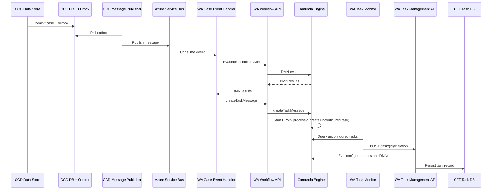
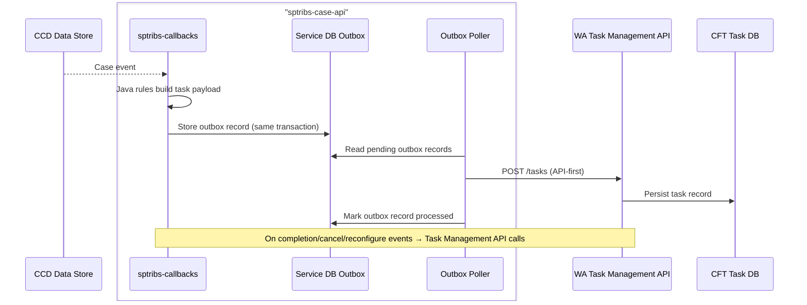

# Overview (Current vs API-First)

API details live in:
- [Task creation](api/task-creation.md)
- [Task termination](api/task-termination.md)

## As-Is Overview (Current WA Flow)

This describes the current CCD → WA task creation path and the components involved.

### Summary
- Task rules live in DMNs under `src/main/resources/dmn/`.
- CCD event publication drives the workflow; the service does not create tasks directly.
- CCD uses a transactional outbox in its database; CCD Message Publisher polls it.
- Camunda orchestrates task creation and holds process state.
- Task Monitor bridges Camunda → Task Management (CFT task DB).
- Case-event-driven task operations (cancel, warn, reconfigure) are routed by Case Event Handler.

## Proposed - API-First Tasks

### Goals
- Task rules live in Java (testable code), not DMNs.
- The service creates fully formed tasks via a new Task Management API endpoint.
- Services lose their transitive dependency on Servicebus & Camunda
- Backwards compatibility; existing task management integrations are unaffected
- Testability; services can write end to end automated tests for their task management integration that:
  - Are deterministic
  - Run locally

### Mermaid Diagram

