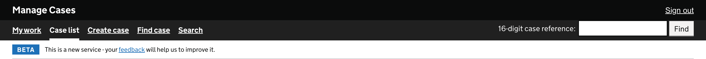
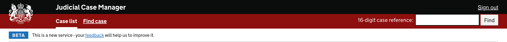
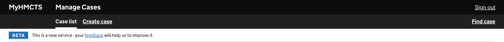
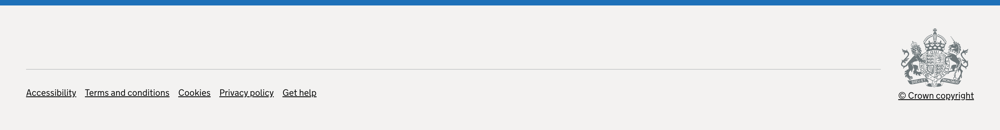

# UI Component Library

`@hmcts-cft/cft-ui-component-lib` provides shared HMCTS header and footer
components as server-rendered nunjucks macros with scoped CSS.

The header uses declarative shadow DOM for style isolation.

## Install

Configure the HMCTS Azure Artifacts npm feed:

```ini
@hmcts-cft:registry=https://pkgs.dev.azure.com/hmcts/Artifacts/_packaging/hmcts-lib/npm/registry/
```

```bash
npm install @hmcts-cft/cft-ui-component-lib
```

## Setup

### 1. Copy assets at build time

Copy the package styles and nunjucks templates into your application's public
and views directories. The source files are at:

- `node_modules/@hmcts-cft/cft-ui-component-lib/src/styles`
- `node_modules/@hmcts-cft/cft-ui-component-lib/src/nunjucks`

For example, with CopyWebpackPlugin:

```js
const root = path.resolve(require.resolve('@hmcts-cft/cft-ui-component-lib'), '..');

new CopyWebpackPlugin({
  patterns: [
    { from: path.resolve(root, 'src', 'styles'), to: 'assets/ui-component-lib' },
    { from: path.resolve(root, 'src', 'nunjucks'), to: '../views/ui-component-lib' },
  ],
});
```

### 2. Build the models

```ts
import { buildHeaderModel, buildFooterModel } from '@hmcts-cft/cft-ui-component-lib';

const headerModel = buildHeaderModel({
  xuiBaseUrl: process.env.XUI_BASE_URL,
  user: { roles: ['caseworker-civil'] },
});

const footerModel = buildFooterModel();
```

### 3. Render in templates

```njk


<link rel="stylesheet" href="/assets/ui-component-lib/ui-component-lib.css">

{{ hmctsXuiHeader(headerModel) }}
{{ hmctsUiFooter(footerModel) }}
```

## Header

`buildHeaderModel(context)` takes the current user and returns a complete
header model with theme, navigation, and search state resolved.

### `HeaderContext` input

| Field | Type | Required | Description |
|-------|------|----------|-------------|
| `xuiBaseUrl` | `string` | yes | XUI root URL, used to build all nav links |
| `user.roles` | `string[]` | yes | User roles, drives theme and menu filtering |

### Header variants

The header resolves its theme from user roles:

**Default** — standard caseworker header



**Judicial** — red header with judicial crest, triggered by judge/judiciary/panelmember roles



**MyHMCTS** — PUI case manager variant



## Footer

`buildFooterModel(context?)` returns a footer model with navigation links
and optional Welsh language toggle.

### `FooterContext` input

| Field | Type | Required | Description |
|-------|------|----------|-------------|
| `welshLanguageToggleEnabled` | `boolean` | no | Show Welsh/English toggle |
| `currentLanguage` | `'en' \| 'cy'` | no | Current language (default `'en'`) |

### Footer



## Local development

```bash
cd frontend/ui-component-lib
npm run preview
```

Serves a preview at `http://localhost:3100` with all variants.
