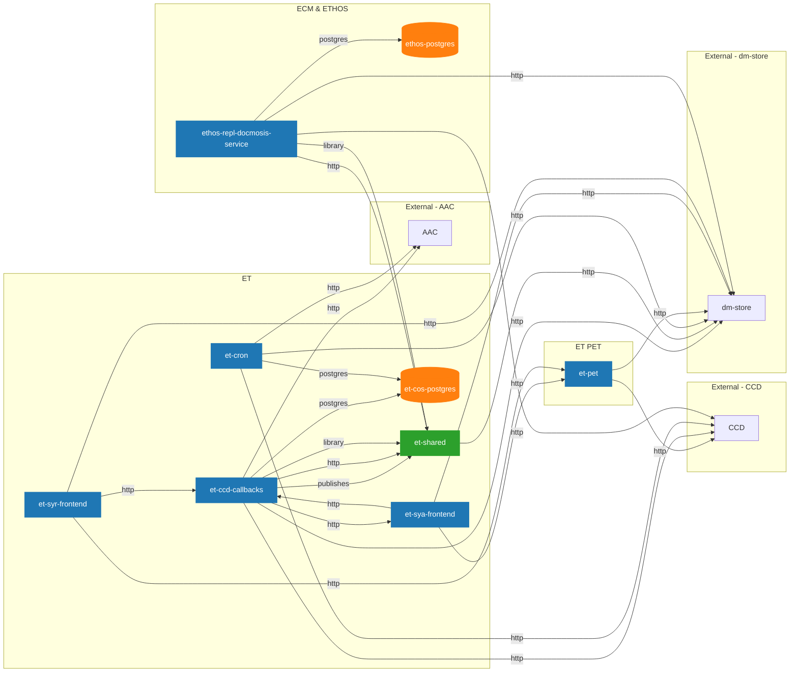

```mermaid
graph LR
%%{init: {"flowchart": {"nodeSpacing": 60, "rankSpacing": 90}} }%%
subgraph ECM_ETHOS[ECM & ETHOS]
  ethos_repl_docmosis_service["ethos-repl-docmosis-service"]
  ethosdb[("ethos-postgres")]
end
subgraph EXTERNAL_AAC[External - AAC]
  aac["AAC"]
end
subgraph EXTERNAL_DM_STORE[External - dm-store]
  dm_store["dm-store"]
end
subgraph EXTERNAL_CCD[External - CCD]
  ccd["CCD"]
end
subgraph ET_OTHER[ET]
  et_ccd_callbacks["et-ccd-callbacks"]
  et_cron["et-cron"]
  et_sya_frontend["et-sya-frontend"]
  et_syr_frontend["et-syr-frontend"]
  et_shared["et-shared"]
  cosdb[("et-cos-postgres")]
end
subgraph ET_PET[ET PET]
  et_pet["et-pet"]
end
et_ccd_callbacks -->|publishes| et_shared
et_ccd_callbacks -->|http| et_shared
et_ccd_callbacks -->|library| et_shared
et_ccd_callbacks -->|http| et_sya_frontend
et_sya_frontend -->|http| et_pet
et_sya_frontend -->|http| et_ccd_callbacks
et_syr_frontend -->|http| et_pet
et_syr_frontend -->|http| et_ccd_callbacks
ethos_repl_docmosis_service -->|http| et_shared
ethos_repl_docmosis_service -->|library| et_shared
ethos_repl_docmosis_service -->|postgres| ethosdb
et_ccd_callbacks -->|postgres| cosdb
et_cron -->|postgres| cosdb
et_ccd_callbacks -->|http| aac
et_cron -->|http| aac
et_ccd_callbacks -->|http| dm_store
et_shared -->|http| dm_store
et_cron -->|http| dm_store
et_pet -->|http| dm_store
et_sya_frontend -->|http| dm_store
et_syr_frontend -->|http| dm_store
ethos_repl_docmosis_service -->|http| dm_store
et_pet -->|http| ccd
et_ccd_callbacks -->|http| ccd
et_cron -->|http| ccd
ethos_repl_docmosis_service -->|http| ccd
classDef db fill:#ff7f0e,color:#fff,stroke:#ff7f0e;
classDef queue fill:#8c564b,color:#fff,stroke:#8c564b;
classDef service fill:#1f77b4,color:#fff,stroke:#1f77b4;
classDef lib fill:#2ca02c,color:#fff,stroke:#2ca02c;
classDef test fill:#e377c2,color:#fff,stroke:#e377c2;
class ethosdb db;
class cosdb db;
class et_ccd_callbacks service;
class et_pet service;
class et_syr_frontend service;
class ethos_repl_docmosis_service service;
class et_cron service;
class et_sya_frontend service;
class et_shared lib;
```
